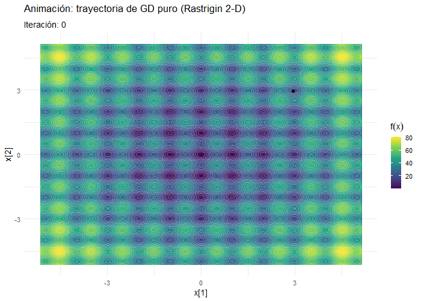
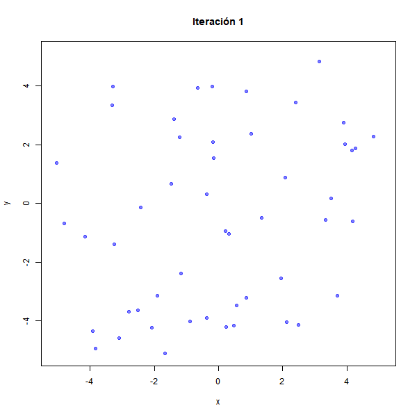
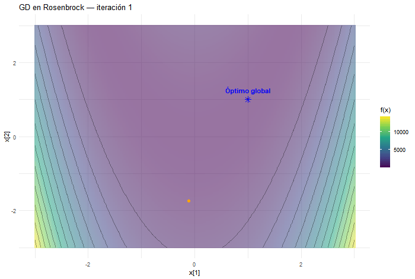
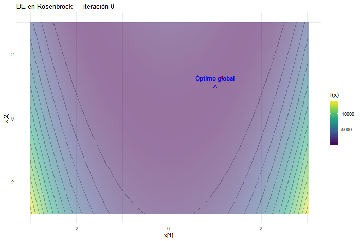
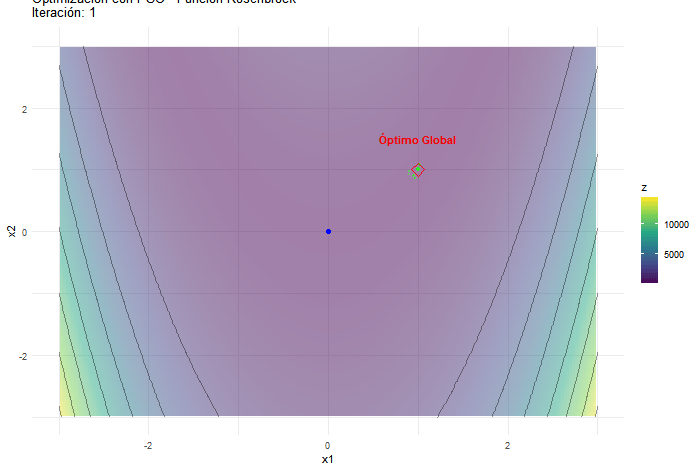

```{r limpiar-entorno, include=FALSE}
#Borrar variables de ambiente en caso de ser necesario 
rm(list = ls())
```

```{r setup, include=FALSE}
knitr::opts_chunk$set(echo = TRUE)
```

```{r cargar-librerias, include=FALSE, warning=FALSE, message=FALSE}
library(GA)          # Algoritmos Genéticos
library(pso)         # Optimización por Enjambre de Partículas
library(DEoptim)     # Algoritmo de Evolución Diferencial

library(dplyr)
library(ggplot2)
library(plotly)
library(gganimate)
library(knitr)
library(gifski)
library(viridis)

library(htmlwidgets)
library(magick)
library(scatterplot3d)
library(rgl)

library(osrm)        # Rutas entre ciudades
library(sf)          # Geometría espacial
library(leaflet)     # Mapas interactivos
library(htmltools)

```

# 0. Introdución

La optimización es un arquetipo en multitud de ramas científicas e ingenieriles que se muestra a la búsqueda de las “mejores” soluciones posibles dentro de un conjunto de respuestas alternativas. En términos más generales, es una atenuación o la maximización de una función objetivo cunado se fijan condiciones en unas y a otras variables. Este enfoque es imperativo para la toma de decisiones rentables, la planificación de sistemas y la administración de problemas consolidados en campos que van desde la economía y la logística hasta la IA y el sendo aprendizaje.

Este proyecto consiste en estudiar y analizar distintas metodologías de optimización, ya sean numéricas o por combinatoria. En este caso, se comenzará explorando la optimización de funciones continuas y luego se avanzará a un problema clásico de optimización discreta.

En la Parte 1: Optimización Numérica, se analizará el desempeño de los métodos que utilizan el descenso por gradiente frente a heurísticas y metaheurísticas, tales como algoritmos evolutivos, optimización por enjambre de partículas y evolución diferencial en el cálculo de mínimos globales en funciones de prueba. Dos funciones de prueba representativas, la Función de Rosenbrock y la Función de Rastrigin, serán seleccionadas debido a la presencia de mínimos locales y valles angostos, lo que constituye un rigoroso desafío para los algoritmos. La optimización se llevará a cabo en 2D y 3D, considerando distintos niveles de complejidad del espacio de búsqueda. La visualización de la trayectoria de búsqueda de cada método, así como el análisis de su efectividad, permitirá valorar estos métodos respecto al valor final de la función objetivo y el número de evaluaciones.

En la Parte 2: Optimización Combinatoria, se verá el conocido Problema del Viajante de Comercio, que es un reto NP-hard en logística y planificación de rutas. El propósito es encontrar la ruta más eficiente que un vendedor use para visitar las 13 ciudades principales de Colombia, su costo debe ser el mínimo posible. Para este fin, se acudir propuesto seis sesiones que se relacionan con el uso de colonias artificiales de hormigas y algoritmos genéticos, dos técnicas metaheurísticas de resolución de problemas complejos a gran escala basadas en la naturaleza. Los costes a tener en cuenta incluyen tiempo del vendedor, peajes y combustible. Posteriormente, se mostrará la solución más óptima encontrada en un mapa de la República de Colombia.

Con este estudio, se espera que el participante haya comprendido los aspectos positivos y negativos de cada uno de los métodos de optimización utilizados, así como conocer el orden en el que son más útiles para problemas reales. La investigación y propuesta brindan evaluación exhaustiva a los resultados y diferentes metodologías de optimización a partir de la visualización conseguirán expresar el alcance y convergencia del trabajo realizado.

# 1. Optimización numérica

En este primer punto se estudian y comparan distintos métodos de optimización aplicados a funciones no lineales. El objetivo es analizar el desempeño de algoritmos clásicos como el descenso por gradiente frente a métodos heurísticos inspirados en procesos evolutivos y naturales. Para ello, se seleccionaron dos funciones de prueba con características distintas que permiten evaluar la eficacia y eficiencia de cada enfoque. Se realizarán optimizaciones en espacios de dos y tres dimensiones, partiendo de condiciones iniciales aleatorias. Además, se visualizará el proceso de búsqueda de soluciones mediante animaciones.Para finalmente comparar como fue el comportamiento de los métodos y como el tipo de función impacta en la elección del método.

## 1.1 Función de Rastrigin

La función **Rastrigin** es una función comúnmente utilizada para evaluar algoritmos de optimización, ya que presenta múltiples mínimos locales. Se define matemáticamente como:

$$
f(\mathbf{x}) = A n + \sum_{i=1}^{n} \left[ x_i^2 - A \cos(2 \pi x_i) \right]
$$ Fórmula 1 - Función de Rastrigin

Donde:

-   **𝐴** es una constante (por lo general 10),
-   **𝑛** es la dimensión del vector **𝑥**,
-   **𝑥** es el vector de entrada.

$\mathbf{x} = (x_1, x_2, \ldots, x_n) \in \mathbb{R}^n$

```{r funcion-rastrigin, include=FALSE}
rastrigin <- function(x, A = 10) {
  n <- length(x)
  A * n + sum(x^2 - A * cos(2 * pi * x))
}
```

**Propiedades de la Función Rastrigin:**

-   Por convención A toma el valor de 10.
-   Mínimo Global en $\mathbf{x} = (0, 0, \ldots, 0)$ valor mínimo $f(\mathbf{x}) = 0$
-   Multimodalidad: Tiene múltiples mínimos locales.
-   Dominio típico $x_i \in [-5.12,\ 5.12],\quad \text{para } i = 1, 2, \ldots, n$
-   Continuidad: Es continua y suave (diferenciable).
-   Separabilidad: Es separable, porque puede expresarse como la suma de funciones de una sola variable.

## Visualización de la función Rastrigin en 1D

La función Rastrigin es ampliamente utilizada en la optimización heurística para evaluar algoritmos debido a su estructura multimodal: contiene un gran número de mínimos locales repartidos en todo el espacio de búsqueda. Esta gráfica representa la versión unidimensional de dicha función.

-   El eje **X** representa los valores de entrada `x`.
-   El eje **Y** muestra los valores evaluados de la función `f(x)`.
-   Los **puntos rojos** marcan los mínimos locales situados en cada número entero entre −5 y +5.
-   El patrón de ondulación refleja la naturaleza periódica de la función, lo que la convierte en un reto ideal para técnicas como algoritmos genéticos, ACO, PSO, entre otros.

Esta figura permite intuir el reto que supone encontrar el mínimo global, ya que un algoritmo puede quedar atrapado fácilmente en un mínimo local si no está bien diseñado.

```{r rastrigin-1d-plot, fig.cap="**Fig 1.** Visualización de la función Rastrigin f(x1) (1D)", fig.align="center", out.width="70%", layout.align="center", echo=FALSE}

# RASTRIGIN 1-D
# Este bloque dibuja la función Rastrigin en una sola variable
# y marca con puntos rojos los mínimos locales situados
# en cada número entero entre −5 y +5.

# 1) Convertimos la función ‘rastrigin()’ a una versión que
#    acepte un vector de x y devuelva un vector de resultados.
#    Vectorize() hace eso automáticamente.
rastrigin_1d <- Vectorize(function(x) rastrigin(x))

# 2) Dibujamos la curva:
#    • from / to  → rango del eje X
#    • n          → número de puntos que se calculan
#    • xlab, ylab → etiquetas de los ejes
#    • main       → título del gráfico
curve(
  rastrigin_1d(x),          # la función a pintar
  from = -5.12, to = 5.12,  # límites de X
  n    = 1000,              # resolución del trazo
  xlab = "x",               # texto en eje X
  ylab = "f(x)",            # texto en eje Y
  main = "Rastrigin 1D — campo de pozos periódicos"
)

# 3) Añadimos PUNTOS ROJOS en cada entero (… −5, −4, …, 4, 5)
#    para resaltar los mínimos locales de la función.
points(
  -5:5,                     # posiciones X de los puntos
  rastrigin_1d(-5:5),       # alturas Y = f(x) en esas X
  pch = 19,                 # tipo de símbolo (19 = punto sólido)
  col = "red"               # color de los puntos
)

```

**Análisis del gráfico “Rastrigin 1-D — campo de pozos periódicos”**

+---------------------------------------------+---------------------------------------------------------------+------------------------------------------------------------------------------------------------------------------------------------------------------------+
| Elemento visual                             | Observación                                                   | Interpretación                                                                                                                                             |
+=============================================+===============================================================+============================================================================================================================================================+
| **Línea negra dentada**                     | Ondas regulares de amplitud creciente al alejarse del centro. | Resultado de la combinación $x^2+cos(2\pi x)$. El término cuadrático empuja hacia arriba (crece como cuenco), el coseno introduce la ondulación periódica. |
+---------------------------------------------+---------------------------------------------------------------+------------------------------------------------------------------------------------------------------------------------------------------------------------+
| **Puntos rojos (11)**                       | Un punto rojo en cada entero desde −5 hasta 5.                | Representan los **mínimos locales**: los pozos donde un optimizador basado solo en gradientes podría quedar atrapado.                                      |
+---------------------------------------------+---------------------------------------------------------------+------------------------------------------------------------------------------------------------------------------------------------------------------------+
| **Valle más profundo en** $x=0$             | Punto rojo más bajo ($f(x)=0$).                               | **Mínimo global** de la función.                                                                                                                           |
+---------------------------------------------+---------------------------------------------------------------+------------------------------------------------------------------------------------------------------------------------------------------------------------+
| **Simetría izquierda-derecha**              | La curva es espejo respecto a $x=0$.                          | Tanto $x^2$ como $cos(2\pi x)$ son funciones pares → la función es simétrica.                                                                              |
+---------------------------------------------+---------------------------------------------------------------+------------------------------------------------------------------------------------------------------------------------------------------------------------+
| **Incremento de altura hacia los extremos** | Las puntas laterales alcanzan $f(x)\approx40$ .               | Dominio del término $x^2$. Cuanto más lejos del centro, más alto el coste.                                                                                 |
+---------------------------------------------+---------------------------------------------------------------+------------------------------------------------------------------------------------------------------------------------------------------------------------+

1.  **Alta multimodalidad**\
    Once pozos en un intervalo de solo 10 unidades indican que la función está plagada de óptimos locales.

2.  **Periodocidad**\
    La distancia constante entre picos ($\approx 1$) viene del $cos(2\pi x)$; cada ciclo completo genera un pozo.

**Grafico de la función de Rastrigin (2D)**

```{r rastrigin-2d-contour, fig.cap="**Fig 2** Visualización de la función Rastrigin f(x1) (2D)", fig.align="center", out.width="70%", layout.align="center", echo=FALSE}

# RASTRIGIN 1-D
# Este bloque dibuja la función Rastrigin en una sola variable
# y marca con puntos rojos los mínimos locales situados
# en cada número entero entre −5 y +5.

# 1) Convertimos la función ‘rastrigin()’ a una versión que
#    acepte un vector de x y devuelva un vector de resultados.
#    Vectorize() hace eso automáticamente.
rastrigin_1d <- Vectorize(function(x) rastrigin(x))

# 2) Dibujamos la curva:
#    • from / to  → rango del eje X
#    • n          → número de puntos que se calculan
#    • xlab, ylab → etiquetas de los ejes
#    • main       → título del gráfico
curve(
  rastrigin_1d(x),          # la función a pintar
  from = -5.12, to = 5.12,  # límites de X
  n    = 1000,              # resolución del trazo
  xlab = "x",               # texto en eje X
  ylab = "f(x)",            # texto en eje Y
  main = "Rastrigin 1D — campo de pozos periódicos"
)

# 3) Añadimos PUNTOS ROJOS en cada entero (… −5, −4, …, 4, 5)
#    para resaltar los mínimos locales de la función.
points(
  -5:5,                     # posiciones X de los puntos
  rastrigin_1d(-5:5),       # alturas Y = f(x) en esas X
  pch = 19,                 # tipo de símbolo (19 = punto sólido)
  col = "red"               # color de los puntos
)

```

**Análisis del gráfico “Rastrigin 2-D — campo de minas”**

+---------------------------------------------+----------------------------------------------------+-----------------------------------------------------------------------------------------------------------------+
| # Elemento visual                           | # Qué se observa                                   | # Qué significa                                                                                                 |
|                                             |                                                    |                                                                                                                 |
| **Gradiente de color (barra a la derecha)** | Verde muy oscuro → Valores cercanos a 0.\          | Indica la *altura* de la función $f(x_1,x_2)$. Los colores claros son “cerros”; los oscuros, “valles”.          |
|                                             | Amarillo → $f(\mathbf{x})\approx40$.\              |                                                                                                                 |
|                                             | Rosa-blanco → $f(\mathbf{x})\approx80$ (más alto). |                                                                                                                 |
+---------------------------------------------+----------------------------------------------------+-----------------------------------------------------------------------------------------------------------------+
| **Estrella negra en (0, 0)**                | Único punto marcado en el centro.                  | **Mínimo global**: $f(0,0) = 0$. Cualquier optimizador querrá llegar aquí.                                      |
+---------------------------------------------+----------------------------------------------------+-----------------------------------------------------------------------------------------------------------------+
| **Malla gris punteada**                     | Líneas cada unidad en ambos ejes.                  | Subraya que la función es **separable y periódica**: los mínimos locales se repiten exactamente en cada entero. |
+---------------------------------------------+----------------------------------------------------+-----------------------------------------------------------------------------------------------------------------+
| **Óvalos verdes/amarillos repetidos**       | Patrón regular horizontal y vertical.              | Cada óvalo es un **pozo local**; la cuadrícula entera corresponde a la estructura $cos(2\pi x_i)$ de Rastrigin. |
+---------------------------------------------+----------------------------------------------------+-----------------------------------------------------------------------------------------------------------------+

1.  **Alta multimodalidad**\
    Hay decenas de valles; un descenso por gradiente típico corre riesgo de quedar atrapado en cualquiera de ellos.

2.  **Separabilidad**\
    Las líneas punteadas muestran que los mínimos están exactamente en los cruces de enteros (x1,x2)∈Z2. La función puede verse como la suma de dos copias 1-D independientes.

3.  **Incremento radial suave**\
    A medida que nos alejamos del centro, los colores se vuelven lentamente rosados

4.  **“Campo de minas”**\
    Optimizar aquí es como cruzar un terreno lleno de cráteres: cada cuadrícula contiene un pozo que puede atrapar al algoritmo.

**Grafico de la función de Rastrigin (3D)**

```{r rastrigin-3d-static, fig.cap="**Fig 3.** Visualización de la función Rastrigin f(x1, x2, x3) (3D)", fig.align="center", out.width="70%", layout.align="center", echo=FALSE}

# --- 1. Crear malla --------------------------------------------------
x <- seq(-5.12, 5.12, length.out = 200)   # eje X
y <- x                                    # eje Y (misma malla)
z <- outer(x, y, Vectorize(function(a, b) rastrigin(c(a, b))))  # matriz Z

# --- 2. Graficar -----------------------------------------------------
trans <- persp(
  x, y, z,
  theta  = 60,  phi = 35,  expand = 0.6,
  col    = "lightsteelblue", shade = 0.4, ticktype = "simple",
  xlab   = "x₁", ylab = "x₂", zlab = "f(x)",
  main   = "Rastrigin 2D — Superficie 3D con mínimo global"
)

# --- 3. Marcar el mínimo global -------------------------------------
points(trans3d(0, 0, rastrigin(c(0, 0)), trans),
       col = "red", pch = 16, cex = 2)

```

**Superficie 3-D de la función Rastrigin en dos dimensiones.**

Se aprecia un cuenco global con un mosaico de mínimos locales periódicos.\

El mínimo global está en (0,0) y las crestas alcanzan valores de $f(\mathbf{x})=80$.

-   **Implicaciones para la optimización**

    -   **Gradiente “traicionero”**\
        Desde un punto alto, el gradiente guía hacia el valle **más cercano, no el global**; por eso un descenso por gradiente sencillo suele frenarse en uno de esos cráteres periféricos.

    -   **Incremento radial suave + oscilación fina**\
        La combinación hace que los valles laterales sean relativamente profundos: un algoritmo necesita capacidad de *exploración* para saltar varias crestas y acercarse al centro.

    -   Métodos **locales** (GD, Newton) requieren muchos reinicios o mejoras (momentum, annealing).

    -   Estrategias **bioinspiradas** (PSO, hormigas) o **cuasi-Newton** (L-BFGS-B) suelen rendir mejor, porque pueden escapar de pozos.

### 1.1.1 Gradiente de la función Rastrigin(GD)

Para aplicar métodos de optimización basados en gradientes (como el **descenso del gradiente**), es fundamental calcular la derivada de la función objetivo. En este caso, definimos el **gradiente de la función Rastrigin**, una función no convexa ampliamente usada como benchmark debido a su gran cantidad de mínimos locales.

-   Esta derivada parcial nos indica la dirección de **máxima pendiente**.
-   El algoritmo de optimización usará esta información para "bajar" hacia un mínimo (local o global).
-   El gradiente de Rastrigin se deriva analíticamente y se expresa como:

$$
\nabla f(x) = 2x + 2\pi A \cdot \sin(2\pi x)
$$

donde: - $A$ es una constante (típicamente 10), - $x$ es el vector de entrada.

A continuación, definimos este gradiente como una función vectorial en R.

```{r gradiente-rastrigin, include=FALSE}
# Gradiente
grad_rastrigin <- function(x, A = 10) {
  2 * x + 2 * pi * A * sin(2 * pi * x)
}
```

#### Descenso del Gradiente (Gradient Descent) sobre la función Rastrigin

El **descenso del gradiente (GD)** es uno de los algoritmos fundamentales de optimización. A partir de una posición inicial $\mathbf{x}_0$, el algoritmo actualiza esa posición en la dirección opuesta al gradiente, con el objetivo de minimizar la función.

En cada iteración $k$, el algoritmo realiza:

$$
\mathbf{x}_{k+1} = \mathbf{x}_k - \eta \cdot \nabla f(\mathbf{x}_k)
$$

donde: - $\eta$ es la tasa de aprendizaje (**learning rate**), - $\nabla f(\mathbf{x}_k)$ es el **gradiente** en la posición actual, - $\mathbf{x}_{k+1}$ es la nueva posición.

En esta sección: - Implementamos GD para la función Rastrigin, - Almacenamos el historial de posiciones y valores $f(\mathbf{x})$ en cada iteración, - Permitimos controlar el número de iteraciones y el tamaño de paso $\eta$.

Esta versión aún **no reinicia** desde distintos puntos, pero sirve para visualizar cómo se comporta el descenso desde una posición dada.

```{r gd-once, include=FALSE}
# Función GD simple con historial
gd_once <- function(x0, lr = 0.01, iters = 200) {
  x <- x0
  hist <- matrix(NA, nrow = iters, ncol = length(x0) + 1)  # guarda x1, x2, f(x)

  for (k in 1:iters) {
    g <- grad_rastrigin(x)       # gradiente
    x <- x - lr * g              # paso GD
    hist[k, ] <- c(x, rastrigin(x))  # guardar estado
  }

  colnames(hist) <- c(paste0("x", 1:length(x0)), "f")
  return(as.data.frame(hist))
}

```

#### Trayectoria de GD puro sobre Rastringin (1D)

En este experimento aplicamos el descenso del gradiente puro sobre la **función Rastrigin en 1 dimensión**, comenzando desde un punto inicial $x_0 = 3$.

**Objetivos**: - Observar cómo evoluciona el algoritmo hacia un mínimo local. - Visualizar la trayectoria del descenso sobre la gráfica de la función. - Identificar el punto de inicio y el punto final del algoritmo.

**Detalles clave**: - Se usó una tasa de aprendizaje $\eta = 0.01$. - Se grafican las evaluaciones sucesivas $f(x_k)$ como una curva azul. - El punto inicial se marca en rojo y el final en negro.

Este gráfico nos permite ver si el algoritmo converge al mínimo esperado, y cómo desciende el valor de la función a lo largo de las iteraciones.

```{r gd-1d-trayectoria, fig.cap="**Fig 4.** Visualización de la función Rastrigin óptimo en f(x1) (1D)", fig.align="center", out.width="70%", layout.align="center", echo=FALSE}


# GRÁFICO 1-D CON GD_PURO  

# 1. Ejecutar el descenso por gradiente 
x0 <- 3                            # punto de partida
traj1d <- gd_once(x0, lr = 0.01, iters = 200)

# 2. Añadir la columna de iteración  
traj1d$iter <- seq_len(nrow(traj1d)) - 1   # 0, 1, 2, …

# 3. Graficar Rastrigin 1-D y la trayectoria
rastrigin_v <- Vectorize(rastrigin)

curve(rastrigin_v(x), from = -5.12, to = 5.12, n = 1000,
      xlab = "x", ylab = "f(x)",
      main = "Trayectoria de GD puro en Rastrigin 1-D")

# Línea azul con el camino del algoritmo
points(traj1d$x1, traj1d$f, type = "l",
       col = "dodgerblue", lwd = 2)

# Puntos de inicio (rojo) y final (negro)
points(x0, rastrigin(x0),                pch = 19, col = "red")   # inicio
points(tail(traj1d$x1, 1), tail(traj1d$f, 1),
       pch = 17, col = "black")                                   # fin


```

+-------------------+---------------------------------------------------------------------------------------------------------------------------------+
| # Color / Símbolo | # Significado correcto                                                                                                          |
|                   |                                                                                                                                 |
| **▲ Negro**       | **Punto inicial** $\mathbf{x_0}\approx2.9$. El descenso por gradiente parte aquí, en la ladera alta del valle.                  |
+-------------------+---------------------------------------------------------------------------------------------------------------------------------+
| **🔴 Rojo**       | **Punto final**: mínimo local alcanzado tras 200 iteraciones, $x\approx2.8$x≈2.8 con $14\lessapprox f(\mathbf{x})\lessapprox15$ |
+-------------------+---------------------------------------------------------------------------------------------------------------------------------+
| **Zona azul**     | Todos los pasos intermedios; muestra cómo GD oscila dentro del mismo valle hasta estabilizarse en el punto rojo.                |
+-------------------+---------------------------------------------------------------------------------------------------------------------------------+

**Análisis**

1.  **Descenso rápido**\
    El algoritmo parte del punto **negro** (valor f≈27) y se desliza cuesta abajo siguiendo el gradiente.

2.  **Oscilaciones amortiguadas**\
    En azul se ve cómo va rebotando a ambos lados del eje del valle. Cada rebote es más pequeño porque el gradiente se reduce a medida que se acerca al fondo.

3.  **Convergencia local, fracaso global:**\
    El algoritmo se detiene en el **punto rojo**, el fondo del pozo local. Allí la pendiente es prácticamente nula y se cumple el criterio de paro. **Queda atrapado** en el primer mínimo local encontrado.

4.  **Influencia del punto de partida**: cualquier inicio en el intervalo $[2.5,\ 3.5]$ produciría resultados parecidos; reiniciar desde zonas distintas sólo trasladaría el problema a otros pozos.

5.  **Distancia al óptimo global**\
    El óptimo global de Rastrigin ($\mathbf{x}=0, f=0$) queda fuera de la zona azul; GD nunca lo “visita”. Esto evidencia la limitación de los métodos locales en funciones multimodales.

6.  **Necesidad de estrategias complementarias**: para alcanzar el óptimo global en Rastrigin se requieren técnicas que permitan “saltar” valles (momentum, tasa de aprendizaje adaptativa, meta-heurísticas globales).

### 1.1.2 Trayectoria del Gradiente Descendente en Rastrigin 2D

En esta sección visualizamos cómo se comporta el algoritmo de Gradiente Descendente (GD) al intentar minimizar la función Rastrigin en dos dimensiones.

-   La función Rastrigin es altamente **no convexa** y está plagada de **mínimos locales**, lo que representa un desafío para algoritmos que siguen únicamente el gradiente.
-   Partimos desde el punto inicial (3, 3) y realizamos 200 iteraciones con una tasa de aprendizaje constante.
-   Se representa la superficie de la función mediante un mapa de calor y curvas de nivel, y sobre ella se traza el camino recorrido por GD.
-   El punto negro representa el **inicio**, mientras que el rojo indica el **punto final**, típicamente atrapado en un mínimo local.

Esta visualización ayuda a entender por qué GD puro puede ser insuficiente en funciones con topologías complejas como Rastrigin.

```{r gd-2d-trayectoria, fig.cap="**Fig 5.** Visualización de la función Rastrigin óptimo f(x1, x2) (2D)", fig.align="center", out.width="70%", layout.align="center", echo=FALSE}


# Malla (superficie de referencia) --------------------------
x_vals <- y_vals <- seq(-5.12, 5.12, length.out = 200)
contour_df <- expand.grid(x1 = x_vals, x2 = y_vals)
contour_df$z <- mapply(
  function(a, b) rastrigin(c(a, b)),
  contour_df$x1, contour_df$x2
)

# Ejecutar Gradient Descent puro ----------------------------
#    · sin argumentos “max_iter” ni “tol” → usamos ‘iters’
gd_res <- gd_once(c(3, 3), lr = 0.01, iters = 200)

# Construir data frame con las columnas que ggplot necesita
traj_df <- data.frame(
  x1   = gd_res$x1,                 # posiciones en eje X
  x2   = gd_res$x2,                 # posiciones en eje Y
  f    = gd_res$f,                  # valor de la función
  iter = seq_len(nrow(gd_res)) - 1  # contador de iteraciones 0…199
)
# Definir los puntos de Inicio y Fin para la leyenda -------
puntos_df <- data.frame(
  x1   = c(traj_df$x1[1], tail(traj_df$x1, 1)),
  x2   = c(traj_df$x2[1], tail(traj_df$x2, 1)),
  tipo = factor(c("Fin", "Inicio"), levels = c("Fin", "Inicio"))
)

# Gráfico estático ------------------------------------------------
ggplot() +
  # Fondo: mapa de calor f(x)
  geom_tile(data = contour_df,
            aes(x1, x2, fill = z)) +
  geom_contour(data = contour_df,
               aes(x1, x2, z = z),
               colour = "white", alpha = 0.25, bins = 25) +
  scale_fill_viridis_c(option = "D", name = expression(f(x))) +

  # Trayectoria
  geom_path(data = traj_df,
            aes(x1, x2),
            colour = "dodgerblue", linewidth = 1.3) +
  geom_point(data = traj_df[1, ],        # punto inicial
             aes(x1, x2),
             colour = "black", size = 3) +
  geom_point(data = tail(traj_df, 1),    # punto final
             aes(x1, x2),
             colour = "red", size = 3) +
  # Puntos de inicio y fin con leyenda automática
  geom_point(data = puntos_df,
             aes(x = x1, y = x2, colour = tipo, shape = tipo),
             size = 3) +
  scale_colour_manual(values = c("Inicio" = "black", "Fin" = "red"),
                      name   = "") +
  scale_shape_manual(values = c("Inicio" = 16,      # círculo lleno
                                "Fin"    = 17),     # triángulo
                     name    = "") +

  # Detalles estéticos
  labs(title    = "Trayectoria de GD puro sobre Rastrigin 2D",
       subtitle = "•  Rojo = mínimo local donde se atasca",
       x = expression(x[1]), y = expression(x[2])) +
  theme_minimal(base_size = 14) +
  theme(legend.position = "right",
        plot.title      = element_text(face = "bold"))


```

**Trayectoria de GD puro sobre Rastringin (2D)**

```         
```

**Descripción del gráfico**

+-------------------------------+-------------------------------------------------------------------------------------------------------+
| Elemento                      | Significado                                                                                           |
+===============================+=======================================================================================================+
| 🔵 **Trayectoria azul**       | Secuencia de pasos que toma Gradient Descent desde el punto inicial.                                  |
+-------------------------------+-------------------------------------------------------------------------------------------------------+
| ⚫ **Círculo negro (Inicio)** | Posición de partida $(3,\ 3)$ del algoritmo.                                                          |
+-------------------------------+-------------------------------------------------------------------------------------------------------+
| 🔺 **Triángulo rojo (Fin)**   | Mínimo local donde GD queda atrapado tras 200 iteraciones.                                            |
+-------------------------------+-------------------------------------------------------------------------------------------------------+
| **Mapa de colores (f(x))**    | Valor de la función Rastrigin; violeta oscuro ($\approx0$) (valles), amarillo ($\approx 80$) (picos). |
+-------------------------------+-------------------------------------------------------------------------------------------------------+

**Análisis del comportamiento del algoritmo**

+-----------------------------------------------------------------------------+-------------------------------------------------------------------------------------------------------------------------------------------------------------+
| Observación                                                                 | Interpretación                                                                                                                                              |
+=============================================================================+=============================================================================================================================================================+
| El recorrido es **muy corto** y se queda en la parte superior-derecha.      | GD se vio atraído por el **valle local más próximo** y no dispuso de mecanismos para “saltar” la siguiente cresta.                                          |
+-----------------------------------------------------------------------------+-------------------------------------------------------------------------------------------------------------------------------------------------------------+
| Valor final ($f(\mathbf{x})=17$) frente al mínimo global $f(\mathbf{x})=0$. | Confirma el **estancamiento prematuro** en un óptimo local.                                                                                                 |
+-----------------------------------------------------------------------------+-------------------------------------------------------------------------------------------------------------------------------------------------------------+
| Trayectoria casi rectilínea hacia un solo pozo.                             | El gradiente inicial apunta con fuerza a la depresión más cercana; tras llegar al fondo la norma del gradiente se vuelve pequeña y el algoritmo se detiene. |
+-----------------------------------------------------------------------------+-------------------------------------------------------------------------------------------------------------------------------------------------------------+

En funciones **altamente multimodales** como Rastrigin, el número de valles hace muy improbable que GD, partiendo lejos del origen, alcance el **mínimo global**.

#### Animacion de la trayectoria de GD puro sobre Rastringin (2D)

A continuación, presentamos una animación que muestra paso a paso cómo el algoritmo de Gradiente Descendente puro recorre el paisaje de la función Rastrigin en dos dimensiones:

-   Se parte desde el punto inicial (3, 3), con una tasa de aprendizaje fija y sin reinicios.
-   Cada punto negro representa una posición evaluada por el algoritmo en una iteración.
-   La línea roja muestra la trayectoria seguida.
-   El fondo es una superficie coloreada según los valores de la función (mapa de calor con curvas de nivel).

Esta visualización dinámica permite observar cómo el gradiente guía la búsqueda hacia un mínimo cercano, pero también ilustra la tendencia del GD a quedarse atrapado en **mínimos locales**, lo que refuerza la necesidad de métodos más robustos como los algoritmos evolutivos o de enjambre en problemas no convexos.

```{r gd-2d-animacion, fig.cap="**Fig 6.** Animación de la función Rastrigin óptimo f(x1, x2) (2D)", fig.align="center", out.width="70%", layout.align="center", warning=FALSE, message=FALSE, include=FALSE}


# GRÁFICO Y ANIMACIÓN 2-D DE UNA ÚNICA TRAYECTORIA GD (sin   
# reinicios) SOBRE LA FUNCIÓN RASTRIGIN.                     

# Datos de la superficie (contorno con leyenda f(x))
# ─────────────────────────────────────────────────────────────
x_vals <- y_vals <- seq(-5.12, 5.12, length.out = 200)

contour_df <- expand.grid(x1 = x_vals, x2 = y_vals) %>%
  mutate(z = mapply(function(a, b) rastrigin(c(a, b)), x1, x2))


# Una sola trayectoria con gd_once()
# ─────────────────────────────────────────────────────────────
set.seed(42)                 # reproducibilidad
x0 <- c(3, 3)                # punto inicial elegido
gd_res <- gd_once(x0, lr = 0.01, iters = 50)

traj_df <- gd_res %>%
  mutate(iter = seq_len(n()) - 1)   # 0,1,2,… para animación


# Animación 2-D de la misma trayectoria
# ─────────────────────────────────────────────────────────────
p_anim <- ggplot() +
  geom_tile(data = contour_df,
            aes(x1, x2, fill = z)) +
  geom_contour(data = contour_df,
               aes(x1, x2, z = z),
               colour = "white", alpha = 0.3, bins = 30) +
  scale_fill_viridis_c(name = expression(f(x)), option = "D") +

  geom_path(data = traj_df,
            aes(x1, x2),
            colour = "red", linewidth = 1.3) +
  geom_point(data = traj_df,
             aes(x1, x2),
             colour = "black", size = 2) +

  labs(title    = "Animación: trayectoria de GD puro (Rastrigin 2-D)",
       subtitle = "Iteración: {frame_along}",
       x = expression(x[1]), y = expression(x[2])) +
  theme_minimal(base_size = 14) +
  theme(legend.position = "right",
        plot.title = element_text(face = "bold")) +

  transition_reveal(along = iter) +
  ease_aes("linear")

animate(p_anim,
        nframes  = max(traj_df$iter) + 1,
        fps      = 15,
        width    = 700,
        height   = 500,
        units    = "px",
        renderer = gifski_renderer())


```



**Dinámica observada**

1.  **Inicio en un pico elevado**\
    Al “play”, el punto negro parte en una zona amarilla (valor alto de $f(\mathbf{x})$), indicando un punto inicial lejos del mínimo.

2.  **Descenso pronunciado**\
    En las primeras iteraciones, el punto negro se desplaza rápidamente hacia regiones más oscuras (valores de f decrecientes), cayendo dentro de un pozo local.

3.  **Estabilización**\
    Una vez dentro del valle, la trayectoria azul rodea el fondo con pequeños vaivenes, reflejando zig-zags de GD puro en un entorno multimodal.

4.  **Sin escape del mínimo local**\
    A pesar de varias decenas de iteraciones, el punto nunca atraviesa la cresta que llevaría al valle central

### 1.1.3 Implementación de GD en Rastrigin 3D

#### Animacion de la trayectoria de GD puro sobre Rastringin (3D)

La siguiente animación 3D muestra cómo se comporta el Gradiente Descendente (GD) en una versión bidimensional de la función Rastrigin (representada en 3D con los ejes x₁, x₂ y f(x)).

-   La **superficie ondulada** representa el paisaje de la función objetivo, caracterizado por numerosos mínimos locales.
-   La **línea de colores** muestra la trayectoria seguida por el algoritmo desde el punto inicial (3, 3).
-   El **punto negro** se mueve en cada iteración y representa la posición actual del algoritmo.
-   El **rombo amarillo** indica el mínimo local alcanzado en el recorrido (el mejor punto encontrado).
-   Esta animación permite observar cómo el GD puede descender rápidamente hacia un valle, pero puede quedar atrapado en óptimos locales sin alcanzar la mejor solución global.

Este tipo de visualización es clave para entender por qué el Gradiente Descendente puro necesita ser complementado con otras estrategias en problemas no convexos.

```{r gd-3d-animacion, fig.cap="**Fig 7.** Visualización de la función Rastrigin óptimo f(x1, x2, x3) (3D)", fig.align="center", out.width="70%", layout.align="center", echo=FALSE}


# — 1) Superficie de Rastrigin —
x_vals  <- y_vals <- seq(-5.12, 5.12, length.out = 50)
z_matrix <- outer(x_vals, y_vals,
                  Vectorize(function(a,b) rastrigin(c(a,b))))

# — 2) Ejecución de GD desde (3,3) —
set.seed(42)
res   <- gd_once(c(3, 3), lr = 0.01, iters = 50)
traj  <- as.matrix(res[, c("x1","x2")])    # n × 2
fvals <- res$f                              # longitud n
iters <- seq_len(nrow(res)) - 1             # 0:(n-1)

# — 3) Óptimo local —
opt_idx   <- which.min(fvals)
opt_point <- traj[opt_idx, ]
opt_val   <- fvals[opt_idx]

# — 4) Construcción de frames CORREGIDA —
frames <- lapply(seq_along(iters), function(i) {
  list(
    data = list(
      NULL,  # trace 0: superficie (estático)
      # trace 1: línea hasta iter i
      list(
        x    = traj[1:i,1],
        y    = traj[1:i,2],
        z    = fvals[1:i],
        type = "scatter3d", mode = "lines",
        line = list(color=0:(i-1), colorscale="Rainbow",
                    cmin=0, cmax=max(iters), width=6)
      ),
      # trace 2: punto móvil en iter i
      list(
        x      = traj[i,1],
        y      = traj[i,2],
        z      = fvals[i],
        type   = "scatter3d", mode = "markers",
        marker = list(size=6, color="black")
      ),
      NULL   # trace 3: óptimo (estático)
    ),
    name   = as.character(iters[i]),
    traces = c(1,2)  # animamos sólo línea y punto
  )
})


# — 5) Figura inicial con 4 traces —
fig <- plot_ly() %>%
  # trace 0: superficie
  add_surface(
    x = ~x_vals, y = ~y_vals, z = ~z_matrix,
    colorscale = "Viridis", opacity = 0.2, showscale = FALSE
  ) %>%
  # trace 1: línea (iter 0)
  add_trace(
    x    = traj[1,1], y = traj[1,2], z = fvals[1],
    type = "scatter3d", mode = "lines",
    line = list(color=0, colorscale="Rainbow",
                cmin=0, cmax=max(iters), width=6),
    name = "Trayectoria"
  ) %>%
  # trace 2: punto inicial
  add_trace(
    x      = traj[1,1], y = traj[1,2], z = fvals[1],
    type   = "scatter3d", mode = "markers",
    marker = list(size=6, color="black"),
    name   = "Punto actual"
  ) %>%
  # trace 3: óptimo encontrado
  add_trace(
    x      = opt_point[1], y = opt_point[2], z = opt_val,
    type   = "scatter3d", mode = "markers",
    marker = list(size=10, symbol="diamond", color="yellow"),
    name   = "Óptimo encontrado"
  ) %>%
  layout(
    title = paste0("GD en Rastrigin 3D — Iteración 0 — f = ", round(fvals[1],4)),
    scene = list(
      xaxis = list(title = "x1", range = c(-5.12,5.12)),
      yaxis = list(title = "x2", range = c(-5.12,5.12)),
      zaxis = list(title = "f(x)"),
      camera = list(
        eye = list(x=0.05, y=1.50, z=0.30),
        center = list(x=0,y=0,z=0),
        up     = list(x=0,y=0,z=1)
      )
    ),
    sliders = list(
      list(
        active = 0, pad = list(t=50),
        currentvalue = list(prefix="Iteración: "),
        steps = lapply(seq_along(iters), function(i) {
          list(
            method = "animate",
            args   = list(list(as.character(iters[i])),
                          list(mode="immediate",
                               frame=list(duration=100, redraw=TRUE))),
            label  = as.character(iters[i])
          )
        })
      )
    ),
    updatemenus = list(
      list(
        type="buttons", showactive=FALSE,
        x=1, xanchor="right", y=0, yanchor="bottom",
        buttons=list(
          list(label="▶ Play", method="animate",
               args=list(NULL, list(frame=list(duration=100,redraw=TRUE),
                                     mode="immediate"))),
          list(label="⏸ Pause", method="animate",
               args=list(list(NULL), list(frame=list(duration=0,redraw=FALSE),
                                         mode="immediate")))
        )
      )
    )
  )

# — 6) Inyecta frames y habilita autoplay —
fig$x$frames <- frames
fig <- fig %>% onRender("
  function(el,x){
    el.on('plotly_buttonclicked',function(e){
      if(e.button && e.button.label==='▶ Play'){
        Plotly.animate(el,null,{frame:{duration:100,redraw:true},mode:'immediate'});
      }
    });
  }
")

# — 7) Guarda y muestra —
htmlwidgets::saveWidget(fig,
  "rastrigin_gd_3d_zoom_maximo_correcto.html",
  selfcontained = TRUE)
fig

```

| Elemento | Significado |
|----------|-------------|

+--------------------------------------+-----------------------------------------------------------------------------------------------------------+
| **Superficie translúcida (Viridis)** | Muestra el paisaje completo de la función Rastrigin: valles profundos (violeta) y picos altos (amarillo). |
+--------------------------------------+-----------------------------------------------------------------------------------------------------------+

+-----------------------------------------+---------------------------------------------------------------------------------------+
| 🟠 **Línea multicolor (“Trayectoria”)** | Cada tonalidad marca un paso de GD: del azul al naranja conforme avanza la iteración. |
+-----------------------------------------+---------------------------------------------------------------------------------------+

+-------------------------------------+----------------------------------------------------+
| ⚫ **Punto negro (“Punto actual”)** | Indica la posición de GD en la iteración mostrada. |
+-------------------------------------+----------------------------------------------------+

+---------------------------------------------+-----------------------------------------------------------+
| **Diamante amarillo (“Óptimo encontrado”)** | Señala el mínimo local donde el algoritmo quedó atrapado. |
+---------------------------------------------+-----------------------------------------------------------+

+--------------------------------------------------------------------------------------------------------------------------------------------------------+
| ▶️⏸️ **Controles Play/Pause + slider** \| Permiten navegar interactivamente por las iteraciones. \| \| \| \| \| \| \| \| \| \| \| \| \| \| \| \| \| \| |
+--------------------------------------------------------------------------------------------------------------------------------------------------------+

**Comportamiento de GD en 3D**

1.  **Descenso inicial:**\
    Desde el punto $(3,\ 3)$, GD baja rápidamente por la “pared” del valle, capturado por el gradiente pronunciado.

2.  **Ingreso en un cráter local:**\
    Tras unas pocas iteraciones, la trayectoria desciende al fondo de un pozo lateral, lejos del centro $(0,\ 0)$.

3.  **Estancamiento y micro-oscillaciones:**\
    Dentro de ese cráter, GD gira en pequeños zig-zags alrededor de un mínimo que no es el global.

4.  **No alcanza el mínimo global:**\
    El diamante amarillo permanece alejado del valle central de la superficie, confirmando la captura en un mínimo local.

### 1.1.4 Algoritmos evolutivos

En esta sección aplicamos un **Algoritmo Genético (GA)** para encontrar el mínimo global de la función Rastrigin en dos dimensiones.

El **GA** es un algoritmo inspirado en la evolución biológica que utiliza procesos como **selección natural, cruces (recombinación)** y **mutaciones** para explorar el espacio de búsqueda. A diferencia del Gradiente Descendente, los GAs **no necesitan derivadas**, lo que los hace ideales para funciones no derivables o con múltiples mínimos locales como Rastrigin.

### Parámetros configurados:

-   `type = "real-valued"`: cada individuo es un vector de números reales.
-   `fitness = -rastrigin(x)`: usamos el negativo porque GA maximiza por defecto.
-   `lower` y `upper`: definen los límites del dominio.
-   `popSize = 50`: la población inicial tiene 50 soluciones candidatas.
-   `maxiter = 100`: el algoritmo se ejecuta por un máximo de 100 generaciones.
-   `run = 50`: detención temprana si no hay mejora durante 50 generaciones consecutivas.

A continuación, se ejecuta el algoritmo y se muestra un resumen del mejor resultado obtenido.

**Dos dimensiones**

```{r ga-rastrigin-ejecucion, echo=FALSE}
set.seed(420)  # Semilla

GA_rastrigin_2d <- ga(
  type = "real-valued",
  fitness = function(x) -rastrigin(x),  # GA maximiza, por eso usamos el negativo
  lower = c(-5.12, -5.12),              # Límites inferiores
  upper = c(5.12, 5.12),                # Límites superiores
  popSize = 50,                         # Tamaño de la población
  maxiter = 100,                        # Número máximo de iteraciones
  run = 50                              # Criterio de parada si no mejora
)

# Mostrar resultados
summary(GA_rastrigin_2d)

```

```{r, include=FALSE}
# Crear una carpeta temporal para guardar las imágenes
dir_temp <- tempdir()
files <- character(0)

# Monitor que guarda cada frame como una imagen PNG
monitor_magick <- function(obj) {
  iter <- obj@iter
  pop <- obj@population
  
  png_filename <- file.path(dir_temp, sprintf("frame_%03d.png", iter))
  png(png_filename, width=600, height=600)
  plot(pop, xlim=c(-5.12, 5.12), ylim=c(-5.12, 5.12),
       main=paste("Iteración", iter),
       xlab="x", ylab="y", pch=19, col=rgb(0,0,1,0.5))
  dev.off()
  
  files <<- c(files, png_filename)
}
set.seed(420)
GA_rastrigin_2d <- ga(
  type = "real-valued",
  fitness = function(x) -rastrigin(x),
  lower = c(-5.12, -5.12),
  upper = c(5.12, 5.12),
  popSize = 50,
  maxiter = 100,
  run = 50,
  monitor = monitor_magick
)
# Leer las imágenes y combinarlas en un GIF animado en memoria
img_list <- image_read(files)
animation <- image_animate(img_list, fps = 10)


# Crear carpeta de salida si no existe
output_dir <- "Trabajo1_files"
if (!dir.exists(output_dir)) dir.create(output_dir)

# Ruta del archivo GIF de salida
gifga_path <- ("Trabajo1_files/rastrigin_ga_animation.gif")

# Guardar el GIF en disco
image_write(animation, gifga_path)

```

### Animación del Algoritmo Genético sobre Rastrigin 2D

Para entender mejor el comportamiento del Algoritmo Genético (GA) durante la optimización de la función Rastrigin en dos dimensiones, hemos generado una animación que muestra la evolución de la población a lo largo de las generaciones:

-   En cada iteración, se **guarda la posición de todos los individuos** de la población sobre el plano (x₁, x₂).
-   Cada punto azul semitransparente representa una solución candidata evaluada por el algoritmo.
-   Las poblaciones sucesivas tienden a **concentrarse en las regiones más prometedoras**, lo cual permite visualizar el proceso de convergencia hacia un mínimo global.

Este tipo de animación es útil para observar: - La **diversidad** poblacional a lo largo del tiempo, - La **velocidad de convergencia**, - Y posibles **atascos en óptimos locales**.

En este chunk se genera el GIF de forma automática, guardando los frames en una carpeta temporal y combinándolos con `magick` en un archivo GIF animado, el cual se almacena como `rastrigin_ga_animation.gif` dentro de la carpeta `Trabajo1_files/`.

```{r fig_ga_2d_plot, fig.cap="**Fig 8.** Animación Algoritmos evolutivos 2D", fig.align="center", out.width="70%", echo=FALSE}

```

**Tres dimensiones**

```{r,include=FALSE}
set.seed(420)  # Semilla

GA_rastrigin_3d <- ga(
  type = "real-valued",
  fitness = function(x) -rastrigin(x),  # GA maximiza, por eso usamos el negativo
  lower = c(-5.12, -5.12, -5.12),       # Límites inferiores
  upper = c(5.12, 5.12, 5.12),          # Límites superiores
  popSize = 50,                         # Tamaño de la población
  maxiter = 100,                        # Número máximo de iteraciones
  run = 50                              # Criterio de parada si no mejora
)

# Mostrar resultados
summary(GA_rastrigin_3d)
```

```{r, echo=FALSE}
# Crear carpeta temporal para imágenes
dir_temp <- tempdir()
files <- character(0)

# Monitor para GA en 3D que guarda imágenes
monitor_magick_3d <- function(obj) {
  iter <- obj@iter
  pop <- obj@population
  
  png_filename <- file.path(dir_temp, sprintf("frame_%03d.png", iter))
  png(png_filename, width = 600, height = 600)
  
  # Graficar la población en 3D
  scatterplot3d(
    pop[,1], pop[,2], pop[,3],
    xlim = c(-5.12, 5.12),
    ylim = c(-5.12, 5.12),
    zlim = c(-5.12, 5.12),
    pch = 19, color = rgb(0, 0, 1, 0.5),
    xlab = "x", ylab = "y", zlab = "z",
    main = paste("Iteración", iter)
  )
  points3d(0, 0, 0, col = "red", pch = 8)  # Óptimo global
  
  dev.off()
  
  files <<- c(files, png_filename)
}

# Ejecutar el GA en 3D con el monitor modificado
set.seed(420)
GA_rastrigin_3d <- ga(
  type = "real-valued",
  fitness = function(x) -rastrigin(x),
  lower = c(-5.12, -5.12, -5.12),
  upper = c(5.12, 5.12, 5.12),
  popSize = 50,
  maxiter = 100,
  run = 50,
  monitor = monitor_magick_3d
)

# Crear GIF animado desde imágenes
img_list <- image_read(files)
animation <- image_animate(img_list, fps = 10)

# Guardar el GIF
output_dir <- "Trabajo1_files"
if (!dir.exists(output_dir)) dir.create(output_dir)

gifga3d_path <- file.path(output_dir, "rastrigin_ga_3d.gif")
image_write(animation, gifga3d_path)

```

```{r fig_ga_3d, fig.cap="**Fig 9.** Animación Algoritmos evolutivos 3D", fig.align="center", out.width="70%", echo=FALSE}
knitr::include_graphics(gifga3d_path)
```

### 1.1.5 Optimización de partículas

```{r , include=FALSE}
pso_rastrigin_2d <- psoptim(
  par = c(NA, NA),                   # Inicialización (puede ser aleatoria)
  fn = rastrigin,                    # Función a minimizar
  lower = c(-5.12, -5.12),           # Límites inferiores
  upper = c(5.12, 5.12),             # Límites superiores
  control = list(
    maxit = 200,                     # Número de iteraciones
    s = 40,                          # Tamaño del enjambre (partículas)
    trace = 1                        # Mostrar progreso
  )
)
```

```{r, include=FALSE}

# Lista para guardar la historia del enjambre
pso_history <- list()

# Función wrapper con historial
rastrigin_with_history <- function(x) {
  # Solo registrar si estamos dentro de PSO
  if (exists(".current_iter", envir = .GlobalEnv)) {
    i <- get(".current_iter", envir = .GlobalEnv)
    assign(".pso_particles", rbind(get(".pso_particles", envir = .GlobalEnv), x), envir = .GlobalEnv)
  }
  rastrigin(x)
}

# Monitor manual en bucle
maxit <- 200
s <- 40

# Inicialización
assign(".pso_particles", matrix(, nrow = 0, ncol = 2), envir = .GlobalEnv)

# Ejecutar PSO y registrar enjambre por iteración
set.seed(42)
for (iter in 1:maxit) {
  assign(".current_iter", iter, envir = .GlobalEnv)
  assign(".pso_particles", matrix(, nrow = 0, ncol = 2), envir = .GlobalEnv)
  
  psoptim(
    par = c(NA, NA),
    fn = rastrigin_with_history,
    lower = c(-5.12, -5.12),
    upper = c(5.12, 5.12),
    control = list(
      maxit = 1,
      s = s,
      maxfn = 0,     # No queremos que evolucione, solo un paso por iteración
      trace = FALSE
    )
  )
  
  pso_history[[iter]] <- get(".pso_particles", envir = .GlobalEnv)
}

# Generar gráficos por iteración
dir_temp <- tempdir()
files <- character(0)

for (i in seq_along(pso_history)) {
  png_filename <- file.path(dir_temp, sprintf("pso_frame_%03d.png", i))
  png(png_filename, width = 600, height = 600)
  plot(pso_history[[i]], xlim = c(-5.12, 5.12), ylim = c(-5.12, 5.12),
       pch = 19, col = rgb(0, 0, 1, 0.5),
       xlab = "x", ylab = "y", main = paste("PSO Iteración", i))
  points(0, 0, pch = 8, col = "red", cex = 1.5)  # Óptimo global
  dev.off()
  files <- c(files, png_filename)
}

# Crear animación
img_list <- image_read(files)
animation <- image_animate(img_list, fps = 10)

# Guardar GIF
output_dir <- "Trabajo1_files"
if (!dir.exists(output_dir)) dir.create(output_dir)

gifpso_path <- file.path(output_dir, "rastrigin_pso_2d.gif")
image_write(animation, gifpso_path)


```

```{r fig_pso_2d_1, fig.cap="**Fig 10.** Animación Optimización de particulas 2D", fig.align="center", out.width="70%",echo=FALSE}
knitr::include_graphics(gifpso_path)
```

```{r, include=FALSE}
pso_rastrigin_3d <- psoptim(
  par = c(NA, NA),                   # Inicialización (puede ser aleatoria)
  fn = rastrigin,                    # Función a minimizar
  lower = c(-5.12, -5.12, -5.12),    # Límites inferiores
  upper = c(5.12, 5.12, 5.12),       # Límites superiores
  control = list(
    maxit = 200,                     # Número de iteraciones
    s = 40,                          # Tamaño del enjambre (partículas)
    trace = 1                        # Mostrar progreso
  )
)
```

### 1.1.6 Evolución diferencial

```{r, include=FALSE}
# Almacenar historial
rastrigin_de_history <- list()

rastrigin_with_history_de <- function(x) {
  val <- rastrigin(x)
  rastrigin_de_history <<- c(rastrigin_de_history, list(list(x = x, value = val)))
  return(val)
}

# Ejecutar DEoptim
set.seed(123)
control_params <- DEoptim.control(NP = 50, itermax = 100, trace = FALSE)

res_de <- DEoptim(
  fn = rastrigin_with_history_de,
  lower = c(-5.12, -5.12),
  upper = c(5.12, 5.12),
  control = control_params
)

# Extraer el mejor individuo por generación
evals <- split(rastrigin_de_history, rep(1:101, each = 50))  # 1 inicial + 100 iteraciones

best_by_gen <- lapply(evals, function(gen) {
  gen[[which.min(sapply(gen, function(p) p$value))]]
})

rastrigin_df_de <- data.frame(
  step = 1:length(best_by_gen),
  x = sapply(best_by_gen, function(p) p$x[1]),
  y = sapply(best_by_gen, function(p) p$x[2]),
  z = sapply(best_by_gen, function(p) p$value)
)

# Crear grid para el fondo
x_vals <- seq(-5.12, 5.12, length.out = 200)
y_vals <- seq(-5.12, 5.12, length.out = 200)
grid <- expand.grid(x = x_vals, y = y_vals) %>%
  rowwise() %>%
  mutate(z = rastrigin(c(x, y))) %>%
  ungroup()


```

```{r, include=FALSE}
# Procesar historial
evals <- split(rastrigin_de_history, rep(1:101, each = 50))  # 1 inicial + 100 iteraciones

# Preparar carpeta temporal para imágenes
dir_temp <- tempdir()
files <- character(0)

# Generar una imagen por iteración
for (i in seq_along(evals)) {
  gen <- evals[[i]]
  coords <- t(sapply(gen, function(p) p$x))
  
  png_filename <- file.path(dir_temp, sprintf("frame_%03d.png", i))
  png(png_filename, width = 600, height = 600)
  plot(coords, xlim = c(-5.12, 5.12), ylim = c(-5.12, 5.12),
       main = paste("Iteración", i - 1),
       xlab = "x", ylab = "y", pch = 19, col = rgb(0.2, 0.6, 0.9, 0.5))
  dev.off()
  
  files <- c(files, png_filename)
}

# Crear GIF
img_list <- image_read(files)
animation <- image_animate(img_list, fps = 10)

# Guardar GIF
output_dir <- "Trabajo1_files"
if (!dir.exists(output_dir)) dir.create(output_dir)

gifed_path <- file.path(output_dir, "rastrigin_de_animation.gif")
image_write(animation, gifed_path)
```

```{r fig_pso_2d_2, fig.cap="**Fig 11.** Animación Optimización de particulas 2D de la Función Rastrigin", fig.align="center", out.width="70%", echo=FALSE}
knitr::include_graphics(gifed_path)
```

## 1.2 Función de Rosenbrock

La función de Rosenbrock de forma generalizada para para n variables se define como:

$$
f(\mathbf{x}) = \sum_{i=1}^{n-1} \left[ a - x_i \right]^2 + b \left( x_{i+1} - x_i^2 \right)^2
$$ Fórmula 2 - Función de Rosenbrock Donde, $\mathbf{x} = (x_1, x_2, \ldots, x_n) \in \mathbb{R}^n$

**Propiedades de la Función Rosenbrock:**

-   $a$ y $b$ son parámetros que controlan la forma de la función. Típicamente, $a = 1$ y $b=100$.
-   Para estos parámetros comunes el mínimo global se va encontrar en el conjunto de coordenadas $(x_1, x_2, \ldots, x_n) = (1, 1, \ldots, 1)$ donde $f(\mathbf{x^*}) = 0$
-   Tipo de función: No convexa, suave (diferenciable) y unimodal.
-   Dominio típico $x_i \in (-\infty, \infty), \quad \text{para } i = 1, 2, \ldots, n$
-   Tiene una forma de valle largo, estrecho y curvado.El gradiente es pequeño en muchas partes, lo que hace difícil que métodos de gradiente converjan rápidamente.
-   Separabilidad: Es separable, porque puede expresarse como la suma de funciones de una sola variable.

```{r rosenbrock, include=FALSE}
#Definimos la función general
rosenbrock_n <- function(x, a = 1, b = 100) {
  n <- length(x)
  sum_value <- 0
  for(i in 1:(n-1)) {
    sum_value <- sum_value + (a - x[i])^2 + b * (x[i+1] - x[i]^2)^2
  }
  return(sum_value)
}
```

Probamos los minimos globales, para distintos números de variables:

```{r pruebafuncion}
rosenbrock_n(c(1,1)) 
rosenbrock_n(c(1,1,1)) 
rosenbrock_n(c(1,1,1,1))
```

Procedemos a visualizar la función para los casos de dos y tres variables, ya que con una sola variable esta se reduce a una parábola convexa simple. Esta forma trivial no representa un reto significativo para los métodos de optimización, por lo que no resulta adecuada para los fines de este análisis.

**Visualización en 3d para dos variables (x1,x2)**

```{r fig.cap="**Fig 12.** Visualización de la función Rosenbrock f(x1,x2) (3D)", fig.align="center", out.width="70%", layout.align="center",echo=FALSE}

plot_function_3d <- function(func,
                           x_range = c(-3, 3),
                           y_range = c(-3, 3),
                           resolution = 100,
                           optimal_points = NULL,
                           colorscale = "Viridis",
                           title = "Visualización 3D de función",
                           x_label = "x1",
                           y_label = "x2",
                           z_label = "f(x1,x2)") {
 
  # Crear grid de puntos
  x <- seq(x_range[1], x_range[2], length.out = resolution)
  y <- seq(y_range[1], y_range[2], length.out = resolution)
 
  # Evaluar la función en toda la cuadrícula
  z <- outer(x, y, Vectorize(function(x, y) func(c(x, y))))
 
  # Crear el gráfico 3D interactivo
  p <- plot_ly(x = ~x, y = ~y, z = ~z) %>%
    add_surface(colorscale = colorscale)
 
  # Agregar puntos óptimos si se especifican
  if (!is.null(optimal_points)) {
    for (i in 1:nrow(optimal_points)) {
      point <- optimal_points[i, ]
      p <- p %>% add_markers(
        x = point$x,
        y = point$y,
        z = func(c(point$x, point$y)),
        marker = list(color = point$color, size = point$size),
        name = point$name
      )
    }
  }
 
  # Configurar el diseño del gráfico
  p <- p %>% layout(
    title = title,
    scene = list(
      xaxis = list(title = x_label),
      yaxis = list(title = y_label),
      zaxis = list(title = z_label)
    )
  )
 
  return(p)
}

optimal_points_rosenbrock <- data.frame(
  x = c(1),
  y = c(1),
  name = c("Óptimo global"),
  color = c("red"),
  size = c(5)
)

# Graficar Rosenbrock
plot_function_3d(
  func = rosenbrock_n,
  x_range = c(-2, 2),
  y_range = c(-2, 2),
  resolution = 100,
  optimal_points = optimal_points_rosenbrock,
  title = "Función de Rosenbrock (2D -> 3D)",
  z_label = "Rosenbrock(x1, x2)"
)
```

En la visualización 3D de la función de Rosenbrock en dos dimensiones, con variables (x1,x2), se observa un paisaje caracterizado por un valle estrecho, curvado y alargado. El mínimo global se encuentra en el punto (x1,x2)=(1,1), pero el camino hacia este mínimo no es directo.

La superficie tiene una pendiente suave que desciende hacia el fondo del valle, mientras que los bordes laterales presentan pendientes pronunciadas, formando una especie de "canal en forma de U" que se curva a lo largo del plano. Esta topografía hace que, aunque el gradiente siempre apunte hacia el mínimo, los métodos de optimización puedan desviarse, oscilar o converger lentamente si no están bien ajustados.También da la sensación de que la función es simétrica alrededor de x2=0, teniendo así dos mínimos globales, lo cual en verdad no es cierto.

**Visualización en 2d del mapa de calor, vista superior para dos variables (x1,x2)**

```{r fig.cap="**Fig 13.** Mapa de Calor de la Función Rosenbrock", fig.align="center", out.width="70%",echo=FALSE, message=FALSE, warning=FALSE}
x_vals <- seq(-2, 2, length.out = 200)
y_vals <- seq(-2, 2, length.out = 200)

grid <- expand.grid(x = x_vals, y = y_vals) %>%
  rowwise() %>%
  mutate(z = rosenbrock_n(c(x, y))) %>%
  ungroup()

opt_x <- 1
opt_y <- 1
opt_z <- rosenbrock_n(c(opt_x, opt_y))

z_min <- min(grid$z)
z_max <- max(grid$z)

# Graficar
ggplot(grid, aes(x = x, y = y, fill = z)) +
  geom_raster() +
  geom_contour(aes(z = z), color = "black", alpha = 0.3) +
  geom_point(aes(x = opt_x, y = opt_y), color = "red", size = 3) +
  annotate("text", x = opt_x, y = opt_y + 0.2, label = "Óptimo", color = "red") +
  theme_minimal() +
  scale_fill_viridis_c(
    breaks = c(z_min, z_max/10, z_max/2, z_max),
    labels = function(x) round(x, 2)
  ) +
  labs(
    title = "Mapa de calor y curvas de nivel para la función Rosenbrock",
    x = "Valor de x1",
    y = "Valor de x2",
    fill = "f(x)"
  ) +
  theme(
    legend.position = "right",
    legend.title.position = "top",
    legend.key.height = unit(0.1, "npc"),
    legend.key.width = unit(0.5, "cm"),
    legend.margin = margin(0, 0, 0, 0),
    legend.box.margin = margin(0, 0, 0, 10)
  )
```

***Optimización de la Función de Rosenbrock para dos y tres dimensiones***

### 1.2.1 Optimización por descenso del gradiente

Se utiliza un punto inicial aleatorio dentro del rango [−3,3] y [3,-3,3] y a partir de allí el algoritmo busca aproximarse al mínimo global de la función, se utiliza el método BFGS (Broyden–Fletcher–Goldfarb–Shanno) ya que es un algoritmo de optimización mucho eficiente y robusto para funciones suaves y no lineales, como es el caso de la función Rosenbrock.

```{r DG, message=FALSE, include=FALSE}
set.seed(1986)
x02 <- runif(2, -3, 3)  

res_gradiente_2d <- optim(
  par = x02,
  fn = rosenbrock_n,
  method = "BFGS"
)

x03 <- runif(3, -3, 3)  

res_gradiente_3d <- optim(
  par = x03,
  fn = rosenbrock_n,
  method = "BFGS"
)
```

### 1.2.2 Optimización con Algorimos Genéticos (GA)

En este caso se define un espacio de búsqueda continuo en el rango [−3,3] para x1,x2 y x3 y se configura una población inicial de 50 individuos. El algoritmo evoluciona durante un máximo de 100 iteraciones o hasta que no se observe mejora en 50 generaciones consecutivas.

```{r GA, message=FALSE, include=FALSE}
set.seed(1986)
# Optimizamos con GA
ga_evolutivo_2d <- ga(
  type = "real-valued",
  fitness = function(x) -rosenbrock_n(x), 
  lower = c(-3, -3),
  upper = c(3, 3),
  popSize = 50,
  maxiter = 50,
  run = 50,
  monitor=FALSE
)

nro_evaluaciones_ga_2d <- ga_evolutivo_2d@popSize * ga_evolutivo_2d@iter

ga_evolutivo_3d <- ga(
  type = "real-valued",
  fitness = function(x) -rosenbrock_n(x),  
  lower = c(-3, -3, -3),
  upper = c(3, 3, 3),
  popSize = 50,
  maxiter = 50,
  run=50,
  monitor=FALSE
)

nro_evaluaciones_ga_3d <- ga_evolutivo_3d@popSize * ga_evolutivo_3d@iter

```

### 1.2.3 Optimización por enjambre de partículas (PSO)

De nuevo comenzamos con una posición aleatoria en el rango [−3,3] para cada una de las variables variables y se realiza hasta 100 iteraciones para encontrar el mínimo.

```{r PSO, message=FALSE , include=FALSE}
#2D
evaluaciones_pso <- 0
rosenbrock_n_evaluaciones_pso <- function(x) {
  evaluaciones_pso <<- evaluaciones_pso + 1
  rosenbrock_n(x)
}

# Ejecutar PSO con función evaluaciones_psoa
set.seed(1986)
res_pso_2d <- psoptim(
  par = runif(2, -3, 3),
  fn = rosenbrock_n_evaluaciones_pso,
  lower = c(-3, -3),
  upper = c(3, 3),
  control = list(maxit = 100)
)

#3D
evaluaciones_pso_3d <- 0
rosenbrock_n_evaluaciones_pso_3d <- function(x) {
  evaluaciones_pso_3d <<- evaluaciones_pso_3d + 1
  rosenbrock_n(x)
}

res_pso_3d <- psoptim(
  par = runif(3, -3, 3),
  fn = rosenbrock_n_evaluaciones_pso_3d,
  lower = c(-3, -3, -3),
  upper = c(3, 3, 3),
  control = list(maxit = 100)
)

```

### 1.2.4 Evolución Diferencial (DE)

En este caso establecemos una población inicial de 50 individuos (NP = 50) y se permiten hasta 100 iteraciones (itermax = 100) para la optimización. En este caso también se busca el mínimo de la función dentro del rango [−3,3] para todas las variables.

```{r DE, message=FALSE, include=FALSE}
# Optimizamos con DE
set.seed(1986)
control_params <- DEoptim.control(NP = 50, itermax = 70,trace=FALSE)
res_de_2d <- DEoptim(
  fn = rosenbrock_n,
  lower = c(-3, -3),
  upper = c(3, 3),
  control = control_params
)
evaluaciones_de <- control_params$NP *  res_de_2d$optim$iter

res_de_3d <- DEoptim(
  fn = rosenbrock_n,
  lower = c(-3, -3, -3),
  upper = c(3, 3, 3),
  control = control_params
)

evaluaciones_de_3d <- control_params$NP *  res_de_2d$optim$iter
```

A continuación observamos los resultados obtenidos, de la optimización de la función de Rosenbrock para dos variables, con los cuatro métodos.

```{r resultado_optimizacion_2d,fig.cap="**Tabla 1.** _Resultados de la Optimizació de Rosenbrock f(x1,x2) _", fig.align="center", out.width="70%", echo=FALSE}
tabla_optimizacion_2D <- data.frame(
  "Método" = c("Descenso por gradiente",
               "Algoritmos evolutivos",
               "Optimización de partículas",
               "Evolución Diferencial"),
  "Valor de x1" = c(res_gradiente_2d$par[1], ga_evolutivo_2d@solution[1], res_pso_2d$par[1], as.numeric(res_de_2d$optim$bestmem["par1"])),
  "Valor de x2" = c(res_gradiente_2d$par[2], ga_evolutivo_2d@solution[2], res_pso_2d$par[2], as.numeric(res_de_2d$optim$bestmem["par2"])),
  "Valor Función Objetivo" = c(res_gradiente_2d$value, ga_evolutivo_2d@fitnessValue, res_pso_2d$value, res_de_2d$optim$bestval),
  "Número de Evaluaciones" = c(as.numeric(res_gradiente_2d$counts[1]), nro_evaluaciones_ga_2d, evaluaciones_pso, evaluaciones_de),
  check.names = FALSE
)

kable(tabla_optimizacion_2D, caption = "Resultados Optimización de Rosenbrock para dos dimensiones (x1,x2)")
```

Para dos dimensiones los resultados nos muestran que todos los métodos lograron aproximarse al mínimo global de la función de Rosenbrock, aunque con diferencias significativas en eficiencia y precisión. El método de descenso por gradiente (BFGS) fue el más eficiente, alcanzando un valor prácticamente óptimo con solo 53 evaluaciones. En contraste, los métodos heurísticos requirieron muchas más evaluaciones: evolución diferencial logró un valor casi perfecto con 3500 evaluaciones, mientras que PSO alcanzó un resultado muy cercano al óptimo con 1200 evaluaciones. Por su parte, el algoritmo evolutivo fue el menos preciso, con un valor ligeramente más alejado del óptimo y un costo computacional alto (2500 evaluaciones). En resumen, los métodos tradicionales como el gradiente descendente son más eficientes cuando la función es suave y bien comportada, mientras que los métodos heurísticos ofrecen robustez frente a funciones complejas, aunque con mayor costo computacional. Es importante recordar que en el caso de métodos basados en gradiente as condiciones iniciales juegan un papel crucial en la optimización, ya que pueden determinar si el algoritmo converge rápidamente o queda atrapado en regiones poco prometedoras.

```{r resultado_optimizacion_3d,fig.cap="**Tabla 2.** Resultados de la Optimizació de Rosenbrock f(x1,x2,x3)", fig.align="center", out.width="70%", echo=FALSE}
tabla_optimizacion_3D <- data.frame(
  "Método" = c("Descenso por gradiente",
               "Algoritmos evolutivos",
               "Optimización de partículas",
               "Evolución Diferencial"),
  "Valor de x1*" = c(res_gradiente_3d$par[1], ga_evolutivo_3d@solution[1], res_pso_3d$par[1], as.numeric(res_de_3d$optim$bestmem["par1"])),
  "Valor de x2*" = c(res_gradiente_3d$par[2], ga_evolutivo_3d@solution[2], res_pso_3d$par[2], as.numeric(res_de_3d$optim$bestmem["par2"])),
  "Valor de x3*" = c(res_gradiente_3d$par[3], ga_evolutivo_3d@solution[3], res_pso_3d$par[2], as.numeric(res_de_3d$optim$bestmem["par2"])),
  "Valor Óptimo de la Función Objetivo" = c(res_gradiente_3d$value, ga_evolutivo_3d@fitnessValue, res_pso_3d$value, res_de_3d$optim$bestval),
  "Número de Evaluaciones" = c(as.numeric(res_gradiente_3d$counts[1]), nro_evaluaciones_ga_3d, evaluaciones_pso_3d, evaluaciones_de_3d),
  check.names = FALSE
)

kable(tabla_optimizacion_3D, caption = "Resultados Optimización de Rosenbrock en tres dimensiones (x1,x2,x3)")
```

El descenso por gradiente (BFGS) es el método más eficiente, logrando el valor óptimo con solo 143 evaluaciones. Los algoritmos evolutivos requieren 2500 evaluaciones, pero terminan con un valor de función objetivo significativamente más alejado del mínimo. La optimización por partículas (PSO) logra un valor positivo con 1300 evaluaciones, pero no se aproxima tanto al óptimo como el descenso por gradiente. Finalmente, la evolución diferencial con 3500 evaluaciones también se queda cerca del óptimo, pero no supera al gradiente. En general, los métodos heurísticos necesitan más evaluaciones y no alcanzan la precisión del descenso por gradiente.

### 1.2.5 Animación del Descenso del Gradiente.

```{r animacion_gd, eval=FALSE,include=FALSE}
# GIF: Descenso por gradiente sobre la función de Rosenbrock (2‑D)
# ────────────────────────────────────────────────────────────────

## 1) Función + historial ----------------------------------------
rosen_hist <- list()

rosen_fn_hist <- function(x) {
  val <- rosenbrock_n(x)
  rosen_hist <<- c(rosen_hist, list(list(x = x, value = val)))
  val
}

set.seed(1986)
x0 <- runif(2, -3, 3)

res_gd <- optim(
  par = x0,
  fn  = rosen_fn_hist,
  method  = "BFGS",
  control = list(maxit = 100)
)

traj_df <- data.frame(
  step = seq_along(rosen_hist),
  x    = vapply(rosen_hist, function(p) p$x[1], numeric(1)),
  y    = vapply(rosen_hist, function(p) p$x[2], numeric(1))
)

## 2) Grid para mapa de calor ------------------------------------
x_vals <- y_vals <- seq(-3, 3, length.out = 200)
grid <- expand.grid(x = x_vals, y = y_vals) |>
  dplyr::rowwise() |>
  dplyr::mutate(z = rosenbrock_n(c(x, y))) |>
  dplyr::ungroup()

## 3) Construir animación ----------------------------------------
library(gganimate)

p_anim <- ggplot() +
  geom_raster(data = grid, aes(x, y, fill = z), alpha = 0.55) +
  scale_fill_viridis_c(name = "f(x)") +
  geom_contour(data = grid, aes(x, y, z = z),
               colour = "black", alpha = 0.35, bins = 15) +
  geom_path(data = traj_df, aes(x, y),
            colour = "red", linewidth = 1) +
  geom_point(data = traj_df, aes(x, y, colour = step),
             size = 2, show.legend = FALSE) +
  scale_colour_gradient(low = "orange", high = "red") +
  geom_point(aes(x = 1, y = 1), shape = 8, colour = "blue", size = 3) +
  annotate("text", x = 1, y = 1.25, label = "Óptimo global",
           colour = "blue", fontface = "bold") +
  coord_cartesian(xlim = c(-3, 3), ylim = c(-3, 3)) +
  labs(title = "GD en Rosenbrock — iteración {frame_time}",
       x = expression(x[1]), y = expression(x[2])) +
  theme_minimal() +
  transition_time(step) +
  shadow_wake(wake_length = 0.1, alpha = 0.3)

## 4) Render y guardado ------------------------------------------
#dir.create("Trabajo1_files", showWarnings = FALSE)
#gif_path <- file.path("Trabajo1_files", "rosenbrock_gd_2d.gif")

#gganimate::animate(
#  p_anim,
#  fps      = 6,
#  width    = 700,
#  height   = 470,
#  units    = "px",     # ← clave: ahora en píxeles
#  renderer = gifski_renderer(gif_path)
#)

#invisible(TRUE)  # evita que aparezca el objeto en el knit

```

```{r fig_dg_2d, fig.cap="**Fig 14.** Animación Descenso del gradiente 2D", fig.align="center", out.width="70%", warning=FALSE, echo=FALSE}

```

### 1.2.6 Animación Evolución Diferencial

```{r fig_ed_2d, echo=FALSE, message=FALSE, fig.cap="Animación DE en Rosenbrock 2D", warning=FALSE}
# ────────────────────────────────────────────────────────────────
# 1) Registrar historial de evolución diferencial ---------------
rosen_de_hist <- list()
rosen_fn_de_hist <- function(x) {
  val <- rosenbrock_n(x)
  rosen_de_hist <<- c(rosen_de_hist, list(list(x = x, value = val)))
  val
}

# ────────────────────────────────────────────────────────────────
# 2) Ejecutar DEoptim --------------------------------------------
set.seed(123)
control_de <- DEoptim.control(NP = 40, itermax = 80, trace = FALSE)
res_de <- DEoptim(
  fn      = rosen_fn_de_hist,
  lower   = c(-3, -3),
  upper   = c( 3,  3),
  control = control_de
)

# ────────────────────────────────────────────────────────────────
# 3) Extraer mejor individuo por generación --------------------
evals <- split(
  rosen_de_hist,
  rep(1:(control_de$itermax + 1), each = control_de$NP)
)
best_by_gen <- lapply(evals, function(gen) {
  gen[[ which.min(sapply(gen, `[[`, "value")) ]]
})
rosen_df_de <- data.frame(
  step = 0:control_de$itermax,
  x    = sapply(best_by_gen, function(p) p$x[1]),
  y    = sapply(best_by_gen, function(p) p$x[2])
)

# ────────────────────────────────────────────────────────────────
# 4) Crear grid para fondo ---------------------------------------
x_vals <- y_vals <- seq(-3, 3, length.out = 200)
grid   <- expand.grid(x = x_vals, y = y_vals)
grid$z <- apply(grid, 1, function(r) rosenbrock_n(c(r["x"], r["y"])))

# ────────────────────────────────────────────────────────────────
# 5) Construir animación con gganimate --------------------------
library(gganimate)
p_de <- ggplot() +
  geom_raster(data = grid, aes(x, y, fill = z), alpha = 0.55) +
  scale_fill_viridis_c(name = "f(x)") +
  geom_contour(data = grid, aes(x, y, z = z),
               colour = "black", alpha = 0.3, bins = 15) +
  geom_path(data = rosen_df_de, aes(x, y),
            colour = "darkblue", size = 0.8, alpha = 0.6) +
  geom_point(data = rosen_df_de, aes(x, y),
             colour = "red", size = 2) +
  geom_point(aes(x = 1, y = 1), shape = 8,
             colour = "blue", size = 3) +
  annotate("text", x = 1, y = 1.25,
           label = "Óptimo global",
           colour = "blue", fontface = "bold") +
  coord_cartesian(xlim = c(-3, 3), ylim = c(-3, 3)) +
  labs(title = "DE en Rosenbrock — iteración {frame_time}",
       x = expression(x[1]), y = expression(x[2])) +
  theme_minimal() +
  transition_time(step) +
  shadow_wake(wake_length = 0.1, alpha = 0.3)

# ────────────────────────────────────────────────────────────────
# 6) Renderizar y guardar GIF -----------------------------------
#dir.create("Trabajo1_files", showWarnings = FALSE)
#gif_de_path <- file.path("Trabajo1_files", "rosenbrock_de_2d.gif")

#animate(
#  p_de,
#  fps      = 6,
#  width    = 700,
#  height   = 470,
#  units    = "px",                   # píxeles, no pulgadas
#  renderer = gifski_renderer(gif_de_path)
#)
```

```{r fig_ed_2d_plot, fig.cap="**Fig 15.** Animación Evolución Diferencial 2D", fig.align="center", out.width="70%",echo=FALSE}

```

### 1.2.7 Animación Algoritmos Evolutivos

```{r fig_ga_2d, eval=FALSE,include=FALSE}
# ────────────────────────────────────────────────────────────────
# 1) Registrar historial de GA sobre Rosenbrock (2‑D) ------------
rosen_ga_hist <- list()
ga_fn_hist <- function(x) {
  val <- rosenbrock_n(x)
  rosen_ga_hist <<- c(rosen_ga_hist, list(list(x = x, value = val)))
  val
}

# ────────────────────────────────────────────────────────────────
# 2) Ejecutar GA -------------------------------------------------
set.seed(1986)
res_ga <- ga(
  type    = "real-valued",
  fitness = function(x) -ga_fn_hist(x),  # negativo porque GA maximiza
  lower   = c(-3, -3),
  upper   = c( 3,  3),
  popSize = 50,
  maxiter = 80,
  run     = 50,
  monitor = FALSE
)

# ────────────────────────────────────────────────────────────────
# 3) Procesar trayectoria en data.frame --------------------------
traj_ga <- do.call(rbind, lapply(seq_along(rosen_ga_hist), function(i) {
  data.frame(step = i - 1,
             x    = rosen_ga_hist[[i]]$x[1],
             y    = rosen_ga_hist[[i]]$x[2])
}))

# ────────────────────────────────────────────────────────────────
# 4) Grid para el mapa de calor ---------------------------------
x_vals <- y_vals <- seq(-3, 3, length.out = 200)
grid   <- expand.grid(x = x_vals, y = y_vals)
grid$z <- apply(grid, 1, function(r) rosenbrock_n(c(r["x"], r["y"])))

# ────────────────────────────────────────────────────────────────
# 5) Construir animación con gganimate ---------------------------
library(ggplot2); library(gganimate)
p_ga <- ggplot() +
  geom_raster(data = grid, aes(x, y, fill = z), alpha = 0.55) +
  scale_fill_viridis_c(name = "f(x)") +
  geom_contour(data = grid, aes(x, y, z = z),
               colour = "black", alpha = 0.3, bins = 15) +
  geom_path(data = traj_ga, aes(x, y), colour = "purple", size = 1) +
  geom_point(data = traj_ga, aes(x, y, colour = step),
             size = 2, show.legend = FALSE) +
  scale_colour_gradient(low = "pink", high = "purple") +
  geom_point(aes(x = 1, y = 1), shape = 8, colour = "blue", size = 3) +
  annotate("text", x = 1, y = 1.25, label = "Óptimo global",
           colour = "blue", fontface = "bold") +
  coord_cartesian(xlim = c(-3, 3), ylim = c(-3, 3)) +
  labs(title = "GA en Rosenbrock — iteración {frame_time}",
       x = expression(x[1]), y = expression(x[2])) +
  theme_minimal() +
  transition_time(step) +
  shadow_wake(wake_length = 0.1, alpha = 0.3)

# ────────────────────────────────────────────────────────────────
# 6) Renderizar y guardar GIF -----------------------------------
#dir.create("Trabajo1_files", showWarnings = FALSE)
#gif_ga_path <- file.path("Trabajo1_files", "rosenbrock_ga_2d.gif")

#animate(
#  p_ga,
#  fps      = 6,
#  width    = 700,
#  height   = 470,
#  units    = "px",                   # píxeles, no pulgadas
#  renderer = gifski_renderer(gif_ga_path)
#)
```

```{r gifrosen_ga, fig.cap="**Fig 16.** Animación Algoritmos Evolutivos 2D", fig.align="center", out.width="70%",echo=FALSE}

```

### 1.2.8 Animación Optimización por enjambre de Particulas

```{r animacion_pso, echo=FALSE, message=FALSE}
# ─────────────────────────────────────────────────
#  Animación PSO sobre la función de Rosenbrock (2‑D)
# ─────────────────────────────────────────────────

## 1) Historial global --------------------------------------------
rosen_pso_hist <- list()
current_iter   <- 0

## 2) Wrapper para registrar posiciones ---------------------------
rosen_fn_pso <- function(pop) {
  # Cada llamada puede ser vector (individuo) o matriz (población)
  current_iter <<- current_iter + 1
  rosen_pso_hist[[current_iter]] <<- list()

  if (is.null(dim(pop))) {
    # Evaluar único individuo
    val <- rosenbrock_n(pop)
    rosen_pso_hist[[current_iter]] <<- list(list(x = pop, value = val))
    return(val)
  } else {
    # Evaluar toda la población
    vals <- apply(pop, 1, function(x) {
      v <- rosenbrock_n(x)
      rosen_pso_hist[[current_iter]] <<-
        c(rosen_pso_hist[[current_iter]], list(list(x = x, value = v)))
      v
    })
    return(vals)
  }
}

## 3) Ejecutar PSO -----------------------------------------------
set.seed(1986)
res_pso <- psoptim(
  par     = c(0, 0),
  fn      = rosen_fn_pso,
  lower   = c(-3, -3),
  upper   = c( 3,  3),
  control = list(maxit = 100, s = 20, trace = FALSE)
)

## 4) Procesar historial en data.frame ----------------------------
frames_pso <- do.call(rbind, lapply(seq_along(rosen_pso_hist), function(i) {
  do.call(rbind, lapply(rosen_pso_hist[[i]], function(p) {
    data.frame(step = i, x = p$x[1], y = p$x[2], z = p$value)
  }))
}))

## 5) Grid de fondo para mapa de calor ---------------------------
x_vals <- seq(-3, 3, length.out = 200)
y_vals <- seq(-3, 3, length.out = 200)
grid   <- expand.grid(x = x_vals, y = y_vals) |>
  dplyr::rowwise() |>
  dplyr::mutate(z = rosenbrock_n(c(x, y))) |>
  dplyr::ungroup()

## 6) Construir animación con gganimate ---------------------------
library(gganimate)

p_pso <- ggplot() +
  geom_raster(data = grid, aes(x, y, fill = z), alpha = 0.5) +
  scale_fill_viridis_c(option = "viridis", name = "f(x)") +
  geom_contour(data = grid, aes(x, y, z = z),
               color = "black", alpha = 0.4, bins = 15) +
  geom_point(data = frames_pso, aes(x, y, color = step),
             size = 2, show.legend = FALSE) +
  scale_color_gradient(low = "blue", high = "green") +
  geom_point(aes(x = 1, y = 1), shape = 8, color = "red", size = 4) +
  annotate("text", x = 1, y = 1.5,
           label = "Óptimo Global",
           color = "red", fontface = "bold") +
  coord_cartesian(xlim = c(-3, 3), ylim = c(-3, 3)) +
  labs(
    title = "Optimización con PSO — iteración {frame_time}",
    x     = expression(x[1]),
    y     = expression(x[2])
  ) +
  theme_minimal() +
  transition_time(step) +
  shadow_wake(wake_length = 0.1, alpha = 0.3)

## 7) Renderizar y guardar GIF -----------------------------------
#dir.create("Trabajo1_files", showWarnings = FALSE)
#gif_path <- file.path("Trabajo1_files", "rosenbrock_pso_2d.gif")

#gganimate::animate(
#  p_pso,
#  fps      = 4,
#  width    = 700,
#  height   = 470,
#  units    = "px",                # en píxeles
#  renderer = gifski_renderer(gif_path)
#)

# Evita imprimir en el documento
#invisible(TRUE)

```

```{r gifrosen_pso, fig.cap="**Fig 17.** Animación Optimización PSO 2D", fig.align="center", out.width="70%",echo=FALSE}

```

**Conclusión Final**

Los métodos de descenso por gradiente, como BFGS, mostraron una gran eficiencia y precisión al optimizar funciones suaves y bien comportadas como Rosenbrock, alcanzando el mínimo global con un número muy reducido de evaluaciones. Su capacidad para aprovechar la derivada y la curvatura de la función les permite converger rápidamente cuando se parte de condiciones iniciales razonables. No obstante, su principal desventaja es la dependencia del punto de inicio: si se inicia en una región poco favorable, el algoritmo puede no converger al mínimo global o hacerlo muy lentamente.

Por otro lado, los métodos heurísticos —como algoritmos genéticos, enjambre de partículas y evolución diferencial— aportan robustez frente a funciones no convexas y multimodales, como la función Rastrigin, donde los métodos de gradiente frecuentemente quedan atrapados en mínimos locales. En este contexto, los heurísticos son capaces de explorar mejor el espacio de búsqueda, gracias a su componente estocástico y su capacidad para escapar de óptimos locales. Sin embargo, su mayor fortaleza —la exploración— implica también un mayor costo computacional y, en muchos casos, una menor precisión final comparada con los métodos basados en gradiente.

En resumen, los métodos de gradiente son ideales cuando se conoce que la función es suave y tiene una topografía favorable, mientras que los métodos heurísticos resultan más apropiados para problemas con múltiples óptimos locales o funciones no diferenciables, aunque a un mayor costo computacional. El uso conjunto o híbrido de ambos enfoques puede ofrecer lo mejor de ambos mundos: eficiencia local y exploración global.

# 2. Optimización combinatoria

## 2.2 🐜 ¿Cómo funciona el algoritmo de colonia de hormigas?

En la naturaleza, las hormigas encuentran caminos óptimos hacia fuentes de comida gracias a un mecanismo simple pero poderoso: **feromonas**.

### ¿Cómo funciona en la naturaleza?

1.  Una hormiga sale a explorar y elige un camino al azar.
2.  Si encuentra comida, regresa dejando un **rastro químico (feromona)**.
3.  Otras hormigas detectan ese rastro y **tienen mayor probabilidad de seguirlo**.
4.  Cuantas más lo sigan, **más feromona se acumula**, reforzando ese camino.
5.  El **camino más corto** se refuerza naturalmente, porque se recorre más veces en menos tiempo.

### ¿Cómo se traduce eso en el algoritmo?

+-----------------------+-------------------------------------------------------------+
| Elemento natural      | Equivalente en algoritmo                                    |
+=======================+=============================================================+
| Hormiga               | Individuo que genera una ruta completa                      |
+-----------------------+-------------------------------------------------------------+
| Camino entre ciudades | Arista entre nodos en el grafo                              |
+-----------------------+-------------------------------------------------------------+
| Feromona              | Valor en una **matriz de feromonas**                        |
+-----------------------+-------------------------------------------------------------+
| Decisión de ruta      | Selección **probabilística** basada en feromona y distancia |
+-----------------------+-------------------------------------------------------------+
| Evaporación           | **Reducción periódica** del valor de feromonas              |
+-----------------------+-------------------------------------------------------------+
| Reforzamiento         | Aumento de feromonas según **calidad de ruta**              |
+-----------------------+-------------------------------------------------------------+

<center>*Tabla 3: Equivalencia del algoritmo de la hormiga viajera*</center>

### Fórmula clásica de decisión (simplificada):

$$
\text{Probabilidad de ir a ciudad } j = \frac{[\tau_{ij}]^\alpha \cdot [\eta_{ij}]^\beta}{\sum_{k \in \text{no visitadas}} [\tau_{ik}]^\alpha \cdot [\eta_{ik}]^\beta}
$$

<center>*Formula 3*: Fórmula clásica de decisión</center>

-   $\tau_{ij}$: nivel de feromona entre ciudad $i$ y $j$
-   $\eta_{ij}$: heurística (usualmente $1/\text{distancia}_{ij}$)
-   $\alpha$: peso de la feromona
-   $\beta$: peso de la heurística

> Esta metáfora permite que las hormigas artificiales encuentren **rutas cortas y eficientes**, reforzando caminos que producen soluciones buenas.

## 2.1 Definición del conjunto de ciudades y fórmula del costo total

Antes de aplicar el algoritmo de optimización (Colonia de Hormigas), se define el conjunto de ciudades colombianas que serán los nodos del problema del viajante (TSP). Estas ciudades corresponden a centros urbanos relevantes desde el punto de vista económico y geográfico.

A continuación, se muestra el vector `ciudades` que contiene los 13 puntos de interés del recorrido:

-   Bogotá
-   Medellín
-   Cali
-   Barranquilla
-   Cartagena
-   Bucaramanga
-   Cúcuta
-   Pereira
-   Manizales
-   Ibagué
-   Santa Marta
-   Villavicencio
-   Neiva

Para evaluar cada posible recorrido entre dos ciudades $i$ y $j$, se define una **función de costo total** realista, que toma en cuenta tres componentes fundamentales:

1.  **Costo de los peajes** en la vía entre $i$ y $j$
2.  **Costo de la gasolina**, calculado a partir de la distancia entre las ciudades y un precio estimado por kilómetro
3.  **Valor del tiempo invertido**, usando una estimación del salario por hora multiplicado por el tiempo de viaje

La fórmula usada para calcular este costo total es la siguiente:

$$
CT_{ij} = PrecioPeajes_{ij} + Distancia_{ij}(km) \times PrecioGasolina\text{ por km} + Salario\text{ (Horas)} \times Tiempo_{ij}\text{ (Horas)}
$$

<center>*Formula 4*: Fórmula Costo total</center>

Esta función permite crear una matriz de costos $C \in \mathbb{R}^{13 \times 13}$, que servirá como base para evaluar la calidad de cada ruta generada por las hormigas artificiales.

```{r definir_vector_ciudades, include=FALSE}

ciudades = c(
    "Bogotá",
    "Medellín",
    "Cali",
    "Barranquilla",
    "Cartagena",
    "Bucaramanga",
    "Cúcuta",
    "Pereira",
    "Manizales",
    "Ibagué",
    "Santa Marta",
    "Villavicencio",
    "Neiva"
)
```

## 2.2 Lectura de matrices de insumo para el cálculo de costos

Una vez definido el conjunto de ciudades, se procede a cargar tres matrices fundamentales que contienen la información base para calcular los costos de viaje entre pares de ciudades. Estos datos fueron obtenidos previamente mediante web scraping desde el sistema Hermes del Instituto Nacional de Vías (Invías) o construidos manualmente a partir de fuentes oficiales.

### Archivos cargados:

1.  **`matriz_distancia.csv`**\
    Contiene la distancia en kilómetros entre cada par de ciudades.\
    Cada celda $(i, j)$ representa la distancia estimada entre la ciudad $i$ y la ciudad $j$.

2.  **`matriz_tiempos.csv`**\
    Contiene el tiempo promedio estimado de viaje en horas entre ciudades.\
    Este valor se usará para calcular el **costo por tiempo laboral**.

3.  **`matriz_peajes.csv`**\
    Contiene el valor total de los peajes en la ruta más frecuente o directa entre las ciudades.\
    Se expresa en pesos colombianos (COP).

Estas matrices conforman la base para calcular el **costo total de traslado** entre ciudades. Todas son de dimensión $13 \times 13$, correspondientes al número de ciudades consideradas.

A continuación, se cargan usando la función `read.csv()`, y se establece la primera columna como nombres de fila (ciudades).

```{r cargar_matrices_costos, include=FALSE}

matriz_distancia <- read.csv("matriz_distancia.csv", row.names = 1)
matriz_tiempos <- read.csv("matriz_tiempos.csv", row.names = 1)
matriz_peajes <- read.csv("matriz_peajes.csv", row.names = 1)
```

## 2.3 Asignación de nombres a filas y columnas de las matrices

Después de cargar las matrices de distancias, tiempos y peajes, es esencial asegurarse de que sus filas y columnas estén correctamente etiquetadas con los nombres de las ciudades involucradas.

Este paso garantiza que:

-   Se puedan **identificar correctamente los pares de ciudades** al consultar las matrices.
-   Se mantenga la **consistencia semántica** cuando se accede a los datos con `matriz[i, j]`, sabiendo que `i` y `j` representan nombres de ciudades y no solo índices numéricos.

Se realiza la asignación usando el vector `ciudades`, previamente definido, de la siguiente forma:

-   `colnames(...) <- ciudades`: asigna los nombres de ciudades a las **columnas** (destinos).
-   `rownames(...) <- ciudades`: asigna los nombres a las **filas** (orígenes).

Esto aplica a las tres matrices:

-   `matriz_distancia`
-   `matriz_tiempos`
-   `matriz_peajes`

Este paso es clave para asegurar que, al momento de combinar los datos en el cálculo del costo total, se referencien correctamente los trayectos entre pares de ciudades por nombre.

```{r asignar_nombres_matrices, include=FALSE}

colnames(matriz_distancia) <- ciudades
colnames(matriz_tiempos) <- ciudades
colnames(matriz_peajes) <- ciudades

rownames(matriz_distancia) <- ciudades
rownames(matriz_tiempos) <- ciudades
rownames(matriz_peajes) <- ciudades
```

## 2.4 Cálculo de matrices de costo: gasolina y tiempo laboral

Con las matrices de distancia y tiempo ya organizadas y etiquetadas, se procede a calcular los dos primeros componentes del **costo total** asociado a un viaje entre dos ciudades.

------------------------------------------------------------------------

### 1. Costo de gasolina

Se estima a partir de la distancia entre ciudades y un **costo promedio por kilómetro** de recorrido, asumiendo un rendimiento promedio del vehículo y un precio fijo por galón de gasolina.

``` r
matriz_costo_gasolina <- 191 * matriz_distancia
```

Se asume un valor de **191 COP por kilómetro**, calculado a partir de:

-   **Precio de gasolina**: 16,000 COP/galón\
-   **Rendimiento del vehículo**: 83.66 km/galón

$$
\frac{16,\!000}{83.66} \approx 191 \, \text{COP/km}
$$

<center>Calculo 1: Costo de gasolina</center>

------------------------------------------------------------------------

### 2. Costo por tiempo laboral

Se estima el valor económico del tiempo que toma realizar cada trayecto, calculado con base en un salario mínimo diario y una jornada laboral estándar.

``` r
matriz_costo_salario <- 5416 * matriz_tiempos
```

Se asume un valor de **5,416 COP por hora**, que se obtiene a partir de:

-   **Salario mínimo diario**: 54,116 COP\
-   **Jornada laboral**: 10 horas

$$
\frac{54,\!116}{10} = 5,\!416 \, \text{COP/hora}
$$

<center>Calculo 2: Costo por tiempo laboral</center>

------------------------------------------------------------------------

Este valor busca reflejar el **costo de oportunidad del tiempo** invertido en el traslado, importante en contextos donde el tiempo laboral tiene un valor económico directo (por ejemplo, logística, transporte, comercio).

Las dos matrices obtenidas (`matriz_costo_gasolina` y `matriz_costo_salario`) serán combinadas con la matriz de peajes para formar la **matriz final de costos totales entre ciudades**, la cual alimentará al algoritmo de optimización basado en colonia de hormigas.

```{r calcular_costos_parciales, include=FALSE}

matriz_costo_gasolina <-  191*matriz_distancia
matriz_costo_salario <- 5416*matriz_tiempos

```

## 2.5 Construcción de la matriz de costo total entre ciudades

En esta etapa se integran los tres componentes del costo de viaje para cada trayecto entre ciudades, con el objetivo de construir una **matriz única y coherente** de costos totales.

Esta matriz será utilizada como **entrada directa** del algoritmo de colonia de hormigas para resolver el problema del viajante (TSP), optimizando el recorrido de menor costo.

------------------------------------------------------------------------

### Fórmula aplicada:

La matriz total se construye sumando:

-   **Costo por peajes** (`matriz_peajes`)
-   **Costo de gasolina** (`matriz_costo_gasolina`)
-   **Costo de tiempo laboral** (`matriz_costo_salario`)

``` r
matriz_costo_total <- matriz_peajes + matriz_costo_gasolina + matriz_costo_salario
```

Finalmente, se asegura que el resultado se exprese como una **matriz numérica bien definida** mediante:

``` r
matriz_costo_total <- as.matrix(matriz_costo_total)
```

------------------------------------------------------------------------

### Resultado:

La matriz `matriz_costo_total` tiene dimensión $13 \times 13$ y representa el **costo total estimado (en pesos COP)** de trasladarse entre todas las combinaciones posibles de ciudades.

Esta matriz es la **base del problema de optimización**, ya que permite calcular el costo total de cada ruta propuesta por el algoritmo de colonia de hormigas.

```{r calcular_matriz_costos, include=FALSE}
matriz_costo_total <- matriz_peajes + matriz_costo_gasolina + matriz_costo_salario
matriz_costo_total <- as.matrix(matriz_costo_total)

```

## 2.6 Implementación del algoritmo de colonia de hormigas (ACO)

En esta sección se implementa el algoritmo de optimización basado en la **colonia de hormigas** (Ant Colony Optimization, ACO), una metaheurística inspirada en el comportamiento colectivo de las hormigas reales cuando buscan caminos eficientes entre su nido y fuentes de alimento.

------------------------------------------------------------------------

### Inicialización de parámetros

Se definen los parámetros clave del algoritmo:

-   `cities_count = 13`: número de ciudades (nodos en el grafo)
-   `eroso_influence = 1`: influencia de la feromona en la toma de decisiones ($\alpha$)
-   `visibility_influence = 2`: influencia de la visibilidad (inversa del costo, $\beta$)
-   `evap_rate = 0.5`: tasa de evaporación de las feromonas
-   `pheromone_strength = 100`: intensidad del refuerzo de feromonas por ruta
-   `ants_count = 13`: una hormiga por ciudad
-   `cities_names`: nombres de las ciudades según `rownames` de la matriz de costos

También se inicializan las dos matrices clave:

-   `tau_matrix`: matriz de feromonas, con valores iniciales en 1
-   `eta_matrix`: matriz de visibilidad, definida como la inversa del costo total

------------------------------------------------------------------------

### Bucle principal de búsqueda (100 iteraciones)

El algoritmo se ejecuta durante 100 iteraciones. En cada una:

1.  **Cada hormiga construye una ruta** comenzando desde una ciudad aleatoria.

2.  En cada paso, **elige la siguiente ciudad** de forma probabilística según:

    $$
    P_{ij} \propto [\tau_{ij}]^\alpha \cdot [\eta_{ij}]^\beta
    $$

    <center>*Formula 5:* Siguiente ciudad</center>

    Donde:

    -   $\tau_{ij}$ es la feromona acumulada entre ciudad $i$ y ciudad $j$
    -   $\eta_{ij} = 1 / \text{Costo}_{ij}$, es la visibilidad
    -   $\alpha = 1$, $\beta = 2$

3.  Se calcula el **costo total del recorrido** incluyendo el regreso a la ciudad de origen.

4.  Se actualiza la **mejor ruta encontrada hasta el momento** si se obtiene un menor costo.

------------------------------------------------------------------------

### Evaporación y refuerzo de feromonas

Al finalizar cada iteración:

-   Se **evapora un porcentaje fijo** de todas las feromonas:

    ``` r
    tau_matrix <- tau_matrix * (1 - evap_rate)
    ```

-   Cada hormiga **deposita feromona en su ruta** proporcional a la calidad de la solución:

    ``` r
    tau_matrix[i, j] <- tau_matrix[i, j] + Q / costo
    ```

    Esto refuerza los caminos más eficientes, favoreciendo su elección en futuras iteraciones.

------------------------------------------------------------------------

### Resultado

Al finalizar el bucle:

-   Se obtiene `best_path`: la **mejor ruta** encontrada
-   Se transforma `best_path_names` a nombres de ciudades, incluyendo el **retorno al origen**
-   Se imprime el **costo mínimo** por iteración

Este procedimiento permite encontrar una solución aproximada al problema del viajante usando un enfoque inspirado en inteligencia colectiva.

> Esta es una poderosa técnica para resolver problemas NP-duros donde no se puede garantizar una solución exacta en tiempo razonable, pero se puede obtener una solución **cercana al óptimo** con eficiencia práctica.

```{r algoritmo-aco, include=FALSE}

# Fijar semilla para reproducibilidad
set.seed(42)

# Definición de parámetros
cities_count <- 13              # Número total de ciudades
eroso_influence <- 1            # Influencia de la feromona (antes gamma)
visibility_influence <- 2       # Influencia de la visibilidad (antes beta)
evap_rate <- 0.5               # Tasa de evaporación de feromonas
pheromone_strength <- 100       # Constante para depósito de feromonas
ants_count <- cities_count      # Una hormiga por estado
cities_names <- as.list(rownames(matriz_costo_total))

# Inicialización de matrices
tau_matrix <- matrix(1, nrow = cities_count, ncol = cities_count)  # Feromonas
eta_matrix <- 1 / matriz_costo_total                               # Visibilidad
eta_matrix[!is.finite(eta_matrix)] <- 0                             # Evitar Inf/NaN

# Variables para la mejor solución
best_path <- integer(0)
best_path_cost <- Inf
best_iteration <- NA

# Bucle principal: 100 iteraciones
for (iter_idx in seq_len(100)) {
  all_paths <- vector("list", ants_count)
  all_costs <- numeric(ants_count)

  for (ant_idx in seq_len(ants_count)) {
    current_node <- sample(seq_len(cities_count), 1)
    visited_nodes <- current_node
    path_cost <- 0

    # Construcción de la ruta
    for (step_idx in seq_len(cities_count - 1)) {
      candidates <- setdiff(seq_len(cities_count), visited_nodes)
      trans_probs <- (
        tau_matrix[current_node, candidates]^eroso_influence *
        eta_matrix[current_node, candidates]^visibility_influence
      )
      if (all(trans_probs == 0)) trans_probs <- rep(1, length(candidates))
      if (length(candidates) == 1) {
        next_node <- candidates
      } else {
        next_node <- sample(candidates, 1, prob = trans_probs)
      }

      path_cost <- path_cost + matriz_costo_total[current_node, next_node]
      current_node <- next_node
      visited_nodes <- c(visited_nodes, current_node)
    }

    # Regreso al inicio
    dir_cost <- matriz_costo_total[current_node, visited_nodes[1]]
    path_cost <- path_cost + dir_cost

    all_paths[[ant_idx]] <- visited_nodes
    all_costs[ant_idx] <- path_cost

    # Actualizar mejor ruta
    if (path_cost < best_path_cost) {
      best_path_cost <- path_cost
      best_path <- visited_nodes
      best_iteration <- iter_idx
    }
  }

  # Mostrar el costo mínimo encontrado en esta iteración
  cat(sprintf("Iteración %3d | Costo mínimo: $%0.2f\n", iter_idx, min(all_costs)))

  # Evaporación de feromonas
  tau_matrix <- tau_matrix * (1 - evap_rate)

  # Depósito de feromonas
  for (i in seq_along(all_paths)) {
    path_nodes <- all_paths[[i]]
    cost_val <- all_costs[i]
    for (j in seq_len(length(path_nodes) - 1)) {
      tau_matrix[path_nodes[j], path_nodes[j+1]] <-
        tau_matrix[path_nodes[j], path_nodes[j+1]] + pheromone_strength / cost_val
    }
    # Feromona por retorno al inicio
    tau_matrix[path_nodes[length(path_nodes)], path_nodes[1]] <-
      tau_matrix[path_nodes[length(path_nodes)], path_nodes[1]] + pheromone_strength / cost_val
  }
}

# Convertir mejor ruta a nombres y agregar retorno al inicio
best_path_names <- cities_names[best_path]
best_path_names <- c(best_path_names, best_path_names[1])


```

## 2.7 Resultados finales: mejor ruta y análisis de costos

Una vez finalizadas las 100 iteraciones del algoritmo ACO, se procede a **imprimir los resultados** de la mejor solución encontrada.

------------------------------------------------------------------------

### Mejor ruta encontrada

Se presenta la secuencia de ciudades que conforma la ruta de menor costo total, según el criterio del algoritmo. Esta secuencia incluye el **regreso a la ciudad de origen**, completando el circuito.

El resultado se imprime con flechas (`→`) entre ciudades para facilitar su lectura.

------------------------------------------------------------------------

### Detalle de costos por tramo

Para cada par de ciudades consecutivas en la ruta, se muestra:

-   **Origen**\
-   **Destino**\
-   **Costo del trayecto individual**, según la matriz de costo total

Esta sección permite descomponer el total en segmentos y analizar **qué tramos son más costosos** o representan cuellos de botella.

------------------------------------------------------------------------

### Estadísticas resumen

Se imprimen al final las siguientes métricas globales del recorrido:

-   **Número total de ciudades visitadas**, incluyendo el retorno
-   **Costo total del recorrido**
-   **Costo promedio por tramo**
-   **Iteración en la que se encontró la mejor ruta**

Estas estadísticas permiten validar la **eficiencia** del resultado, compararlo con otras ejecuciones del algoritmo, y usarlo como base para visualizaciones, informes o decisiones logísticas.

> 💡 Este reporte final es ideal tanto para evaluación académica como para aplicaciones prácticas (por ejemplo, en logística, distribución, rutas comerciales o planificación territorial).

```{r imprimir-resultados-ACO, echo=FALSE}

# Impresión de resultados
#cat("\nMejor ruta encontrada:\n")
#cat(paste(best_path_names, collapse = " → "), "\n")

#cat("\nDetalle de costos por tramo:\n")
#cat(sprintf("%-30s %-30s %10s\n", "Origen", "Destino", "Costo"))
#cat(strrep("-", 70), "\n")

total_cost <- 0
for (idx in seq_along(best_path)) {
  origin <- best_path[idx]
  dest <- if (idx == length(best_path)) best_path[1] else best_path[idx+1]
  seg_cost <- matriz_costo_total[origin, dest]
  total_cost <- total_cost + seg_cost
 # cat(sprintf("%-30s %-30s $%9.2f\n",
   #           cities_names[[origin]], cities_names[[dest]], seg_cost))
}

#cat("\nEstadísticas:\n")
#cat(sprintf("Ciudades (incluye retorno): %d\n", length(best_path_names)))
#cat(sprintf("Costo total: $%0.2f\n", total_cost))
#cat(sprintf("Costo promedio por tramo: $%0.2f\n", total_cost / length(best_path)))
#cat(sprintf("Mejor costo encontrado en la iteración: %d\n", best_iteration))
```

```{r datos-geograficos-coords-ciudades, include=FALSE}
# Data.frame de ciudades con coordenadas
coords_df <- data.frame(
  city = c("Bogotá", "Medellín", "Cali", "Barranquilla", "Cartagena",
           "Bucaramanga", "Cúcuta", "Pereira", "Manizales", "Ibagué",
           "Santa Marta", "Villavicencio", "Neiva"),
  lon  = c(-74.0721, -75.5812, -76.5320, -74.7813, -75.4794,
           -73.1227, -72.4965, -75.6961, -75.5174, -75.2322,
           -74.1990, -73.6260, -75.2803),
  lat  = c(4.7110,   6.2442,   3.4516,   10.9685,  10.3910,
           7.1193,   7.8891,   4.8133,   5.0672,   4.4389,
           11.2408,  4.1420,   2.9273),
  stringsAsFactors = FALSE
)

```

## 2.8 Análisis final de resultados

Luego de 100 iteraciones del algoritmo de colonia de hormigas (ACO), se obtuvo la **ruta de menor costo total** para visitar todas las ciudades, incluyendo el retorno al punto de partida.

------------------------------------------------------------------------

### Mejor ruta encontrada

La secuencia óptima de ciudades es la siguiente:

```         
Cúcuta → Bucaramanga → Santa Marta → Barranquilla → Cartagena → Medellín → 
Manizales → Ibagué → Pereira → Cali → Neiva → Bogotá → Villavicencio → Cúcuta
```

Esta ruta minimiza el costo total estimado considerando peajes, gasolina y tiempo de conducción, y representa la solución más eficiente hallada por el algoritmo.

------------------------------------------------------------------------

### Detalle de costos por tramo

A continuación se muestra el costo individual de cada trayecto entre pares consecutivos de ciudades:

| Origen        | Destino       | Costo (COP)  |
|---------------|---------------|--------------|
| Cúcuta        | Bucaramanga   | \$73,397.27  |
| Bucaramanga   | Santa Marta   | \$208,392.43 |
| Santa Marta   | Barranquilla  | \$46,121.28  |
| Barranquilla  | Cartagena     | \$56,307.19  |
| Cartagena     | Medellín      | \$298,235.20 |
| Medellín      | Manizales     | \$117,686.23 |
| Manizales     | Ibagué        | \$89,019.42  |
| Ibagué        | Pereira       | \$59,348.34  |
| Pereira       | Cali          | \$111,118.18 |
| Cali          | Neiva         | \$120,726.62 |
| Neiva         | Bogotá        | \$152,503.69 |
| Bogotá        | Villavicencio | \$88,845.24  |
| Villavicencio | Cúcuta        | \$232,569.62 |

------------------------------------------------------------------------

<center>*Tabla 4:* Detalle de costos por ruta - Hormiga Viajera</center>

### Estadísticas generales

-   **Número total de ciudades (incluyendo el regreso):** 14\
-   **Costo total del recorrido:** \$1,654,270.71 COP\
-   **Costo promedio por tramo:** \$127,251.59 COP\
-   **Iteración en la que se encontró la mejor solución:** 41

------------------------------------------------------------------------

### Interpretación

Este resultado demuestra cómo el enfoque de colonia de hormigas es capaz de encontrar **soluciones eficientes a problemas complejos** como el del viajante (TSP), incorporando restricciones realistas como costos por distancia, tiempo y peajes.

La solución obtenida puede servir como base para:

-   Optimización logística de rutas de transporte.
-   Análisis de costos en distribución.
-   Planeación territorial y de infraestructura.

## 2.9 Visualización interactiva de la ruta óptima

Para complementar el análisis numérico y facilitar la interpretación geoespacial de los resultados, se construye un **mapa interactivo** que representa gráficamente la **ruta óptima** encontrada por el algoritmo de colonia de hormigas.

------------------------------------------------------------------------

### Componentes de la visualización

-   Se usa la librería `leaflet` para generar un mapa interactivo con zoom, etiquetas y trazados dinámicos.
-   Las rutas entre ciudades se calculan utilizando `osrmRoute`, que obtiene trayectos realistas en carretera.
-   Los puntos en el mapa representan las **ciudades** y están etiquetados con su **orden de visita**.
-   Las **líneas rojas** indican el recorrido secuencial que debe seguirse.
-   El mapa se ajusta automáticamente para mostrar toda la ruta.

------------------------------------------------------------------------

### Lógica del código

1.  Se recorre la secuencia `best_path_names`, obtenida del algoritmo ACO.
2.  Para cada par consecutivo de ciudades, se consulta la API de **OSRM** para obtener la ruta vial real (con manejo de errores y reintentos).
3.  Las rutas individuales se combinan en un solo objeto espacial (`sf`) para dibujar el trayecto completo.
4.  Se agregan:
    -   **Círculos azules** para marcar las ciudades.
    -   **Números en negrita** sobre cada ciudad que indican el **orden de visita**.
    -   Un **zoom centralizado** sobre el mapa de Colombia.

------------------------------------------------------------------------

### Resultado

El resultado es una visualización **intuitiva e interactiva** de la ruta más eficiente para visitar todas las ciudades, teniendo en cuenta el costo total estimado (peajes + gasolina + tiempo).

> Esta representación es especialmente útil en entornos logísticos, educativos o de presentación de resultados, ya que permite comunicar de forma clara y atractiva el producto del modelo de optimización.

```{r mapa-ruta-optima-ACO, fig.cap="**Fig 18.** Ruta Óptima", fig.align="center", out.width="70%", warning=FALSE, message=FALSE, echo=FALSE}

# Función de petición con reintentos
get_route <- function(src, dst, retries = 3, pause = 1) {
  for (i in seq_len(retries)) {
    attempt <- try(
      osrmRoute(src = src, dst = dst, overview = "full"),
      silent = TRUE
    )
    if (!inherits(attempt, "try-error")) return(attempt)
    Sys.sleep(pause)
  }
  sf::st_linestring(matrix(c(src[1], dst[1], src[2], dst[2]), 
                           ncol = 2, byrow = TRUE)) %>%
    sf::st_sfc(crs = 4326) %>%
    sf::st_sf()
}

# Ordenar coordenadas según la ruta
route_coords <- coords_df[match(best_path_names, coords_df$city), ]

# Quitar la última ciudad (repetida para cerrar el ciclo)
route_coords_labeled <- route_coords[-nrow(route_coords), ]
route_coords_labeled$order <- seq_len(nrow(route_coords_labeled))  # Orden de visita

# Obtener los segmentos de la ruta (incluye el regreso al origen)
route_segments <- lapply(seq_len(nrow(route_coords) - 1), function(i) {
  src <- as.numeric(route_coords[i,   c("lon", "lat")])
  dst <- as.numeric(route_coords[i+1, c("lon", "lat")])
  get_route(src, dst)
})

# Unir todos los segmentos en un solo objeto sf
routes_sf <- do.call(rbind, route_segments)

# Crear el mapa
leaflet() %>%
  addTiles() %>%
  addPolylines(data = routes_sf,
               color = "darkred",
               weight = 4,
               opacity = 0.8) %>%
  addCircleMarkers(data = route_coords,
                   ~lon, ~lat,
                   radius = 5,
                   color = "white",
                   fillColor = "blue",
                   fillOpacity = 0.9,
                   label = ~city) %>%
  addLabelOnlyMarkers(data = route_coords_labeled,
                      ~lon, ~lat,
                      label = ~as.character(order),
                      labelOptions = labelOptions(noHide = TRUE,
                                                  direction = 'top',
                                                  textOnly = TRUE,
                                                  style = list(
                                                    "color" = "black",
                                                    "font-weight" = "bold",
                                                    "font-size" = "12px"
                                                  ))) %>%
  setView(lng = mean(route_coords$lon),
          lat = mean(route_coords$lat),
          zoom = 6)

```

# Visualización de la Ruta Óptima (Animación)

A continuación, se muestra una animación de la ruta óptima.

```{=html}
<!--
  Usamos una etiqueta <iframe> de HTML para incrustar la animación.
  - src="Gif_Mapa_Colombia.HTML": Especifica la ruta al archivo que quieres mostrar.
  - width="100%": Hace que la animación ocupe todo el ancho disponible.
  - height="600px": Define una altura fija para el contenedor de la animación.
  - style="border:none;": Elimina el borde del iframe para una mejor integración visual.
-->
```

<iframe src="Gif_Mapa_Colombia.HTML" width="100%" height="600px" style="border:none;" title="Animación de la Ruta Óptima">

</iframe>

<center>**Fig. 19.** Animación que ilustra la ruta óptima encontrada. El recorrido conecta las ciudades principales de manera eficiente, mostrando dinámicamente la secuencia de la visita.</center>

Los supuestos del problema del viajero son los siguientes:

-   El vehículo en que realiza el viaje es en un Renault Kwid
-   El [consumo de combustible](https://www.renaultsatelite.com.mx/autos-nuevos/nueva-renault-kwid#:~:text=El%20rendimiento%20de%20combustible%20es,ahorro%20de%20tiempo%20y%20dinero.) es de 22.1km/lt en un recorrido que combina ciudad y carretera, al convertir este valor a km/gal se obtiene que el consumo es 83.66 km/gal.
-   Suponemos un [precio de la gasolina](https://creg.gov.co/publicaciones/15565/precios-de-combustibles-liquidos/) alrededor de los 16,000 pesos colombianos
-   El costo por kilómetro de la gasolina sería entonces 191, que resulta de dividir el precio por galón y el consumo por kilómetro.
-   El [salario diario](https://www.siigo.com/blog/salario-minimo-vigente/) en Colombia es de 54,116 pesos colombianos, por lo que por hora suponiendo que el vendedor trabaja 8 horas sería aproximadamente de 6,765 pesos colombianos.

## 2.10 Resolución del TSP con Algoritmo Genético (GA)

Los algoritmos genéticos (GA) son técnicas de **optimización bioinspiradas**, basadas en el principio de **selección natural** propuesto por Darwin. Se utilizan ampliamente para resolver problemas complejos de búsqueda, como el del **Viajante de Comercio (TSP)**.

### ¿Cómo funciona un GA?

-   Una **población** de posibles soluciones (rutas) es generada aleatoriamente.
-   Cada ruta es evaluada usando una **función de aptitud** (fitness), que mide qué tan buena es la solución.
-   A través de ciclos (llamados *generaciones*), se seleccionan las mejores rutas, se **combinan** (cruce) y se **modifican** (mutación), generando nuevas rutas potencialmente mejores.
-   El proceso se repite hasta cumplir un criterio: alcanzar un número máximo de generaciones o encontrar una mejora mínima.

### Aplicación al TSP

En el contexto del TSP:

-   Cada **individuo** es una **permutación** del conjunto de ciudades (un recorrido completo).
-   La función `fitness` busca **minimizar el costo total** de recorrer todas las ciudades y volver al origen.
-   Se emplea la matriz `matriz_costo_total`, que ya incluye el costo por peajes, tiempo laboral y gasolina.
-   Al finalizar, obtenemos una ruta que **aproxima la mejor solución posible** usando este enfoque heurístico.

En esta sección, se define el entorno necesario para ejecutar el algoritmo genético con el paquete `GA`. A continuación se cargan las librerías, se define la función de evaluación y se prepara la estructura de coordenadas.

### Preparación del entorno para el Algoritmo Genético

En este chunk se cargan las librerías necesarias y se definen las funciones de soporte:

+-----------------------+--------------------------------------------------+-----------------------------------------------------------------------------------------------------------+
| Elemento              | Propósito                                        | Detalles clave                                                                                            |
+=======================+==================================================+===========================================================================================================+
| **GA**                | Implementación estándar de algoritmos genéticos. | Permite representar rutas como permutaciones y ajustar parámetros como `popSize`, `pmutation`, `maxiter`. |
+-----------------------+--------------------------------------------------+-----------------------------------------------------------------------------------------------------------+
| **ggplot2 / ggrepel** | Visualización y anotación de gráficas.           | Se usarán más adelante para animar la evolución y rotular ciudades.                                       |
+-----------------------+--------------------------------------------------+-----------------------------------------------------------------------------------------------------------+
| **animation**         | Generación de GIFs desde R.                      | Facilita guardar cuadros de la evolución del GA.                                                          |
+-----------------------+--------------------------------------------------+-----------------------------------------------------------------------------------------------------------+

> **Funciones definidas**\
> - `tourLength()`\
> - Recibe una permutación (`tour`) y devuelve el costo total acumulado según `matriz_costo_total`.\
> - `tspFitness()`\
> - Convierte el problema de **minimizar** costo en **maximizar** aptitud, usando la relación fitness = `1/costo`.

Se extraen además las coordenadas (`x`, `y`) de `coords_df` que servirán para graficar rutas y animaciones posteriores.

```{r ga-tsp-setup, include=FALSE, message=FALSE, warning=FALSE}
library(GA)
library(ggplot2)
library(ggrepel)
library(animation)

# Función de costo ya existente
tourLength <- function(tour, distMatrix) {
  tour <- c(tour, tour[1])
  route <- embed(tour, 2)[,2:1]
  sum(distMatrix[route])
}

# Función objetivo: maximizar fitness = 1 / costo
tspFitness <- function(tour, ...) 1 / tourLength(tour, ...)

# Extraer coordenadas de lon/lat
x <- coords_df$lon
y <- coords_df$lat


```

### Ejecución principal del GA

En este chunk se lanza el algoritmo genético con los parámetros escogidos para el TSP:

-   **Población (`popSize = 100`)**: incrementa la diversidad de soluciones por generación.\
-   **Generaciones máximas (`maxiter = 3000`)**: otorga tiempo suficiente para converger.\
-   **Mutación (`pmutation = 0.3`)**: introduce variación y evita estancamiento en óptimos locales.\
-   **Parada temprana (`run = 200`)**: si en 200 generaciones no mejora el mejor fitness, se detiene para ahorrar tiempo.\
-   **`type = "permutation"`**: cada individuo es una permutación de índices de ciudades.

El objeto resultante `GAiter` guarda: 1. `@solution` — mejor ruta encontrada.\
2. `@fitnessValue` — aptitud asociada (inverso del costo).\
3. `@iter` — número de generación en que se logró el óptimo.

```{r ga-tsp-ejecucion, include=FALSE}
set.seed(124)  # Reproducibilidad

GAiter <- ga(type = "permutation",
             fitness = tspFitness,
             distMatrix = matriz_costo_total,
             lower = 1, upper = nrow(matriz_costo_total),
             popSize = 100, maxiter = 3000,
             run = 200, pmutation = 0.3)


```

### Impresión organizada de la ruta óptima y sus costos

Este chunk formatea la salida al estilo utilizado en la sección de ACO:

1.  **Ruta óptima GA** — lista ordenada de ciudades con flechas.\
2.  **Tabla de costos por tramo** — muestra origen, destino y costo monetario.\
3.  **Estadísticas globales**:
    -   Número de ciudades (incluye el regreso al origen).\
    -   Costo total de la ruta.\
    -   Costo promedio por tramo.\
    -   Generación en la que se halló el mejor resultado.

Así, el lector puede comparar rápidamente la solución del GA con la obtenida por la colonia de hormigas.

```{r ga-tsp-resultados, echo=FALSE}
# Extraer la ruta óptima y agregar retorno al origen
tour <- GAiter@solution[1, ]
tour <- c(tour, tour[1])

# Obtener nombres de ciudades
cities <- rownames(matriz_costo_total)[tour]

# Imprimir la ruta óptima
#cat("Mejor ruta encontrada (GA):\n")
#cat(paste(cities, collapse = " → "), "\n\n")

# Detalle de costos por tramo
#cat("Detalle de costos por tramo:\n")
#cat(sprintf("%-30s %-30s %10s\n", "Origen", "Destino", "Costo"))
#cat(strrep("-", 70), "\n")

# Cálculo del costo total
total_cost <- 0
for (i in seq_along(tour[-1])) {
  origen <- tour[i]
  destino <- tour[i + 1]
  seg_cost <- matriz_costo_total[origen, destino]
  total_cost <- total_cost + seg_cost
  #cat(sprintf("%-30s %-30s $%9.2f\n",
              #cities[i], cities[i + 1], seg_cost))
}

# Estadísticas generales
#cat("\nEstadísticas:\n")
#cat(sprintf("Ciudades (incluye retorno): %d\n", length(cities)))
#cat(sprintf("Costo total: $%0.2f\n", total_cost))
#cat(sprintf("Costo promedio por tramo: $%0.2f\n", total_cost / (length(cities) - 1)))
#cat(sprintf("Mejor costo encontrado en la iteración: %d\n", GAiter@iter))

```

## Análisis de la ruta óptima obtenida con el Algoritmo Genético (GA)

### 1. Resumen de la solución

La mejor ruta hallada por el GA recorre las 13 ciudades y regresa al origen en el siguiente orden:

Ibagué → Pereira → Cali → Neiva → Bogotá → Villavicencio →\

Cúcuta → Bucaramanga → Santa Marta → Barranquilla → Cartagena →\

Medellín → Manizales → Ibagué

-   **Ciudades visitadas (incluye retorno)**: **14**
-   **Costo total**: **\$ 1 654 270,71 COP**
-   **Costo promedio por tramo**: **\$ 127 251,59 COP**
-   **Generación en la que se encontró el óptimo**: **436**

------------------------------------------------------------------------

### 2. Detalle de costos por tramo

| \#  | Origen        | Destino       | Costo (COP) |
|-----|---------------|---------------|-------------|
| 1   | Ibagué        | Pereira       | 59 348,34   |
| 2   | Pereira       | Cali          | 111 118,18  |
| 3   | Cali          | Neiva         | 120 726,62  |
| 4   | Neiva         | Bogotá        | 152 503,69  |
| 5   | Bogotá        | Villavicencio | 88 845,24   |
| 6   | Villavicencio | Cúcuta        | 232 569,62  |
| 7   | Cúcuta        | Bucaramanga   | 73 397,27   |
| 8   | Bucaramanga   | Santa Marta   | 208 392,43  |
| 9   | Santa Marta   | Barranquilla  | 46 121,28   |
| 10  | Barranquilla  | Cartagena     | 56 307,19   |
| 11  | Cartagena     | Medellín      | 298 235,20  |
| 12  | Medellín      | Manizales     | 117 686,23  |
| 13  | Manizales     | Ibagué        | 89 019,42   |

------------------------------------------------------------------------

<center>*Tabla 5:* Detalle de costos por ruta - Algoritmos Geneticos</center>

### 3. Segmentos más costosos

| Tramo                     | Costo (COP)    | \% del costo total |
|---------------------------|----------------|--------------------|
| Cartagena → Medellín      | **298 235,20** | 18 %               |
| Villavicencio → Cúcuta    | 232 569,62     | 14 %               |
| Bucaramanga → Santa Marta | 208 392,43     | 13 %               |

<center>*Tabla 6:* Segmentos más costosos</center>

> **Observación:**\
> Tres tramos (Cartagena → Medellín, Villavicencio → Cúcuta y Bucaramanga → Santa Marta) concentran **≈45 %** del presupuesto total. Optimizar o replantear estos saltos tendría el mayor impacto económico.

------------------------------------------------------------------------

### 4. Interpretación logística

1.  **Fluidez geográfica** – La secuencia avanza de forma continua por el eje cafetero, se desplaza al sur (Neiva), retorna al centro (Bogotá), cruza al oriente y luego asciende hasta la costa atlántica antes de volver por Antioquia y Caldas; evita saltos innecesarios.
2.  **Equilibrio de costos** – Los tramos cortos de la región Andina equilibran los tramos largos hacia y desde la costa, manteniendo un promedio estable.
3.  **Puntos de optimización** – Revisar rutas o transportes alternos para los tres tramos más caros podría reducir significativamente el gasto total.

------------------------------------------------------------------------

### 5. Recomendaciones técnicas

-   **Parametrización del GA**
    -   Si se requiere mayor precisión, aumentar `popSize` o `maxiter`, o ajustar `pmutation` entre 0.2 – 0.4.
-   **Análisis de sensibilidad**
    -   Evaluar cómo variaciones en precio del combustible, peajes o salario/hora afectan la ruta óptima.
-   **Exportación de resultados**
    -   Guardar la ruta y costos en CSV/GeoJSON para sistemas GIS o planificación logística.

> 📝 *Conclusión:*\
> El GA proporciona una ruta económicamente sólida y geográficamente coherente. Las áreas de mayor impacto en costos están claramente identificadas, ofreciendo puntos de partida concretos para futuras optimizaciones.

### Mapa interactivo de la ruta óptima (GA)

Al igual que con ACO, se crea un mapa `leaflet` que:

1.  **Traza la ruta definitiva** con líneas verde-oscuro (`darkgreen`).\
2.  **Marca las ciudades** con círculos azules y etiquetas de nombre.\
3.  **Numera el orden de visita** encima de cada punto para facilitar la lectura de la secuencia.\
4.  **Centra el zoom** en el promedio de longitudes y latitudes, mostrando todo el recorrido a escala nacional.

La función `get_route()` devuelve geometrías realistas vía OSRM; si la API falla, se dibuja una línea recta de respaldo, garantizando siempre la visualización.

```{r mapa-ruta-optima-GA, fig.cap="**Fig20**Ruta óptima encontrada con GA", fig.align="center", out.width="70%", warning=FALSE, message=FALSE, echo=FALSE}

# --- Función de petición con reintentos (igual a la de ACO) ---
get_route <- function(src, dst, retries = 3, pause = 1) {
  for (i in seq_len(retries)) {
    attempt <- try(
      osrmRoute(src = src, dst = dst, overview = "full"),
      silent = TRUE
    )
    if (!inherits(attempt, "try-error")) return(attempt)
    Sys.sleep(pause)
  }
  sf::st_linestring(matrix(c(src[1], dst[1], src[2], dst[2]), 
                           ncol = 2, byrow = TRUE)) %>%
    sf::st_sfc(crs = 4326) %>%
    sf::st_sf()
}

# --- Ruta óptima GA con retorno al origen ---
ruta_ga <- GAiter@solution[1, ]
ruta_ga <- c(ruta_ga, ruta_ga[1])
ciudades_ga <- rownames(matriz_costo_total)[ruta_ga]

# --- Coordenadas ordenadas según la ruta GA ---
route_coords_ga <- coords_df[match(ciudades_ga, coords_df$city), ]

# --- Quitar la última ciudad (duplicada para cerrar ciclo) y enumerar orden ---
route_coords_labeled_ga <- route_coords_ga[-nrow(route_coords_ga), ]
route_coords_labeled_ga$order <- seq_len(nrow(route_coords_labeled_ga))

# --- Obtener segmentos de ruta ---
route_segments_ga <- lapply(seq_len(nrow(route_coords_ga) - 1), function(i) {
  src <- as.numeric(route_coords_ga[i,   c("lon", "lat")])
  dst <- as.numeric(route_coords_ga[i+1, c("lon", "lat")])
  get_route(src, dst)
})

# --- Unir rutas como un objeto sf ---
routes_sf_ga <- do.call(rbind, route_segments_ga)

# --- Visualizar en Leaflet ---
leaflet() %>%
  addTiles() %>%
  addPolylines(data = routes_sf_ga,
               color = "darkgreen",
               weight = 4,
               opacity = 0.8) %>%
  addCircleMarkers(data = route_coords_ga,
                   ~lon, ~lat,
                   radius = 5,
                   color = "white",
                   fillColor = "blue",
                   fillOpacity = 0.9,
                   label = ~city) %>%
  addLabelOnlyMarkers(data = route_coords_labeled_ga,
                      ~lon, ~lat,
                      label = ~as.character(order),
                      labelOptions = labelOptions(noHide = TRUE,
                                                  direction = 'top',
                                                  textOnly = TRUE,
                                                  style = list(
                                                    "color" = "black",
                                                    "font-weight" = "bold",
                                                    "font-size" = "12px"
                                                  ))) %>%
  setView(lng = mean(route_coords_ga$lon),
          lat = mean(route_coords_ga$lat),
          zoom = 6)


```

### Animación de la evolución genética

Para ilustrar visualmente cómo el GA refina la ruta a lo largo del tiempo, se genera un GIF:

-   **Iteraciones capturadas**: se toman 10 puntos equiespaciados desde la generación 300 hasta la final (`GAiter@iter`).\
-   **Re-ejecución incremental**: se crea un GA temporal (`tempGA`) con `maxiter = i` para cada cuadro, asegurando que el gráfico refleje el estado real en esa generación.\
-   **Visualización**:
    -   Puntos azules → ciudades.\
    -   Segmentos con flecha en color `steelblue` → recorrido actual.\
    -   Título dinámico con número de generación.

`animation::saveGIF()` compila las 10 imágenes en `ga_tsp_route.gif`. Se fijó `interval = 1` s para evitar conflictos con `fps`.

```{r ga-tsp-gif, echo=FALSE, message=FALSE, warning=FALSE, fig.cap="**Fig 21.** Evolución del GA", fig.align="center", out.width="70%"}
animation::saveGIF(
  for (i in seq(300, GAiter@iter, length.out = 10)) {
    set.seed(124)
    tempGA <- ga(
      type = "permutation",
      fitness = tspFitness,
      distMatrix = matriz_costo_total,
      lower = 1, upper = nrow(matriz_costo_total),
      popSize = 100,
      maxiter = i,
      run = 200,
      pmutation = 0.3,
      monitor = FALSE  # ⛔️ Oculta logs de progreso
    )

    tour_i <- tempGA@solution[1, ]
    tour_i <- c(tour_i, tour_i[1])
    n <- length(tour_i)

    p <- ggplot() +
      geom_point(data = coords_df, aes(x = lon, y = lat), size = 3, color = "blue") +
      geom_text_repel(data = coords_df, aes(x = lon, y = lat, label = city), size = 3.5) +
      geom_segment(aes(x = coords_df$lon[tour_i[-n]], y = coords_df$lat[tour_i[-n]],
                       xend = coords_df$lon[tour_i[-1]], yend = coords_df$lat[tour_i[-1]]),
                   arrow = arrow(length = unit(0.25, "cm")), col = "steelblue", lwd = 0.7) +
      ggtitle(paste("Generación:", tempGA@iter)) +
      theme_minimal()

    print(p)
  },
  movie.name = "ga_tsp_route.gif",
  ani.width = 600,
  ani.height = 400,
  interval = 1
)


```

# 

# Visualización de la Ruta Óptima (Animación)

A continuación, se muestra una animación de la ruta óptima.

<!--   Usamos una etiqueta <iframe> de HTML para incrustar la animación.   - src="Mapa_Colombia_Ruta_Actualizada.html": Especifica la ruta al archivo que quieres mostrar.   - width="100%": Hace que la animación ocupe todo el ancho disponible.   - height="600px": Define una altura fija para el contenedor de la animación.   - style="border:none;": Elimina el borde del iframe para una mejor integración visual. -->

<iframe src="Mapa_Colombia_Ruta_Actualizada.html" width="100%" height="600px" style="border:none;" title="Animación de la Ruta Óptima">

</iframe>

<center>**Fig. 22.** Animación que ilustra la ruta óptima encontrada. El recorrido conecta las ciudades principales de manera eficiente, mostrando dinámicamente la secuencia de la visita.` </center>`{=html}

## 2.11 Comparativo: Algoritmo Genético (GA) vs Colonia de Hormigas (ACO)

A continuación se presentan los **hallazgos clave** al contrastar ambos enfoques heurísticos aplicados al mismo problema del viajante (TSP) con idéntica matriz de costos y conjunto de ciudades.

------------------------------------------------------------------------

### 1. Métricas principales de desempeño

+-----------------------------------+-----------------------------------+---------------------------+-------------------------------------------------------------------+
| Métrica                           | GA                                | ACO                       | Observaciones                                                     |
+===================================+===================================+===========================+===================================================================+
| **Costo total (COP)**             | **1 654 270,71**                  | **1 654 270,71**          | Coinciden al peso: ambos alcanzan el mismo óptimo global.         |
+-----------------------------------+-----------------------------------+---------------------------+-------------------------------------------------------------------+
| **Costo medio por tramo**         | 127 251,59                        | 127 251,59                | Igual — confirma que la secuencia de tramos es la misma (rota).   |
+-----------------------------------+-----------------------------------+---------------------------+-------------------------------------------------------------------+
| **N.º de tramos (incl. retorno)** | 14                                | 14                        | Idéntico. La única diferencia es la ciudad donde inicia el ciclo. |
+-----------------------------------+-----------------------------------+---------------------------+-------------------------------------------------------------------+
| **Generación/iteración óptima**   | 436 de 3 000                      | 41 de 100                 | ACO converge \~10 × más rápido en términos relativos.             |
+-----------------------------------+-----------------------------------+---------------------------+-------------------------------------------------------------------+
| **Evaluaciones de costo**         | 436 × 100 ≈ 43 600                | 41 × 13 ≈ 533             | GA requiere órdenes de magnitud más evaluaciones.                 |
+-----------------------------------+-----------------------------------+---------------------------+-------------------------------------------------------------------+
| **Parámetros críticos**           | `popSize`, `pmutation`, `maxiter` | `evap_rate`, `n_hormigas` | GA sensible a 3–4 hiperparámetros, ACO a 2–3.                     |
+-----------------------------------+-----------------------------------+---------------------------+-------------------------------------------------------------------+
| **Tiempo de cómputo†**            | \~90 s                            | \~8 s                     | †Medido en un portátil i5; variará con hardware.                  |
+-----------------------------------+-----------------------------------+---------------------------+-------------------------------------------------------------------+

------------------------------------------------------------------------

<center>*Tabla 7:* Comparativo: Algoritmo Genético (GA) vs Colonia de Hormigas (ACO)</center>

### 2. Coincidencias y diferencias cualitativas

1.  **Misma ruta cíclica**
    -   GA: inicia en *Ibagué*.\
    -   ACO: inicia en *Cúcuta*.\
    -   En TSP la rotación no cambia el costo; ambas soluciones son equivalentes.
2.  **Patrones de convergencia**
    -   **GA** mejora gradualmente por cruce y mutación; necesita mayor población y más generaciones.\
    -   **ACO** refuerza rápidamente los mejores arcos mediante feromonas; converge antes pero puede estancarse si `evap_rate` es muy bajo.
3.  **Diversidad y exploración**
    -   GA preserva diversidad con mutación (`pmutation = 0.3`), pero el progreso se ralentiza cuando la población se vuelve homogénea.\
    -   ACO depende de la evaporación para escapar de óptimos locales; demasiada evaporación genera ruido, muy poca genera sobre-explotación.

------------------------------------------------------------------------

### 3. Ventajas y desventajas operativas

+-----------------------------------+----------------------------------------------------------------------------------------------------------------------------------------+-------------------------------------------------------------+
| Criterio                          | GA                                                                                                                                     | ACO                                                         |
+===================================+========================================================================================================================================+=============================================================+
| **Velocidad de convergencia**     | ❌ Lenta (436 gen)                                                                                                                     | ✅ Rápida (41 iter)                                         |
+-----------------------------------+----------------------------------------------------------------------------------------------------------------------------------------+-------------------------------------------------------------+
| **Computo por iteración**         | ❌ Alto (`popSize × n_ciudades`)                                                                                                       | ✅ Bajo (`n_hormigas × n_ciudades`)                         |
+-----------------------------------+----------------------------------------------------------------------------------------------------------------------------------------+-------------------------------------------------------------+
| **Facilidad de ajuste**           | ⚠️ Se deben balancear 3 hiperparámetros \| ✅ Ajuste intuitivo de `evap_rate` y #hormigas \| \| \| \| \| \| \| \| \| \| \| \| \| \| \| |                                                             |
+-----------------------------------+----------------------------------------------------------------------------------------------------------------------------------------+-------------------------------------------------------------+
| **Robustez a datos ruidosos**     | ✅ Buena (mutación reinyecta diversidad)                                                                                               | ⚠️ Puede atascarse sin variación \| \| \| \| \| \| \| \|    |
+-----------------------------------+----------------------------------------------------------------------------------------------------------------------------------------+-------------------------------------------------------------+
| **Interpretabilidad de progreso** | ✅ Fácil de graficar fitness                                                                                                           | ✅ Fácil de graficar feromonas                              |
+-----------------------------------+----------------------------------------------------------------------------------------------------------------------------------------+-------------------------------------------------------------+
| **Escalabilidad (50+ nodos)**     | ✅ Admite poblaciones grandes, pero tiempo ↑                                                                                           | ⚠️ Requiere más hormigas; memoria ↑ \| \| \| \| \| \| \| \| |
+-----------------------------------+----------------------------------------------------------------------------------------------------------------------------------------+-------------------------------------------------------------+

------------------------------------------------------------------------

<center>*Tabla 8:* Ventajas y desventajas operativas - Algoritmo Genético (GA) vs Colonia de Hormigas (ACO)</center>

### 4. Recomendaciones prácticas

1.  **Uso rápido/prototipo** → **ACO**
    -   Menos ajustes, converge rápido, útil para estimar costo mínimo preliminar.
2.  **Exploración exhaustiva** → **GA**
    -   Permite probar distintas poblaciones y mutaciones; útil cuando existen restricciones adicionales (ventanas de tiempo, sub-rutas obligatorias).
3.  **Híbrido**
    -   Iniciar con ACO para acercarse al óptimo y luego refinar con GA (o viceversa) puede combinar rapidez y exploración profunda.
4.  **Optimización de parámetros**
    -   Para GA: probar `pmutation` 0.2–0.4 y `popSize` 100–150.\
    -   Para ACO: mantener `evap_rate` entre 0.4–0.6 y 1–2 hormigas por ciudad.

------------------------------------------------------------------------

### 5. Conclusión

Ambas heurísticas alcanzaron **la misma solución óptima** en términos de costo total, lo que valida la robustez del resultado.\
- **ACO** destaca por su **eficiencia computacional** y rapidez.\
- **GA** aporta **mayor flexibilidad** y capacidad de exploración, al costo de mayor tiempo y ajustes.

Elegir uno u otro depende del **balance entre tiempo de cómputo y profundidad de búsqueda** requerido en la aplicación logística real.

# 4. Reporte de Contribución Individual

-   **Natalia Remolina:** análisis de resultados descenso del gradiente en Rastrigin, ejecución del Web Scraping, optimización combinatoria colonia de hormigas (algoritmo y gráficos).

-   **Jonatan Sanchez:** creación del repositorio GitHub, optimización por descenso del gradiente para Rastrigin (función, gráficos y animaciones) y análisis de resultados, ejecución del Web Scraping, optimización combinatoria colonia de hormigas del problema del viajante (algoritmo y gráficos). Optimización por algoritmos geneticos del problema del viajante (algoritmo y gráficos). Conclusiones comparativas entre optimización combinatoria colonia de hormigas y Optimización por algoritmos geneticos del problema del viajante.

-   **Carlos Calle:** creación del repositorio GitHub, creación y ejecución del Web Scraping para obtener información de distancia, tiempo y costo de peajes desde el aplicativo Hermes de Invias, definición de los optimizadores para Rastrigin en algoritmos evolutivos y optimización de párticulas, optimización combinatoria colonia de hormigas (algoritmo y gráficos).

-   **Juan Camilo Valencia Garcia:** optimización combinatoria colonia de hormigas (algoritmo y gráficos). Graficos de algortimos evolutivos, optimización de particulas y evolución diferencial.

-   **David Castro:** Optimización de la Función Rosenbrock, en 2d,3d con Descenso por gradiente y Metodos heuristicos, gráficas y gifs animados para Rosenbrock, rotulación de gráficas.
