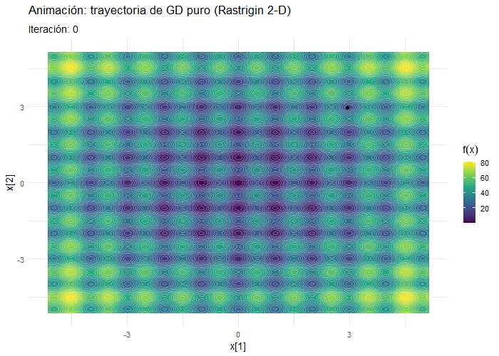

```{r rm, include=FALSE}
#Borrar variables de ambiente en caso de ser necesario 
rm(list = ls())
```

```{r setup, include=FALSE}
knitr::opts_chunk$set(echo = TRUE)
```

```{r librerias, warning=FALSE,message=FALSE}
library(GA) #Algoritmos Evolutivos
library(pso) #Optimización de Particulas
library(DEoptim)  #Evolución Diferencial
library(dplyr)
library(ggplot2)
library(plotly)
library(gganimate)
library(knitr)
library(gifski)
library(viridis)
library(htmlwidgets)
library(magick)
library(scatterplot3d)
library(rgl)
library(osrm)
library(sf)
library(leaflet)
library(htmltools)
```

# ***1. Optimización numérica***

En este primer punto se estudian y comparan distintos métodos de optimización aplicados a funciones no lineales. El objetivo es analizar el desempeño de algoritmos clásicos como el descenso por gradiente frente a métodos heurísticos inspirados en procesos evolutivos y naturales. Para ello, se seleccionaron dos funciones de prueba con características distintas que permiten evaluar la eficacia y eficiencia de cada enfoque. Se realizarán optimizaciones en espacios de dos y tres dimensiones, partiendo de condiciones iniciales aleatorias. Además, se visualizará el proceso de búsqueda de soluciones mediante animaciones.Para finalmente comparar como fue el comportamiento de los métodos y como el tipo de función impacta en la elección del método.

## 1.1 Función de Rastrigin

La función de Rastrigin se define como:

$$
f(\mathbf{x}) = A n + \sum_{i=1}^{n} \left[ x_i^2 - A \cos(2 \pi x_i) \right]
$$

Donde, $\mathbf{x} = (x_1, x_2, \ldots, x_n) \in \mathbb{R}^n$

```{r}
rastrigin <- function(x, A = 10) {
  n <- length(x)
  A * n + sum(x^2 - A * cos(2 * pi * x))
}
```

**Propiedades de la Función Rastrigin:**

- Por convención A toma el valor de 10. 
- Mínimo Global en $\mathbf{x} = (0, 0, \ldots, 0)$ valor mínimo $f(\mathbf{x}) = 0$
- Multimodalidad: Tiene múltiples mínimos locales.
- Dominio típico $x_i \in [-5.12,\ 5.12],\quad \text{para } i = 1, 2, \ldots, n$
- Continuidad:  Es continua y suave (diferenciable).
- Separabilidad: Es separable, porque puede expresarse como la suma de funciones de una sola variable.


### Grafico de la función de Rastrigin (1D)

```{r fig.cap="**Fig 1.** Visualización de la función Rastrigin f(x1) (1D)", fig.align="center", out.width="70%", layout.align="center"}
# RASTRIGIN 1-D
# Este bloque dibuja la función Rastrigin en una sola variable
# y marca con puntos rojos los mínimos locales situados
# en cada número entero entre −5 y +5.

# 1) Convertimos la función ‘rastrigin()’ a una versión que
#    acepte un vector de x y devuelva un vector de resultados.
#    Vectorize() hace eso automáticamente.
rastrigin_1d <- Vectorize(function(x) rastrigin(x))

# 2) Dibujamos la curva:
#    • from / to  → rango del eje X
#    • n          → número de puntos que se calculan
#    • xlab, ylab → etiquetas de los ejes
#    • main       → título del gráfico
curve(
  rastrigin_1d(x),          # la función a pintar
  from = -5.12, to = 5.12,  # límites de X
  n    = 1000,              # resolución del trazo
  xlab = "x",               # texto en eje X
  ylab = "f(x)",            # texto en eje Y
  main = "Rastrigin 1D — campo de pozos periódicos"
)

# 3) Añadimos PUNTOS ROJOS en cada entero (… −5, −4, …, 4, 5)
#    para resaltar los mínimos locales de la función.
points(
  -5:5,                     # posiciones X de los puntos
  rastrigin_1d(-5:5),       # alturas Y = f(x) en esas X
  pch = 19,                 # tipo de símbolo (19 = punto sólido)
  col = "red"               # color de los puntos
)

```

#### Análisis del gráfico “Rastrigin 1-D — campo de pozos periódicos”

| Elemento visual | Observación | Interpretación |
|----|----|----|
| **Línea negra dentada** | Ondas regulares de amplitud creciente al alejarse del centro. | Resultado de la combinación $x^2+cos(2\pi x)$. El término cuadrático empuja hacia arriba (crece como cuenco), el coseno introduce la ondulación periódica. |
| **Puntos rojos (11)** | Un punto rojo en cada entero desde −5 hasta 5. | Representan los **mínimos locales**: los pozos donde un optimizador basado solo en gradientes podría quedar atrapado. |
| **Valle más profundo en** $x=0$ | Punto rojo más bajo ($f(x)=0$). | **Mínimo global** de la función. |
| **Simetría izquierda-derecha** | La curva es espejo respecto a $x=0$. | Tanto $x^2$ como $cos(2\pi x)$ son funciones pares → la función es simétrica. |
| **Incremento de altura hacia los extremos** | Las puntas laterales alcanzan $f(x)\approx40$ . | Dominio del término $x^2$. Cuanto más lejos del centro, más alto el coste. |

1.  **Alta multimodalidad**\
    Once pozos en un intervalo de solo 10 unidades indican que la función está plagada de óptimos locales.

2.  **Periodocidad**\
    La distancia constante entre picos ($\approx 1$) viene del $cos(2\pi x)$; cada ciclo completo genera un pozo.

### Grafico de la función de Rastrigin (2D)

```{r fig.cap="**Fig 2.** Visualización de la función Rastrigin f(x1, x2) (2D)", fig.align="center", out.width="70%", layout.align="center"}

# RASTRIGIN 2-D 
# Objetivo: dibujar un “mapa de calor” que muestre los pozos locales
# y el mínimo global de la función Rastrigin en dos variables.


# 1. Crear la rejilla (grilla) de puntos 
#    • seq() genera 200 valores igualmente espaciados
#    • El rango va de −5.12 a +5.12 (dominio típico de prueba)
x <- y <- seq(-5.12, 5.12, length.out = 200)

# 2. Calcular f(x1,x2) para cada punto de la rejilla 
#    • outer() combina todos los x con todos los y
#    • Vectorize() convierte la llamada a rastrigin() en “apta para matriz”
z <- outer(
  x, y,
  Vectorize(function(a, b) rastrigin(c(a, b)))  # a = x1, b = x2
)

# 3. Dibujar el contorno coloreado 
filled.contour(
  x, y, z,
  color.palette = terrain.colors,  # paleta “relieve” (verde-marrón)
  nlevels       = 30,              # número de franjas de color
  plot.title = title(
    main = "Rastrigin 2-D — campo de minas",   # título grande
    xlab = "x1",                               # etiqueta eje X
    ylab = "x2"                                # etiqueta eje Y
  ),

  # --- plot.axes: todo lo que añadas aquí se superpone al gráfico ---
  plot.axes = {
    axis(1); axis(2)                                # muestra los ejes
    abline(h = -5:5, v = -5:5,                      # rejilla entera
           col = "grey90", lty = 3)                 # líneas gris claro
    points(0, 0,                                    # coord. (0,0)
           pch = 8,    # símbolo estrella
           col = "black",
           cex = 1.5)                              # tamaño 1.5×
  }
)


```

#### Análisis del gráfico “Rastrigin 2-D — campo de minas”

+---------------------------------------------+----------------------------------------------------+-----------------------------------------------------------------------------------------------------------------+
| # Elemento visual                           | # Qué se observa                                   | # Qué significa                                                                                                 |
|                                             |                                                    |                                                                                                                 |
| **Gradiente de color (barra a la derecha)** | Verde muy oscuro → Valores cercanos a 0.\          | Indica la *altura* de la función $f(x_1,x_2)$. Los colores claros son “cerros”; los oscuros, “valles”.          |
|                                             | Amarillo → $f(\mathbf{x})\approx40$.\              |                                                                                                                 |
|                                             | Rosa-blanco → $f(\mathbf{x})\approx80$ (más alto). |                                                                                                                 |
+---------------------------------------------+----------------------------------------------------+-----------------------------------------------------------------------------------------------------------------+
| **Estrella negra en (0, 0)**                | Único punto marcado en el centro.                  | **Mínimo global**: $f(0,0) = 0$. Cualquier optimizador querrá llegar aquí.                                      |
+---------------------------------------------+----------------------------------------------------+-----------------------------------------------------------------------------------------------------------------+
| **Malla gris punteada**                     | Líneas cada unidad en ambos ejes.                  | Subraya que la función es **separable y periódica**: los mínimos locales se repiten exactamente en cada entero. |
+---------------------------------------------+----------------------------------------------------+-----------------------------------------------------------------------------------------------------------------+
| **Óvalos verdes/amarillos repetidos**       | Patrón regular horizontal y vertical.              | Cada óvalo es un **pozo local**; la cuadrícula entera corresponde a la estructura $cos(2\pi x_i)$ de Rastrigin. |
+---------------------------------------------+----------------------------------------------------+-----------------------------------------------------------------------------------------------------------------+

1.  **Alta multimodalidad**\
    Hay decenas de valles; un descenso por gradiente típico corre riesgo de quedar atrapado en cualquiera de ellos.

2.  **Separabilidad**\
    Las líneas punteadas muestran que los mínimos están exactamente en los cruces de enteros (x1,x2)∈Z2. La función puede verse como la suma de dos copias 1-D independientes.

3.  **Incremento radial suave**\
    A medida que nos alejamos del centro, los colores se vuelven lentamente rosados

4.  **“Campo de minas”**\
    Optimizar aquí es como cruzar un terreno lleno de cráteres: cada cuadrícula contiene un pozo que puede atrapar al algoritmo.

## Grafico de la función de Rastrigin (3D)

```{r fig.cap="**Fig 3.** Visualización de la función Rastrigin f(x1, x2, x3) (3D)", fig.align="center", out.width="70%", layout.align="center"}
# -----------------------------------------------
# Dibujar superficie 3D de Rastrigin y mínimo global
# -----------------------------------------------

# Evaluar el mínimo global
min_x <- 0
min_y <- 0
min_z <- 20  # Para Rastrigin 2D, f(0, 0) = 20

# Crear el gráfico y guardar la transformación
trans <- persp(
  x, y, z,
  theta = 60,                 # Ángulo horizontal (más frontal)
  phi = 35,                   # Ángulo vertical (más inclinada hacia abajo)
  expand = 0.6,
  col = "lightblue",
  shade = 0,
  border = NA,
  ticktype = "simple",
  xlab = "x1",
  ylab = "x2",
  zlab = "f(x)",
  main = "Rastrigin 2D — Superficie 3D con mínimo global"
)

# Proyectar el punto (0, 0, f(0,0)) a 2D para añadirlo al gráfico
punto <- trans3d(min_x, min_y, min_z, trans)

# Añadir punto rojo
points(punto, col = "salmon", pch = 16, cex = 2)  # pch 16 = círculo lleno

```

#### Superficie 3-D de la función Rastrigin en dos dimensiones.

Se aprecia un cuenco global con un mosaico de mínimos locales periódicos.\

El mínimo global está en (0,0) y las crestas alcanzan valores de $f(\mathbf{x})=80$.

-   **Implicaciones para la optimización**

    -   **Gradiente “traicionero”**\
        Desde un punto alto, el gradiente guía hacia el valle **más cercano, no el global**; por eso un descenso por gradiente sencillo suele frenarse en uno de esos cráteres periféricos.

    -   **Incremento radial suave + oscilación fina**\
        La combinación hace que los valles laterales sean relativamente profundos: un algoritmo necesita capacidad de *exploración* para saltar varias crestas y acercarse al centro.

    -   Métodos **locales** (GD, Newton) requieren muchos reinicios o mejoras (momentum, annealing).

    -   Estrategias **bioinspiradas** (PSO, hormigas) o **cuasi-Newton** (L-BFGS-B) suelen rendir mejor, porque pueden escapar de pozos.

## Descenso del gradiente (GD)

### Gradiente

```{r}
grad_rastrigin <- function(x, A = 10) {
  2 * x + 2 * pi * A * sin(2 * pi * x)
}
```

### Función GD

```{r}
# Función GD simple con historial
gd_once <- function(x0, lr = 0.01, iters = 200) {
  x <- x0
  hist <- matrix(NA, nrow = iters, ncol = length(x0) + 1)  # guarda x1, x2, f(x)

  for (k in 1:iters) {
    g <- grad_rastrigin(x)       # gradiente
    x <- x - lr * g              # paso GD
    hist[k, ] <- c(x, rastrigin(x))  # guardar estado
  }

  colnames(hist) <- c(paste0("x", 1:length(x0)), "f")
  return(as.data.frame(hist))
}

```

### Rastringin

### Implementación de GD en Rastrigin 1D

#### Trayectoria de GD puro sobre Rastringin (1D)

```{r fig.cap="**Fig 4.** Visualización de la función Rastrigin óptimo en f(x1) (1D)", fig.align="center", out.width="70%", layout.align="center"}

# GRÁFICO 1-D CON GD_PURO  

# 1. Ejecutar el descenso por gradiente 
x0 <- 3                            # punto de partida
traj1d <- gd_once(x0, lr = 0.01, iters = 200)

# 2. Añadir la columna de iteración  
traj1d$iter <- seq_len(nrow(traj1d)) - 1   # 0, 1, 2, …

# 3. Graficar Rastrigin 1-D y la trayectoria
rastrigin_v <- Vectorize(rastrigin)

curve(rastrigin_v(x), from = -5.12, to = 5.12, n = 1000,
      xlab = "x", ylab = "f(x)",
      main = "Trayectoria de GD puro en Rastrigin 1-D")

# Línea azul con el camino del algoritmo
points(traj1d$x1, traj1d$f, type = "l",
       col = "dodgerblue", lwd = 2)

# Puntos de inicio (rojo) y final (negro)
points(x0, rastrigin(x0),                pch = 19, col = "red")   # inicio
points(tail(traj1d$x1, 1), tail(traj1d$f, 1),
       pch = 17, col = "black")                                   # fin


```

+-------------------+---------------------------------------------------------------------------------------------------------------------------------+
| # Color / Símbolo | # Significado correcto                                                                                                          |
|                   |                                                                                                                                 |
| **▲ Negro**       | **Punto inicial** $\mathbf{x_0}\approx2.9$. El descenso por gradiente parte aquí, en la ladera alta del valle.                  |
+-------------------+---------------------------------------------------------------------------------------------------------------------------------+
| **🔴 Rojo**       | **Punto final**: mínimo local alcanzado tras 200 iteraciones, $x\approx2.8$x≈2.8 con $14\lessapprox f(\mathbf{x})\lessapprox15$ |
+-------------------+---------------------------------------------------------------------------------------------------------------------------------+
| **Zona azul**     | Todos los pasos intermedios; muestra cómo GD oscila dentro del mismo valle hasta estabilizarse en el punto rojo.                |
+-------------------+---------------------------------------------------------------------------------------------------------------------------------+

#### Análisis

1.  **Descenso rápido**\
    El algoritmo parte del punto **negro** (valor f≈27) y se desliza cuesta abajo siguiendo el gradiente.

2.  **Oscilaciones amortiguadas**\
    En azul se ve cómo va rebotando a ambos lados del eje del valle. Cada rebote es más pequeño porque el gradiente se reduce a medida que se acerca al fondo.

3.  **Convergencia local, fracaso global:**\
    El algoritmo se detiene en el **punto rojo**, el fondo del pozo local. Allí la pendiente es prácticamente nula y se cumple el criterio de paro. **Queda atrapado** en el primer mínimo local encontrado.

4.  **Influencia del punto de partida**: cualquier inicio en el intervalo $[2.5,\ 3.5]$ produciría resultados parecidos; reiniciar desde zonas distintas sólo trasladaría el problema a otros pozos.

5.  **Distancia al óptimo global**\
    El óptimo global de Rastrigin ($\mathbf{x}=0, f=0$) queda fuera de la zona azul; GD nunca lo “visita”. Esto evidencia la limitación de los métodos locales en funciones multimodales.

6.  **Necesidad de estrategias complementarias**: para alcanzar el óptimo global en Rastrigin se requieren técnicas que permitan “saltar” valles (momentum, tasa de aprendizaje adaptativa, meta-heurísticas globales).

### Implementación de GD en Rastrigin 2D

#### Trayectoria de GD puro sobre Rastringin (2D)

```{r fig.cap="**Fig 5.** Visualización de la función Rastrigin óptimo f(x1, x2) (2D)", fig.align="center", out.width="70%", layout.align="center"}

# Malla (superficie de referencia) --------------------------
x_vals <- y_vals <- seq(-5.12, 5.12, length.out = 200)
contour_df <- expand.grid(x1 = x_vals, x2 = y_vals)
contour_df$z <- mapply(
  function(a, b) rastrigin(c(a, b)),
  contour_df$x1, contour_df$x2
)

# Ejecutar Gradient Descent puro ----------------------------
#    · sin argumentos “max_iter” ni “tol” → usamos ‘iters’
gd_res <- gd_once(c(3, 3), lr = 0.01, iters = 200)

# Construir data frame con las columnas que ggplot necesita
traj_df <- data.frame(
  x1   = gd_res$x1,                 # posiciones en eje X
  x2   = gd_res$x2,                 # posiciones en eje Y
  f    = gd_res$f,                  # valor de la función
  iter = seq_len(nrow(gd_res)) - 1  # contador de iteraciones 0…199
)
# Definir los puntos de Inicio y Fin para la leyenda -------
puntos_df <- data.frame(
  x1   = c(traj_df$x1[1], tail(traj_df$x1, 1)),
  x2   = c(traj_df$x2[1], tail(traj_df$x2, 1)),
  tipo = factor(c("Fin", "Inicio"), levels = c("Fin", "Inicio"))
)

# Gráfico estático ------------------------------------------------
ggplot() +
  # Fondo: mapa de calor f(x)
  geom_tile(data = contour_df,
            aes(x1, x2, fill = z)) +
  geom_contour(data = contour_df,
               aes(x1, x2, z = z),
               colour = "white", alpha = 0.25, bins = 25) +
  scale_fill_viridis_c(option = "D", name = expression(f(x))) +

  # Trayectoria
  geom_path(data = traj_df,
            aes(x1, x2),
            colour = "dodgerblue", linewidth = 1.3) +
  geom_point(data = traj_df[1, ],        # punto inicial
             aes(x1, x2),
             colour = "black", size = 3) +
  geom_point(data = tail(traj_df, 1),    # punto final
             aes(x1, x2),
             colour = "red", size = 3) +
  # Puntos de inicio y fin con leyenda automática
  geom_point(data = puntos_df,
             aes(x = x1, y = x2, colour = tipo, shape = tipo),
             size = 3) +
  scale_colour_manual(values = c("Inicio" = "black", "Fin" = "red"),
                      name   = "") +
  scale_shape_manual(values = c("Inicio" = 16,      # círculo lleno
                                "Fin"    = 17),     # triángulo
                     name    = "") +

  # Detalles estéticos
  labs(title    = "Trayectoria de GD puro sobre Rastrigin 2D",
       subtitle = "•  Rojo = mínimo local donde se atasca",
       x = expression(x[1]), y = expression(x[2])) +
  theme_minimal(base_size = 14) +
  theme(legend.position = "right",
        plot.title      = element_text(face = "bold"))


```

##### Descripción del gráfico

| Elemento | Significado |
|----|----|
| 🔵 **Trayectoria azul** | Secuencia de pasos que toma Gradient Descent desde el punto inicial. |
| ⚫ **Círculo negro (Inicio)** | Posición de partida $(3,\ 3)$ del algoritmo. |
| 🔺 **Triángulo rojo (Fin)** | Mínimo local donde GD queda atrapado tras 200 iteraciones. |
| **Mapa de colores (f(x))** | Valor de la función Rastrigin; violeta oscuro ($\approx0$) (valles), amarillo ($\approx 80$) (picos). |

##### Análisis del comportamiento del algoritmo

| Observación | Interpretación |
|----|----|
| El recorrido es **muy corto** y se queda en la parte superior-derecha. | GD se vio atraído por el **valle local más próximo** y no dispuso de mecanismos para “saltar” la siguiente cresta. |
| Valor final ($f(\mathbf{x})=17$) frente al mínimo global $f(\mathbf{x})=0$. | Confirma el **estancamiento prematuro** en un óptimo local. |
| Trayectoria casi rectilínea hacia un solo pozo. | El gradiente inicial apunta con fuerza a la depresión más cercana; tras llegar al fondo la norma del gradiente se vuelve pequeña y el algoritmo se detiene. |

En funciones **altamente multimodales** como Rastrigin, el número de valles hace muy improbable que GD, partiendo lejos del origen, alcance el **mínimo global**.

#### Animacion de la trayectoria de GD puro sobre Rastringin (2D)

```{r fig.cap="**Fig 6.** Animación de la función Rastrigin óptimo f(x1, x2) (2D)", fig.align="center", out.width="70%", layout.align="center", warning=FALSE, message=FALSE}

# GRÁFICO Y ANIMACIÓN 2-D DE UNA ÚNICA TRAYECTORIA GD (sin   
# reinicios) SOBRE LA FUNCIÓN RASTRIGIN.                     

# Datos de la superficie (contorno con leyenda f(x))
# ─────────────────────────────────────────────────────────────
x_vals <- y_vals <- seq(-5.12, 5.12, length.out = 200)

contour_df <- expand.grid(x1 = x_vals, x2 = y_vals) %>%
  mutate(z = mapply(function(a, b) rastrigin(c(a, b)), x1, x2))


# Una sola trayectoria con gd_once()
# ─────────────────────────────────────────────────────────────
set.seed(42)                 # reproducibilidad
x0 <- c(3, 3)                # punto inicial elegido
gd_res <- gd_once(x0, lr = 0.01, iters = 50)

traj_df <- gd_res %>%
  mutate(iter = seq_len(n()) - 1)   # 0,1,2,… para animación


# Animación 2-D de la misma trayectoria
# ─────────────────────────────────────────────────────────────
p_anim <- ggplot() +
  geom_tile(data = contour_df,
            aes(x1, x2, fill = z)) +
  geom_contour(data = contour_df,
               aes(x1, x2, z = z),
               colour = "white", alpha = 0.3, bins = 30) +
  scale_fill_viridis_c(name = expression(f(x)), option = "D") +

  geom_path(data = traj_df,
            aes(x1, x2),
            colour = "red", linewidth = 1.3) +
  geom_point(data = traj_df,
             aes(x1, x2),
             colour = "black", size = 2) +

  labs(title    = "Animación: trayectoria de GD puro (Rastrigin 2-D)",
       subtitle = "Iteración: {frame_along}",
       x = expression(x[1]), y = expression(x[2])) +
  theme_minimal(base_size = 14) +
  theme(legend.position = "right",
        plot.title = element_text(face = "bold")) +

  transition_reveal(along = iter) +
  ease_aes("linear")

animate(p_anim,
        nframes  = max(traj_df$iter) + 1,
        fps      = 15,
        width    = 700,
        height   = 500,
        units    = "px",
        renderer = gifski_renderer())


```



##### Dinámica observada

1.  **Inicio en un pico elevado**\
    Al “play”, el punto negro parte en una zona amarilla (valor alto de $f(\mathbf{x})$), indicando un punto inicial lejos del mínimo.

2.  **Descenso pronunciado**\
    En las primeras iteraciones, el punto negro se desplaza rápidamente hacia regiones más oscuras (valores de f decrecientes), cayendo dentro de un pozo local.

3.  **Estabilización**\
    Una vez dentro del valle, la trayectoria azul rodea el fondo con pequeños vaivenes, reflejando zig-zags de GD puro en un entorno multimodal.

4.  **Sin escape del mínimo local**\
    A pesar de varias decenas de iteraciones, el punto nunca atraviesa la cresta que llevaría al valle central

### Implementación de GD en Rastrigin 3D

#### Animacion de la trayectoria de GD puro sobre Rastringin (3D)

```{r fig.cap="**Fig 7.** Visualización de la función Rastrigin óptimo f(x1, x2, x3) (3D)", fig.align="center", out.width="70%", layout.align="center"}


# — 1) Superficie de Rastrigin —
x_vals  <- y_vals <- seq(-5.12, 5.12, length.out = 50)
z_matrix <- outer(x_vals, y_vals,
                  Vectorize(function(a,b) rastrigin(c(a,b))))

# — 2) Ejecución de GD desde (3,3) —
set.seed(42)
res   <- gd_once(c(3, 3), lr = 0.01, iters = 50)
traj  <- as.matrix(res[, c("x1","x2")])    # n × 2
fvals <- res$f                              # longitud n
iters <- seq_len(nrow(res)) - 1             # 0:(n-1)

# — 3) Óptimo local —
opt_idx   <- which.min(fvals)
opt_point <- traj[opt_idx, ]
opt_val   <- fvals[opt_idx]

# — 4) Construcción de frames CORREGIDA —
frames <- lapply(seq_along(iters), function(i) {
  list(
    data = list(
      NULL,  # trace 0: superficie (estático)
      # trace 1: línea hasta iter i
      list(
        x    = traj[1:i,1],
        y    = traj[1:i,2],
        z    = fvals[1:i],
        type = "scatter3d", mode = "lines",
        line = list(color=0:(i-1), colorscale="Rainbow",
                    cmin=0, cmax=max(iters), width=6)
      ),
      # trace 2: punto móvil en iter i
      list(
        x      = traj[i,1],
        y      = traj[i,2],
        z      = fvals[i],
        type   = "scatter3d", mode = "markers",
        marker = list(size=6, color="black")
      ),
      NULL   # trace 3: óptimo (estático)
    ),
    name   = as.character(iters[i]),
    traces = c(1,2)  # animamos sólo línea y punto
  )
})


# — 5) Figura inicial con 4 traces —
fig <- plot_ly() %>%
  # trace 0: superficie
  add_surface(
    x = ~x_vals, y = ~y_vals, z = ~z_matrix,
    colorscale = "Viridis", opacity = 0.2, showscale = FALSE
  ) %>%
  # trace 1: línea (iter 0)
  add_trace(
    x    = traj[1,1], y = traj[1,2], z = fvals[1],
    type = "scatter3d", mode = "lines",
    line = list(color=0, colorscale="Rainbow",
                cmin=0, cmax=max(iters), width=6),
    name = "Trayectoria"
  ) %>%
  # trace 2: punto inicial
  add_trace(
    x      = traj[1,1], y = traj[1,2], z = fvals[1],
    type   = "scatter3d", mode = "markers",
    marker = list(size=6, color="black"),
    name   = "Punto actual"
  ) %>%
  # trace 3: óptimo encontrado
  add_trace(
    x      = opt_point[1], y = opt_point[2], z = opt_val,
    type   = "scatter3d", mode = "markers",
    marker = list(size=10, symbol="diamond", color="yellow"),
    name   = "Óptimo encontrado"
  ) %>%
  layout(
    title = paste0("GD en Rastrigin 3D — Iteración 0 — f = ", round(fvals[1],4)),
    scene = list(
      xaxis = list(title = "x1", range = c(-5.12,5.12)),
      yaxis = list(title = "x2", range = c(-5.12,5.12)),
      zaxis = list(title = "f(x)"),
      camera = list(
        eye = list(x=0.05, y=1.50, z=0.30),
        center = list(x=0,y=0,z=0),
        up     = list(x=0,y=0,z=1)
      )
    ),
    sliders = list(
      list(
        active = 0, pad = list(t=50),
        currentvalue = list(prefix="Iteración: "),
        steps = lapply(seq_along(iters), function(i) {
          list(
            method = "animate",
            args   = list(list(as.character(iters[i])),
                          list(mode="immediate",
                               frame=list(duration=100, redraw=TRUE))),
            label  = as.character(iters[i])
          )
        })
      )
    ),
    updatemenus = list(
      list(
        type="buttons", showactive=FALSE,
        x=1, xanchor="right", y=0, yanchor="bottom",
        buttons=list(
          list(label="▶ Play", method="animate",
               args=list(NULL, list(frame=list(duration=100,redraw=TRUE),
                                     mode="immediate"))),
          list(label="⏸ Pause", method="animate",
               args=list(list(NULL), list(frame=list(duration=0,redraw=FALSE),
                                         mode="immediate")))
        )
      )
    )
  )

# — 6) Inyecta frames y habilita autoplay —
fig$x$frames <- frames
fig <- fig %>% onRender("
  function(el,x){
    el.on('plotly_buttonclicked',function(e){
      if(e.button && e.button.label==='▶ Play'){
        Plotly.animate(el,null,{frame:{duration:100,redraw:true},mode:'immediate'});
      }
    });
  }
")

# — 7) Guarda y muestra —
htmlwidgets::saveWidget(fig,
  "rastrigin_gd_3d_zoom_maximo_correcto.html",
  selfcontained = TRUE)
fig

```

| Elemento | Significado |
|----------|-------------|

|  |  |
|----|----|
| **Superficie translúcida (Viridis)** | Muestra el paisaje completo de la función Rastrigin: valles profundos (violeta) y picos altos (amarillo). |

|  |  |
|----|----|
| 🟠 **Línea multicolor (“Trayectoria”)** | Cada tonalidad marca un paso de GD: del azul al naranja conforme avanza la iteración. |

|  |  |
|----|----|
| ⚫ **Punto negro (“Punto actual”)** | Indica la posición de GD en la iteración mostrada. |

|  |  |
|----|----|
| **Diamante amarillo (“Óptimo encontrado”)** | Señala el mínimo local donde el algoritmo quedó atrapado. |

|  |
|----|
| ▶️⏸️ **Controles Play/Pause + slider** \| Permiten navegar interactivamente por las iteraciones. \| \| \| \| \| \| \| |

##### Comportamiento de GD en 3D

1.  **Descenso inicial:**\
    Desde el punto $(3,\ 3)$, GD baja rápidamente por la “pared” del valle, capturado por el gradiente pronunciado.

2.  **Ingreso en un cráter local:**\
    Tras unas pocas iteraciones, la trayectoria desciende al fondo de un pozo lateral, lejos del centro $(0,\ 0)$.

3.  **Estancamiento y micro-oscillaciones:**\
    Dentro de ese cráter, GD gira en pequeños zig-zags alrededor de un mínimo que no es el global.

4.  **No alcanza el mínimo global:**\
    El diamante amarillo permanece alejado del valle central de la superficie, confirmando la captura en un mínimo local.

## Algoritmos evolutivos

### Rastrigin

#### Dos dimensiones

```{r ,include=FALSE}
set.seed(420)  # Semilla

GA_rastrigin_2d <- ga(
  type = "real-valued",
  fitness = function(x) -rastrigin(x),  # GA maximiza, por eso usamos el negativo
  lower = c(-5.12, -5.12),              # Límites inferiores
  upper = c(5.12, 5.12),                # Límites superiores
  popSize = 50,                         # Tamaño de la población
  maxiter = 100,                        # Número máximo de iteraciones
  run = 50                              # Criterio de parada si no mejora
)

# Mostrar resultados
summary(GA_rastrigin_2d)

```

```{r, include=FALSE}
# Crear una carpeta temporal para guardar las imágenes
dir_temp <- tempdir()
files <- character(0)

# Monitor que guarda cada frame como una imagen PNG
monitor_magick <- function(obj) {
  iter <- obj@iter
  pop <- obj@population
  
  png_filename <- file.path(dir_temp, sprintf("frame_%03d.png", iter))
  png(png_filename, width=600, height=600)
  plot(pop, xlim=c(-5.12, 5.12), ylim=c(-5.12, 5.12),
       main=paste("Iteración", iter),
       xlab="x", ylab="y", pch=19, col=rgb(0,0,1,0.5))
  dev.off()
  
  files <<- c(files, png_filename)
}
set.seed(420)
GA_rastrigin_2d <- ga(
  type = "real-valued",
  fitness = function(x) -rastrigin(x),
  lower = c(-5.12, -5.12),
  upper = c(5.12, 5.12),
  popSize = 50,
  maxiter = 100,
  run = 50,
  monitor = monitor_magick
)
# Leer las imágenes y combinarlas en un GIF animado en memoria
img_list <- image_read(files)
animation <- image_animate(img_list, fps = 10)


# Crear carpeta de salida si no existe
output_dir <- "Trabajo1_files"
if (!dir.exists(output_dir)) dir.create(output_dir)

# Ruta del archivo GIF de salida
gifga_path <- file.path(output_dir, "rastrigin_ga_animation.gif")

# Guardar el GIF en disco
image_write(animation, gifga_path)

```

```{r fig_ga_2d, fig.cap="**Fig 8.** Animación Algoritmos evolutivos 2D", fig.align="center", out.width="70%"}
knitr::include_graphics(gifga_path)
```

#### Tres dimensiones

```{r,include=FALSE}
set.seed(420)  # Semilla

GA_rastrigin_3d <- ga(
  type = "real-valued",
  fitness = function(x) -rastrigin(x),  # GA maximiza, por eso usamos el negativo
  lower = c(-5.12, -5.12, -5.12),       # Límites inferiores
  upper = c(5.12, 5.12, 5.12),          # Límites superiores
  popSize = 50,                         # Tamaño de la población
  maxiter = 100,                        # Número máximo de iteraciones
  run = 50                              # Criterio de parada si no mejora
)

# Mostrar resultados
summary(GA_rastrigin_3d)
```

```{r, echo=FALSE}
# Crear carpeta temporal para imágenes
dir_temp <- tempdir()
files <- character(0)

# Monitor para GA en 3D que guarda imágenes
monitor_magick_3d <- function(obj) {
  iter <- obj@iter
  pop <- obj@population
  
  png_filename <- file.path(dir_temp, sprintf("frame_%03d.png", iter))
  png(png_filename, width = 600, height = 600)
  
  # Graficar la población en 3D
  scatterplot3d(
    pop[,1], pop[,2], pop[,3],
    xlim = c(-5.12, 5.12),
    ylim = c(-5.12, 5.12),
    zlim = c(-5.12, 5.12),
    pch = 19, color = rgb(0, 0, 1, 0.5),
    xlab = "x", ylab = "y", zlab = "z",
    main = paste("Iteración", iter)
  )
  points3d(0, 0, 0, col = "red", pch = 8)  # Óptimo global
  
  dev.off()
  
  files <<- c(files, png_filename)
}

# Ejecutar el GA en 3D con el monitor modificado
set.seed(420)
GA_rastrigin_3d <- ga(
  type = "real-valued",
  fitness = function(x) -rastrigin(x),
  lower = c(-5.12, -5.12, -5.12),
  upper = c(5.12, 5.12, 5.12),
  popSize = 50,
  maxiter = 100,
  run = 50,
  monitor = monitor_magick_3d
)

# Crear GIF animado desde imágenes
img_list <- image_read(files)
animation <- image_animate(img_list, fps = 10)

# Guardar el GIF
output_dir <- "Trabajo1_files"
if (!dir.exists(output_dir)) dir.create(output_dir)

gifga3d_path <- file.path(output_dir, "rastrigin_ga_3d.gif")
image_write(animation, gifga3d_path)

```

```{r fig_ga_3d, fig.cap="**Fig 9.** Animación Algoritmos evolutivos 3D", fig.align="center", out.width="70%"}
knitr::include_graphics(gifga3d_path)
```

## Optimización de partículas

```{r , include=FALSE}
pso_rastrigin_2d <- psoptim(
  par = c(NA, NA),                   # Inicialización (puede ser aleatoria)
  fn = rastrigin,                    # Función a minimizar
  lower = c(-5.12, -5.12),           # Límites inferiores
  upper = c(5.12, 5.12),             # Límites superiores
  control = list(
    maxit = 200,                     # Número de iteraciones
    s = 40,                          # Tamaño del enjambre (partículas)
    trace = 1                        # Mostrar progreso
  )
)
```

```{r, include=FALSE}

# Lista para guardar la historia del enjambre
pso_history <- list()

# Función wrapper con historial
rastrigin_with_history <- function(x) {
  # Solo registrar si estamos dentro de PSO
  if (exists(".current_iter", envir = .GlobalEnv)) {
    i <- get(".current_iter", envir = .GlobalEnv)
    assign(".pso_particles", rbind(get(".pso_particles", envir = .GlobalEnv), x), envir = .GlobalEnv)
  }
  rastrigin(x)
}

# Monitor manual en bucle
maxit <- 200
s <- 40

# Inicialización
assign(".pso_particles", matrix(, nrow = 0, ncol = 2), envir = .GlobalEnv)

# Ejecutar PSO y registrar enjambre por iteración
set.seed(42)
for (iter in 1:maxit) {
  assign(".current_iter", iter, envir = .GlobalEnv)
  assign(".pso_particles", matrix(, nrow = 0, ncol = 2), envir = .GlobalEnv)
  
  psoptim(
    par = c(NA, NA),
    fn = rastrigin_with_history,
    lower = c(-5.12, -5.12),
    upper = c(5.12, 5.12),
    control = list(
      maxit = 1,
      s = s,
      maxfn = 0,     # No queremos que evolucione, solo un paso por iteración
      trace = FALSE
    )
  )
  
  pso_history[[iter]] <- get(".pso_particles", envir = .GlobalEnv)
}

# Generar gráficos por iteración
dir_temp <- tempdir()
files <- character(0)

for (i in seq_along(pso_history)) {
  png_filename <- file.path(dir_temp, sprintf("pso_frame_%03d.png", i))
  png(png_filename, width = 600, height = 600)
  plot(pso_history[[i]], xlim = c(-5.12, 5.12), ylim = c(-5.12, 5.12),
       pch = 19, col = rgb(0, 0, 1, 0.5),
       xlab = "x", ylab = "y", main = paste("PSO Iteración", i))
  points(0, 0, pch = 8, col = "red", cex = 1.5)  # Óptimo global
  dev.off()
  files <- c(files, png_filename)
}

# Crear animación
img_list <- image_read(files)
animation <- image_animate(img_list, fps = 10)

# Guardar GIF
output_dir <- "Trabajo1_files"
if (!dir.exists(output_dir)) dir.create(output_dir)

gifpso_path <- file.path(output_dir, "rastrigin_pso_2d.gif")
image_write(animation, gifpso_path)


```

```{r fig_pso_2d_1, fig.cap="**Fig 10.** Animación Optimización de particulas 2D", fig.align="center", out.width="70%",echo=FALSE}
knitr::include_graphics(gifpso_path)
```

```{r, include=FALSE}
pso_rastrigin_3d <- psoptim(
  par = c(NA, NA),                   # Inicialización (puede ser aleatoria)
  fn = rastrigin,                    # Función a minimizar
  lower = c(-5.12, -5.12, -5.12),    # Límites inferiores
  upper = c(5.12, 5.12, 5.12),       # Límites superiores
  control = list(
    maxit = 200,                     # Número de iteraciones
    s = 40,                          # Tamaño del enjambre (partículas)
    trace = 1                        # Mostrar progreso
  )
)
```

## Evolución diferencial

```{r, include=FALSE}
# Almacenar historial
rastrigin_de_history <- list()

rastrigin_with_history_de <- function(x) {
  val <- rastrigin(x)
  rastrigin_de_history <<- c(rastrigin_de_history, list(list(x = x, value = val)))
  return(val)
}

# Ejecutar DEoptim
set.seed(123)
control_params <- DEoptim.control(NP = 50, itermax = 100, trace = FALSE)

res_de <- DEoptim(
  fn = rastrigin_with_history_de,
  lower = c(-5.12, -5.12),
  upper = c(5.12, 5.12),
  control = control_params
)

# Extraer el mejor individuo por generación
evals <- split(rastrigin_de_history, rep(1:101, each = 50))  # 1 inicial + 100 iteraciones

best_by_gen <- lapply(evals, function(gen) {
  gen[[which.min(sapply(gen, function(p) p$value))]]
})

rastrigin_df_de <- data.frame(
  step = 1:length(best_by_gen),
  x = sapply(best_by_gen, function(p) p$x[1]),
  y = sapply(best_by_gen, function(p) p$x[2]),
  z = sapply(best_by_gen, function(p) p$value)
)

# Crear grid para el fondo
x_vals <- seq(-5.12, 5.12, length.out = 200)
y_vals <- seq(-5.12, 5.12, length.out = 200)
grid <- expand.grid(x = x_vals, y = y_vals) %>%
  rowwise() %>%
  mutate(z = rastrigin(c(x, y))) %>%
  ungroup()


```

```{r, include=FALSE}
# Procesar historial
evals <- split(rastrigin_de_history, rep(1:101, each = 50))  # 1 inicial + 100 iteraciones

# Preparar carpeta temporal para imágenes
dir_temp <- tempdir()
files <- character(0)

# Generar una imagen por iteración
for (i in seq_along(evals)) {
  gen <- evals[[i]]
  coords <- t(sapply(gen, function(p) p$x))
  
  png_filename <- file.path(dir_temp, sprintf("frame_%03d.png", i))
  png(png_filename, width = 600, height = 600)
  plot(coords, xlim = c(-5.12, 5.12), ylim = c(-5.12, 5.12),
       main = paste("Iteración", i - 1),
       xlab = "x", ylab = "y", pch = 19, col = rgb(0.2, 0.6, 0.9, 0.5))
  dev.off()
  
  files <- c(files, png_filename)
}

# Crear GIF
img_list <- image_read(files)
animation <- image_animate(img_list, fps = 10)

# Guardar GIF
output_dir <- "Trabajo1_files"
if (!dir.exists(output_dir)) dir.create(output_dir)

gifed_path <- file.path(output_dir, "rastrigin_de_animation.gif")
image_write(animation, gifed_path)
```

```{r fig_pso_2d_2, fig.cap="**Fig 11.** Animación Optimización de particulas 2D de la Función Rastrigin", fig.align="center", out.width="70%"}
knitr::include_graphics(gifed_path)
```

## ***1.2 Función de Rosenbrock***

La función de Rosenbrock de forma generalizada para para n variables se define como:

$$
f(\mathbf{x}) = \sum_{i=1}^{n-1} \left[ a - x_i \right]^2 + b \left( x_{i+1} - x_i^2 \right)^2
$$ Donde, $\mathbf{x} = (x_1, x_2, \ldots, x_n) \in \mathbb{R}^n$

**Propiedades de la Función Rosenbrock:**

- $a$ y $b$ son parámetros que controlan la forma de la función. Típicamente, $a = 1$ y $b=100$. 
- Para estos parámetros comunes el mínimo global se va encontrar en el conjunto de coordenadas $(x_1, x_2, \ldots, x_n) = (1, 1, \ldots, 1)$ donde $f(\mathbf{x^*}) = 0$
- Tipo de función: No convexa, suave (diferenciable) y unimodal.
- Dominio típico $x_i \in (-\infty, \infty), \quad \text{para } i = 1, 2, \ldots, n$
- Tiene una forma de valle largo, estrecho y curvado.El gradiente es pequeño en muchas partes, lo que hace difícil que métodos de gradiente converjan rápidamente.
- Separabilidad: Es separable, porque puede expresarse como la suma de funciones de una sola variable.


```{r rosenbrock}
#Definimos la función general
rosenbrock_n <- function(x, a = 1, b = 100) {
  n <- length(x)
  sum_value <- 0
  for(i in 1:(n-1)) {
    sum_value <- sum_value + (a - x[i])^2 + b * (x[i+1] - x[i]^2)^2
  }
  return(sum_value)
}
```

Probamos los minimos globales, para distintos números de variables:

```{r pruebafuncion}
rosenbrock_n(c(1,1)) 
rosenbrock_n(c(1,1,1)) 
rosenbrock_n(c(1,1,1,1))
```

Procedemos a visualizar la función para los casos de dos y tres variables, ya que con una sola variable esta se reduce a una parábola convexa simple. Esta forma trivial no representa un reto significativo para los métodos de optimización, por lo que no resulta adecuada para los fines de este análisis.

**Visualización en 3d para dos variables (x1,x2)**

```{r fig.cap="**Fig 12.** Visualización de la función Rosenbrock f(x1,x2) (3D)", fig.align="center", out.width="70%", layout.align="center",echo=FALSE}

plot_function_3d <- function(func,
                           x_range = c(-3, 3),
                           y_range = c(-3, 3),
                           resolution = 100,
                           optimal_points = NULL,
                           colorscale = "Viridis",
                           title = "Visualización 3D de función",
                           x_label = "x1",
                           y_label = "x2",
                           z_label = "f(x1,x2)") {
 
  # Crear grid de puntos
  x <- seq(x_range[1], x_range[2], length.out = resolution)
  y <- seq(y_range[1], y_range[2], length.out = resolution)
 
  # Evaluar la función en toda la cuadrícula
  z <- outer(x, y, Vectorize(function(x, y) func(c(x, y))))
 
  # Crear el gráfico 3D interactivo
  p <- plot_ly(x = ~x, y = ~y, z = ~z) %>%
    add_surface(colorscale = colorscale)
 
  # Agregar puntos óptimos si se especifican
  if (!is.null(optimal_points)) {
    for (i in 1:nrow(optimal_points)) {
      point <- optimal_points[i, ]
      p <- p %>% add_markers(
        x = point$x,
        y = point$y,
        z = func(c(point$x, point$y)),
        marker = list(color = point$color, size = point$size),
        name = point$name
      )
    }
  }
 
  # Configurar el diseño del gráfico
  p <- p %>% layout(
    title = title,
    scene = list(
      xaxis = list(title = x_label),
      yaxis = list(title = y_label),
      zaxis = list(title = z_label)
    )
  )
 
  return(p)
}

optimal_points_rosenbrock <- data.frame(
  x = c(1),
  y = c(1),
  name = c("Óptimo global"),
  color = c("red"),
  size = c(5)
)

# Graficar Rosenbrock
plot_function_3d(
  func = rosenbrock_n,
  x_range = c(-2, 2),
  y_range = c(-2, 2),
  resolution = 100,
  optimal_points = optimal_points_rosenbrock,
  title = "Función de Rosenbrock (2D -> 3D)",
  z_label = "Rosenbrock(x1, x2)"
)
```

En la visualización 3D de la función de Rosenbrock en dos dimensiones, con variables (x1,x2), se observa un paisaje caracterizado por un valle estrecho, curvado y alargado. El mínimo global se encuentra en el punto (x1,x2)=(1,1), pero el camino hacia este mínimo no es directo.

La superficie tiene una pendiente suave que desciende hacia el fondo del valle, mientras que los bordes laterales presentan pendientes pronunciadas, formando una especie de "canal en forma de U" que se curva a lo largo del plano. Esta topografía hace que, aunque el gradiente siempre apunte hacia el mínimo, los métodos de optimización puedan desviarse, oscilar o converger lentamente si no están bien ajustados.También da la sensación de que la función es simétrica alrededor de x2=0, teniendo así dos mínimos globales, lo cual en verdad no es cierto.

**Visualización en 2d del mapa de calor, vista superior para dos variables (x1,x2)**

```{r fig.cap="**Fig 13.** Mapa de Calor de la Función Rosenbrock", fig.align="center", out.width="70%",echo=FALSE, message=FALSE, warning=FALSE}
x_vals <- seq(-2, 2, length.out = 200)
y_vals <- seq(-2, 2, length.out = 200)

grid <- expand.grid(x = x_vals, y = y_vals) %>%
  rowwise() %>%
  mutate(z = rosenbrock_n(c(x, y))) %>%
  ungroup()

opt_x <- 1
opt_y <- 1
opt_z <- rosenbrock_n(c(opt_x, opt_y))

z_min <- min(grid$z)
z_max <- max(grid$z)

# Graficar
ggplot(grid, aes(x = x, y = y, fill = z)) +
  geom_raster() +
  geom_contour(aes(z = z), color = "black", alpha = 0.3) +
  geom_point(aes(x = opt_x, y = opt_y), color = "red", size = 3) +
  annotate("text", x = opt_x, y = opt_y + 0.2, label = "Óptimo", color = "red") +
  theme_minimal() +
  scale_fill_viridis_c(
    breaks = c(z_min, z_max/10, z_max/2, z_max),
    labels = function(x) round(x, 2)
  ) +
  labs(
    title = "Mapa de calor y curvas de nivel para la función Rosenbrock",
    x = "Valor de x1",
    y = "Valor de x2",
    fill = "f(x)"
  ) +
  theme(
    legend.position = "right",
    legend.title.position = "top",
    legend.key.height = unit(0.1, "npc"),
    legend.key.width = unit(0.5, "cm"),
    legend.margin = margin(0, 0, 0, 0),
    legend.box.margin = margin(0, 0, 0, 10)
  )
```

### ***1.2.1 Optimización de la Función de Rosenbrock***

#### ***1.2.1.1 Optimización de la Función de Rosenbrock para dos*** $(x_1, x_2)$ y tres dimensiones $(x_1,x_2,x_3)$

##### **Optimización por descenso del gradiente**

Se utiliza un punto inicial aleatorio dentro del rango [−3,3] y [3,-3,3] y a partir de allí el algoritmo busca aproximarse al mínimo global de la función, se utiliza el método BFGS (Broyden–Fletcher–Goldfarb–Shanno) ya que es un algoritmo de optimización mucho eficiente y robusto para funciones suaves y no lineales, como es el caso de la función Rosenbrock.

```{r DG, message=FALSE, include=FALSE}
set.seed(1986)
x02 <- runif(2, -3, 3)  

res_gradiente_2d <- optim(
  par = x02,
  fn = rosenbrock_n,
  method = "BFGS"
)

x03 <- runif(3, -3, 3)  

res_gradiente_3d <- optim(
  par = x03,
  fn = rosenbrock_n,
  method = "BFGS"
)
```

##### **Optimización con Algorimos Genéticos (GA)**

En este caso se define un espacio de búsqueda continuo en el rango [−3,3] para x1,x2 y x3 y se configura una población inicial de 50 individuos. El algoritmo evoluciona durante un máximo de 100 iteraciones o hasta que no se observe mejora en 50 generaciones consecutivas.

```{r GA, message=FALSE, include=FALSE}
set.seed(1986)
# Optimizamos con GA
ga_evolutivo_2d <- ga(
  type = "real-valued",
  fitness = function(x) -rosenbrock_n(x), 
  lower = c(-3, -3),
  upper = c(3, 3),
  popSize = 50,
  maxiter = 50,
  run = 50,
  monitor=FALSE
)

nro_evaluaciones_ga_2d <- ga_evolutivo_2d@popSize * ga_evolutivo_2d@iter

ga_evolutivo_3d <- ga(
  type = "real-valued",
  fitness = function(x) -rosenbrock_n(x),  
  lower = c(-3, -3, -3),
  upper = c(3, 3, 3),
  popSize = 50,
  maxiter = 50,
  run=50,
  monitor=FALSE
)

nro_evaluaciones_ga_3d <- ga_evolutivo_3d@popSize * ga_evolutivo_3d@iter

```

##### **Optimización por enjambre de partículas (PSO)**

De nuevo comenzamos con una posición aleatoria en el rango [−3,3] para cada una de las variables variables y se realiza hasta 100 iteraciones para encontrar el mínimo.

```{r PSO, message=FALSE , include=FALSE}
#2D
evaluaciones_pso <- 0
rosenbrock_n_evaluaciones_pso <- function(x) {
  evaluaciones_pso <<- evaluaciones_pso + 1
  rosenbrock_n(x)
}

# Ejecutar PSO con función evaluaciones_psoa
set.seed(1986)
res_pso_2d <- psoptim(
  par = runif(2, -3, 3),
  fn = rosenbrock_n_evaluaciones_pso,
  lower = c(-3, -3),
  upper = c(3, 3),
  control = list(maxit = 100)
)

#3D
evaluaciones_pso_3d <- 0
rosenbrock_n_evaluaciones_pso_3d <- function(x) {
  evaluaciones_pso_3d <<- evaluaciones_pso_3d + 1
  rosenbrock_n(x)
}

res_pso_3d <- psoptim(
  par = runif(3, -3, 3),
  fn = rosenbrock_n_evaluaciones_pso_3d,
  lower = c(-3, -3, -3),
  upper = c(3, 3, 3),
  control = list(maxit = 100)
)

```

##### **Evolución Diferencial (DE)**

En este caso establecemos una población inicial de 50 individuos (NP = 50) y se permiten hasta 100 iteraciones (itermax = 100) para la optimización. En este caso también se busca el mínimo de la función dentro del rango [−3,3] para todas las variables.

```{r DE, message=FALSE, include=FALSE}
# Optimizamos con DE
set.seed(1986)
control_params <- DEoptim.control(NP = 50, itermax = 70,trace=FALSE)
res_de_2d <- DEoptim(
  fn = rosenbrock_n,
  lower = c(-3, -3),
  upper = c(3, 3),
  control = control_params
)
evaluaciones_de <- control_params$NP *  res_de_2d$optim$iter

res_de_3d <- DEoptim(
  fn = rosenbrock_n,
  lower = c(-3, -3, -3),
  upper = c(3, 3, 3),
  control = control_params
)

evaluaciones_de_3d <- control_params$NP *  res_de_2d$optim$iter
```

A continuación observamos los resultados obtenidos, de la optimización de la función de Rosenbrock para dos variables, con los cuatro métodos.

```{r resultado_optimizacion_2d,fig.cap="**Tabla 1.** _Resultados de la Optimizació de Rosenbrock f(x1,x2) _", fig.align="center", out.width="70%", echo=FALSE}
tabla_optimizacion_2D <- data.frame(
  "Método" = c("Descenso por gradiente",
               "Algoritmos evolutivos",
               "Optimización de partículas",
               "Evolución Diferencial"),
  "Valor de x1" = c(res_gradiente_2d$par[1], ga_evolutivo_2d@solution[1], res_pso_2d$par[1], as.numeric(res_de_2d$optim$bestmem["par1"])),
  "Valor de x2" = c(res_gradiente_2d$par[2], ga_evolutivo_2d@solution[2], res_pso_2d$par[2], as.numeric(res_de_2d$optim$bestmem["par2"])),
  "Valor Función Objetivo" = c(res_gradiente_2d$value, ga_evolutivo_2d@fitnessValue, res_pso_2d$value, res_de_2d$optim$bestval),
  "Número de Evaluaciones" = c(as.numeric(res_gradiente_2d$counts[1]), nro_evaluaciones_ga_2d, evaluaciones_pso, evaluaciones_de),
  check.names = FALSE
)

kable(tabla_optimizacion_2D, caption = "Resultados Optimización de Rosenbrock para dos dimensiones (x1,x2)")
```

Para dos dimensiones los resultados nos muestran que todos los métodos lograron aproximarse al mínimo global de la función de Rosenbrock, aunque con diferencias significativas en eficiencia y precisión. El método de descenso por gradiente (BFGS) fue el más eficiente, alcanzando un valor prácticamente óptimo con solo 53 evaluaciones. En contraste, los métodos heurísticos requirieron muchas más evaluaciones: evolución diferencial logró un valor casi perfecto con 3500 evaluaciones, mientras que PSO alcanzó un resultado muy cercano al óptimo con 1200 evaluaciones. Por su parte, el algoritmo evolutivo fue el menos preciso, con un valor ligeramente más alejado del óptimo y un costo computacional alto (2500 evaluaciones). En resumen, los métodos tradicionales como el gradiente descendente son más eficientes cuando la función es suave y bien comportada, mientras que los métodos heurísticos ofrecen robustez frente a funciones complejas, aunque con mayor costo computacional. Es importante recordar que en el caso de métodos basados en gradiente as condiciones iniciales juegan un papel crucial en la optimización, ya que pueden determinar si el algoritmo converge rápidamente o queda atrapado en regiones poco prometedoras.

```{r resultado_optimizacion_3d,fig.cap="**Tabla 3.** Resultados de la Optimizació de Rosenbrock f(x1,x2,x3)", fig.align="center", out.width="70%", echo=FALSE}
tabla_optimizacion_3D <- data.frame(
  "Método" = c("Descenso por gradiente",
               "Algoritmos evolutivos",
               "Optimización de partículas",
               "Evolución Diferencial"),
  "Valor de x1*" = c(res_gradiente_3d$par[1], ga_evolutivo_3d@solution[1], res_pso_3d$par[1], as.numeric(res_de_3d$optim$bestmem["par1"])),
  "Valor de x2*" = c(res_gradiente_3d$par[2], ga_evolutivo_3d@solution[2], res_pso_3d$par[2], as.numeric(res_de_3d$optim$bestmem["par2"])),
  "Valor de x3*" = c(res_gradiente_3d$par[3], ga_evolutivo_3d@solution[3], res_pso_3d$par[2], as.numeric(res_de_3d$optim$bestmem["par2"])),
  "Valor Óptimo de la Función Objetivo" = c(res_gradiente_3d$value, ga_evolutivo_3d@fitnessValue, res_pso_3d$value, res_de_3d$optim$bestval),
  "Número de Evaluaciones" = c(as.numeric(res_gradiente_3d$counts[1]), nro_evaluaciones_ga_3d, evaluaciones_pso_3d, evaluaciones_de_3d),
  check.names = FALSE
)

kable(tabla_optimizacion_3D, caption = "Resultados Optimización de Rosenbrock en tres dimensiones (x1,x2,x3)")
```

El descenso por gradiente (BFGS) es el método más eficiente, logrando el valor óptimo con solo 143 evaluaciones. Los algoritmos evolutivos requieren 2500 evaluaciones, pero terminan con un valor de función objetivo significativamente más alejado del mínimo. La optimización por partículas (PSO) logra un valor positivo con 1300 evaluaciones, pero no se aproxima tanto al óptimo como el descenso por gradiente. Finalmente, la evolución diferencial con 3500 evaluaciones también se queda cerca del óptimo, pero no supera al gradiente. En general, los métodos heurísticos necesitan más evaluaciones y no alcanzan la precisión del descenso por gradiente.

### Animación del Descenso del Gradiente.

```{r animacion_gd, eval=FALSE,include=FALSE}
rosenbrock_3d_history <- list()

rosenbrock_with_history_3d <- function(x) {
  val <- rosenbrock_n(x)
  rosenbrock_3d_history <<- c(rosenbrock_3d_history, list(list(x = x, value = val)))
  return(val)
}
# Optimización 2D

set.seed(1986)

x0_3r <- runif(2, -3, 3)

# Optimización
res_3d <- optim(
  par = x0_3r,
  fn = rosenbrock_with_history_3d,
  method = "BFGS",
  control = list(trace = 1, REPORT = 1, maxit = 100)
)

rosenbrock_df_3d <- data.frame(
  step = 1:length(rosenbrock_3d_history),
  x = sapply(rosenbrock_3d_history, function(p) p$x[1]),
  y = sapply(rosenbrock_3d_history, function(p) p$x[2]),
  z = sapply(rosenbrock_3d_history, function(p) p$value)
)

# Crear cuadrícula para visualización de la función
x_vals <- seq(-3, 3, length.out = 200)
y_vals <- seq(-3, 3, length.out = 200)
grid <- expand.grid(x = x_vals, y = y_vals) %>%
  rowwise() %>%
  mutate(z = rosenbrock_n(c(x, y))) %>%
  ungroup()

# Crear gráfico animado
p <- ggplot() +
  # Capa BASE de relleno para el mapa de calor
  geom_raster(data = grid, aes(x = x, y = y, fill = z), alpha = 0.5) +
  scale_fill_viridis_c(option = "viridis", name = "Valor de Rosenbrock") +
  
  # Curvas de nivel
  geom_contour(data = grid, aes(x = x, y = y, z = z), 
               color = "black", alpha = 0.4, bins = 15) +
  
  # Trayectoria del optimizador
  geom_path(data = rosenbrock_df_3d, aes(x = x, y = y), 
            color = "darkgrey", alpha = 0.5, linewidth = 0.8) +
  
  # Puntos animados (nuevo esquema de colores)
  geom_point(data = rosenbrock_df_3d, aes(x = x, y = y, color = step), 
             size = 3, show.legend = FALSE) +
  scale_color_gradient(low = "orange", high = "red") +  # Naranja a rojo
  
  # Punto óptimo
  geom_point(aes(x = 1, y = 1), shape = 5, color = "red", size = 4) +
  annotate("text", x = 1, y = 1.5, label = "Óptimo Global", 
           color = "red", fontface = "bold") +
  
  # Estilo y animación
  theme_minimal() +
  labs(
    title = "Optimización de la Función Rosenbrock\nIteración: {frame_time}",
    x = "x1",
    y = "x2"
  ) +
  transition_time(step) +
  shadow_wake(wake_length = 0.1, alpha = 0.3) +
  
  # Limitar los ejes x y y entre -2 y 2
  xlim(-3, 3) +
  ylim(-3, 3) +
  
  theme(plot.margin = margin(t = 30, r = 10, b = 10, l = 10, unit = "pt"))

# Renderizar la animación
#animate(p, fps = 3, width = 700, height = 470, renderer = av_renderer("Trabajo1_files/rosenbrock_3d_path.mp4"))
#renderer <- gifski_renderer(tempfile(fileext = ".gif"))
#gganimate::animate(p, fps = 3, width = 700, height = 470, renderer = renderer)
#animate(p, fps = 3, width = 700, height = 470, renderer = gifski_renderer("rosenbrock_3d_gifanimado.gif"))
gganimate::animate(p, fps = 3, width = 700, height = 470,
                   renderer = gifski_renderer("Trabajo1_files/rosenbrock_gd_2d.gif"))
```

```{r fig_dg_2d, fig.cap="**Fig 14.** Animación Descenso del gradiente 2D", fig.align="center", out.width="70%",echo=FALSE}
knitr::include_graphics("Trabajo1_files/rosenbrock_gd_2d.gif")
```

## Animación Evolución Diferencial

```{r, eval=FALSE,include=FALSE}
# Función objetivo con almacenamiento de la historia
rosenbrock_de_history <- list()

rosenbrock_with_history_de <- function(x) {
  val <- rosenbrock_n(x)
  rosenbrock_de_history <<- c(rosenbrock_de_history, list(list(x = x, value = val)))
  return(val)
}

# Ejecutar DEoptim
set.seed(1986)
control_params <- DEoptim.control(NP = 50, itermax = 100, trace = FALSE)

res_de_2d <- DEoptim(
  fn = rosenbrock_with_history_de,
  lower = c(-3, -3),
  upper = c(3, 3),
  control = control_params
)

# Extraer solo el mejor individuo por generación
evals <- split(rosenbrock_de_history, rep(1:101, each = 50))  # 101 = 1 inicial + 100 iteraciones

best_by_gen <- lapply(evals, function(gen) {
  gen[[which.min(sapply(gen, function(p) p$value))]]
})

rosenbrock_df_de <- data.frame(
  step = 1:length(best_by_gen),
  x = sapply(best_by_gen, function(p) p$x[1]),
  y = sapply(best_by_gen, function(p) p$x[2]),
  z = sapply(best_by_gen, function(p) p$value)
)

# Crear el grid para el fondo de la animación
x_vals <- seq(-3, 3, length.out = 200)
y_vals <- seq(-3, 3, length.out = 200)
grid <- expand.grid(x = x_vals, y = y_vals) %>%
  rowwise() %>%
  mutate(z = rosenbrock_n(c(x, y))) %>%
  ungroup()

# Crear el gráfico animado
p_de <- ggplot() +
  geom_raster(data = grid, aes(x = x, y = y, fill = z), alpha = 0.5) +
  scale_fill_viridis_c(option = "viridis") +
  geom_contour(data = grid, aes(x = x, y = y, z = z), color = "black", alpha = 0.4) +
  geom_path(data = rosenbrock_df_de, aes(x = x, y = y), color = "darkgrey", alpha = 0.5) +
  geom_point(data = rosenbrock_df_de, aes(x = x, y = y, color = step), size = 3, show.legend = FALSE) +
  scale_color_gradient(low = "blue", high = "green") +
  geom_point(aes(x = 1, y = 1), shape = 5, color = "red", size = 4) +
  annotate("text", x = 1, y = 1.5, label = "Óptimo Global", color = "red", fontface = "bold") +
  theme_minimal() +
  labs(
    title = "Optimización con DE - Función Rosenbrock\nIteración: {frame_time}",
    x = "x1", y = "x2"
  ) +
  transition_time(step) +
  shadow_wake(wake_length = 0.1, alpha = 0.3) +
  xlim(-3, 3) +
  ylim(-3, 3)

# Renderizar y guardar el GIF
gganimate::animate(p_de, fps = 3, width = 700, height = 470,
                   renderer = gifski_renderer("Trabajo1_files/rosenbrock_de_2d.gif"))
```

```{r fig_ed_2d, fig.cap="**Fig 15.** Animación Evolución Diferencial 2D", fig.align="center", out.width="70%",echo=FALSE}
knitr::include_graphics("Trabajo1_files/rosenbrock_de_2d.gif")
```

## Animación Algoritmos Evolutivos

```{r, eval=FALSE,include=FALSE}
# Contador para las generaciones (esto va antes de correr el GA)
rosenbrock_ga_history <- list()
generation_counter <- 0
individual_counter <- 0
gen_sizes <- c()  # Para guardar el número de individuos por generación

# Función de evaluación
rosenbrock_with_history_ga <- function(x) {
  val <- -rosenbrock_n(x)
  rosenbrock_ga_history <<- c(rosenbrock_ga_history, list(list(x = x, value = -val, gen = generation_counter)))
  individual_counter <<- individual_counter + 1
  return(val)
}

# Callback para marcar el inicio de cada generación
my_monitor <- function(obj) {
  generation_counter <<- generation_counter + 1
  gen_sizes <<- c(gen_sizes, individual_counter)
  individual_counter <<- 0
}

# Ejecutar el algoritmo genético
set.seed(1986)
res_ga <- ga(
  type = "real-valued",
  fitness = rosenbrock_with_history_ga,
  lower = c(-3, -3),
  upper = c(3, 3),
  popSize = 50,
  maxiter = 50,
  run = 50,
  monitor = my_monitor
)

# Asegurarnos de guardar la última generación
gen_sizes <- c(gen_sizes, individual_counter)

# Agrupar por generación
evals <- split(rosenbrock_ga_history, sapply(rosenbrock_ga_history, function(p) p$gen))

# Extraer el mejor de cada generación
best_by_gen <- lapply(evals, function(gen) {
  gen[[which.min(sapply(gen, function(p) p$value))]]
})

# Dataframe para la animación
rosenbrock_df_ga <- data.frame(
  step = 1:length(best_by_gen),
  x = sapply(best_by_gen, function(p) p$x[1]),
  y = sapply(best_by_gen, function(p) p$x[2]),
  z = sapply(best_by_gen, function(p) p$value)
)

# Crear el grid para la animación
x_vals <- seq(-3, 3, length.out = 200)
y_vals <- seq(-3, 3, length.out = 200)
grid <- expand.grid(x = x_vals, y = y_vals) %>%
  rowwise() %>%
  mutate(z = rosenbrock_n(c(x, y))) %>%
  ungroup()

# Crear el gráfico animado
p_ga <- ggplot() +
  geom_raster(data = grid, aes(x = x, y = y, fill = z), alpha = 0.5) +
  scale_fill_viridis_c(option = "viridis") +
  geom_contour(data = grid, aes(x = x, y = y, z = z), color = "black", alpha = 0.4) +
  geom_path(data = rosenbrock_df_ga, aes(x = x, y = y), color = "darkgrey", alpha = 0.5) +
  geom_point(data = rosenbrock_df_ga, aes(x = x, y = y, color = step), size = 3, show.legend = FALSE) +
  scale_color_gradient(low = "blue", high = "green") +
  geom_point(aes(x = 1, y = 1), shape = 5, color = "red", size = 4) +
  annotate("text", x = 1, y = 1.5, label = "Óptimo Global", color = "red", fontface = "bold") +
  theme_minimal() +
  labs(
    title = "Optimización con GA - Función Rosenbrock\nIteración: {frame_time}",
    x = "x1", y = "x2"
  ) +
  transition_time(step) +
  shadow_wake(wake_length = 0.1, alpha = 0.3) +
  xlim(-3, 3) +
  ylim(-3, 3)

# Renderizar y guardar el GIF
gganimate::animate(p_ga, fps = 3, width = 700, height = 470,
                   renderer = gifski_renderer("Trabajo1_files/rosenbrock_ga_2d.gif"))
```

```{r gifrosen_ga, fig.cap="**Fig 16.** Animación Algoritmos Evolutivos 2D", fig.align="center", out.width="70%",echo=FALSE}
knitr::include_graphics("Trabajo1_files/rosenbrock_ga_2d.gif")
```

## Animación Optimización por enjambre de Particulas

```{r, eval=FALSE,include=FALSE}
# Historial global
rosenbrock_pso_history <- list()
current_pso_iter <- 0

# Función para registrar posiciones y evaluar
rosenbrock_with_history_pso <- function(x) {
  val <- rosenbrock_n(x)
  rosenbrock_pso_history[[current_pso_iter]] <<- append(rosenbrock_pso_history[[current_pso_iter]], list(list(x = x, value = val)))
  return(val)
}

# Función adaptativa para población (matriz) o individuo (vector)
fitness_wrapper <- function(pop) {
  current_pso_iter <<- current_pso_iter + 1
  rosenbrock_pso_history[[current_pso_iter]] <<- list()
  
  if (is.null(dim(pop))) {
    # Caso: vector
    return(rosenbrock_with_history_pso(pop))
  } else {
    # Caso: matriz
    return(apply(pop, 1, rosenbrock_with_history_pso))
  }
}

# Ejecutar PSO
set.seed(1986)
res_pso <- psoptim(
  par = c(0, 0),
  fn = fitness_wrapper,
  lower = c(-3, -3),
  upper = c(3, 3),
  control = list(maxit = 100, trace = 0,s=20)  
)

# Procesar historial
frames_pso <- do.call(rbind, lapply(seq_along(rosenbrock_pso_history), function(i) {
  do.call(rbind, lapply(rosenbrock_pso_history[[i]], function(p) {
    data.frame(step = i, x = p$x[1], y = p$x[2], z = p$value)
  }))
}))

# Crear grid de fondo
x_vals <- seq(-3, 3, length.out = 200)
y_vals <- seq(-3, 3, length.out = 200)
grid <- expand.grid(x = x_vals, y = y_vals) %>%
  rowwise() %>%
  mutate(z = rosenbrock_n(c(x, y))) %>%
  ungroup()

# Crear animación
p_pso <- ggplot() +
  geom_raster(data = grid, aes(x = x, y = y, fill = z), alpha = 0.5) +
  scale_fill_viridis_c(option = "viridis") +
  geom_contour(data = grid, aes(x = x, y = y, z = z), color = "black", alpha = 0.4) +
  geom_point(data = frames_pso, aes(x = x, y = y, color = step), size = 2, show.legend = FALSE) +
  scale_color_gradient(low = "blue", high = "green") +
  geom_point(aes(x = 1, y = 1), shape = 5, color = "red", size = 4) +
  annotate("text", x = 1, y = 1.5, label = "Óptimo Global", color = "red", fontface = "bold") +
  theme_minimal() +
  labs(
    title = "Optimización con PSO - Función Rosenbrock\nIteración: {frame_time}",
    x = "x1", y = "x2"
  ) +
  transition_time(step) +
  shadow_wake(wake_length = 0.1, alpha = 0.3) +
  xlim(-3, 3) +
  ylim(-3, 3)

# Renderizar
gganimate::animate(p_pso, fps = 4, width = 700, height = 470,
                   renderer = gifski_renderer("Trabajo1_files/rosenbrock_pso_2d.gif"))
```

```{r gifrosen_pso, fig.cap="**Fig 17.** Animación Optimización PSO 2D", fig.align="center", out.width="70%",echo=FALSE}
knitr::include_graphics("Trabajo1_files/rosenbrock_pso_2d.gif")
```

**Conclusión Final**

Los métodos de descenso por gradiente, como BFGS, mostraron una gran eficiencia y precisión al optimizar funciones suaves y bien comportadas como Rosenbrock, alcanzando el mínimo global con un número muy reducido de evaluaciones. Su capacidad para aprovechar la derivada y la curvatura de la función les permite converger rápidamente cuando se parte de condiciones iniciales razonables. No obstante, su principal desventaja es la dependencia del punto de inicio: si se inicia en una región poco favorable, el algoritmo puede no converger al mínimo global o hacerlo muy lentamente.

Por otro lado, los métodos heurísticos —como algoritmos genéticos, enjambre de partículas y evolución diferencial— aportan robustez frente a funciones no convexas y multimodales, como la función Rastrigin, donde los métodos de gradiente frecuentemente quedan atrapados en mínimos locales. En este contexto, los heurísticos son capaces de explorar mejor el espacio de búsqueda, gracias a su componente estocástico y su capacidad para escapar de óptimos locales. Sin embargo, su mayor fortaleza —la exploración— implica también un mayor costo computacional y, en muchos casos, una menor precisión final comparada con los métodos basados en gradiente.

En resumen, los métodos de gradiente son ideales cuando se conoce que la función es suave y tiene una topografía favorable, mientras que los métodos heurísticos resultan más apropiados para problemas con múltiples óptimos locales o funciones no diferenciables, aunque a un mayor costo computacional. El uso conjunto o híbrido de ambos enfoques puede ofrecer lo mejor de ambos mundos: eficiencia local y exploración global.


# 2. Optimización combinatoria

$CT_{ij} = PrecioPeajes_{ij} + Distancia_{ij}(km) * PrecioGasolina/km + Salario(Horas) * Tiempo_{ij}(Horas)$

```{r}
ciudades = c(
    "Bogotá",
    "Medellín",
    "Cali",
    "Barranquilla",
    "Cartagena",
    "Bucaramanga",
    "Cúcuta",
    "Pereira",
    "Manizales",
    "Ibagué",
    "Santa Marta",
    "Villavicencio",
    "Neiva"
)
```

```{r}
matriz_distancia <- read.csv("matriz_distancia.csv", row.names = 1)
matriz_tiempos <- read.csv("matriz_tiempos.csv", row.names = 1)
matriz_peajes <- read.csv("matriz_peajes.csv", row.names = 1)
```

```{r}
colnames(matriz_distancia) <- ciudades
colnames(matriz_tiempos) <- ciudades
colnames(matriz_peajes) <- ciudades

rownames(matriz_distancia) <- ciudades
rownames(matriz_tiempos) <- ciudades
rownames(matriz_peajes) <- ciudades
```

```{r}
matriz_costo_gasolina <-  191*matriz_distancia
matriz_costo_salario <- 5416*matriz_tiempos

```

```{r}
matriz_costo_total <- matriz_peajes + matriz_costo_gasolina + matriz_costo_salario
matriz_costo_total <- as.matrix(matriz_costo_total)

```

```{r, echo=FALSE}
# Fijar semilla para reproducibilidad
set.seed(42)

# Definición de parámetros
cities_count <- 13              # Número total de ciudades
eroso_influence <- 1            # Influencia de la feromona (antes gamma)
visibility_influence <- 2       # Influencia de la visibilidad (antes beta)
evap_rate <- 0.5               # Tasa de evaporación de feromonas
pheromone_strength <- 100       # Constante para depósito de feromonas
ants_count <- cities_count      # Una hormiga por estado
cities_names <- as.list(rownames(matriz_costo_total))

# Inicialización de matrices
tau_matrix <- matrix(1, nrow = cities_count, ncol = cities_count)  # Feromonas
eta_matrix <- 1 / matriz_costo_total                               # Visibilidad
eta_matrix[!is.finite(eta_matrix)] <- 0                             # Evitar Inf/NaN

# Variables para la mejor solución
best_path <- integer(0)
best_path_cost <- Inf
best_iteration <- NA

# Bucle principal: 100 iteraciones
for (iter_idx in seq_len(100)) {
  all_paths <- vector("list", ants_count)
  all_costs <- numeric(ants_count)

  for (ant_idx in seq_len(ants_count)) {
    current_node <- sample(seq_len(cities_count), 1)
    visited_nodes <- current_node
    path_cost <- 0

    # Construcción de la ruta
    for (step_idx in seq_len(cities_count - 1)) {
      candidates <- setdiff(seq_len(cities_count), visited_nodes)
      trans_probs <- (
        tau_matrix[current_node, candidates]^eroso_influence *
        eta_matrix[current_node, candidates]^visibility_influence
      )
      if (all(trans_probs == 0)) trans_probs <- rep(1, length(candidates))
      if (length(candidates) == 1) {
        next_node <- candidates
      } else {
        next_node <- sample(candidates, 1, prob = trans_probs)
      }

      path_cost <- path_cost + matriz_costo_total[current_node, next_node]
      current_node <- next_node
      visited_nodes <- c(visited_nodes, current_node)
    }

    # Regreso al inicio
    dir_cost <- matriz_costo_total[current_node, visited_nodes[1]]
    path_cost <- path_cost + dir_cost

    all_paths[[ant_idx]] <- visited_nodes
    all_costs[ant_idx] <- path_cost

    # Actualizar mejor ruta
    if (path_cost < best_path_cost) {
      best_path_cost <- path_cost
      best_path <- visited_nodes
      best_iteration <- iter_idx
    }
  }

  # Mostrar el costo mínimo encontrado en esta iteración
  cat(sprintf("Iteración %3d | Costo mínimo: $%0.2f\n", iter_idx, min(all_costs)))

  # Evaporación de feromonas
  tau_matrix <- tau_matrix * (1 - evap_rate)

  # Depósito de feromonas
  for (i in seq_along(all_paths)) {
    path_nodes <- all_paths[[i]]
    cost_val <- all_costs[i]
    for (j in seq_len(length(path_nodes) - 1)) {
      tau_matrix[path_nodes[j], path_nodes[j+1]] <-
        tau_matrix[path_nodes[j], path_nodes[j+1]] + pheromone_strength / cost_val
    }
    # Feromona por retorno al inicio
    tau_matrix[path_nodes[length(path_nodes)], path_nodes[1]] <-
      tau_matrix[path_nodes[length(path_nodes)], path_nodes[1]] + pheromone_strength / cost_val
  }
}

# Convertir mejor ruta a nombres y agregar retorno al inicio
best_path_names <- cities_names[best_path]
best_path_names <- c(best_path_names, best_path_names[1])

# Impresión de resultados
cat("\nMejor ruta encontrada:\n")
cat(paste(best_path_names, collapse = " → "), "\n")

cat("\nDetalle de costos por tramo:\n")
cat(sprintf("%-30s %-30s %10s\n", "Origen", "Destino", "Costo"))
cat(strrep("-", 70), "\n")

total_cost <- 0
for (idx in seq_along(best_path)) {
  origin <- best_path[idx]
  dest <- if (idx == length(best_path)) best_path[1] else best_path[idx+1]
  seg_cost <- matriz_costo_total[origin, dest]
  total_cost <- total_cost + seg_cost
  cat(sprintf("%-30s %-30s $%9.2f\n",
              cities_names[[origin]], cities_names[[dest]], seg_cost))
}

cat("\nEstadísticas:\n")
cat(sprintf("Ciudades (incluye retorno): %d\n", length(best_path_names)))
cat(sprintf("Costo total: $%0.2f\n", total_cost))
cat(sprintf("Costo promedio por tramo: $%0.2f\n", total_cost / length(best_path)))
cat(sprintf("Mejor costo encontrado en la iteración: %d\n", best_iteration))

```

```{r}
# Data.frame de ciudades con coordenadas
coords_df <- data.frame(
  city = c("Bogotá", "Medellín", "Cali", "Barranquilla", "Cartagena",
           "Bucaramanga", "Cúcuta", "Pereira", "Manizales", "Ibagué",
           "Santa Marta", "Villavicencio", "Neiva"),
  lon  = c(-74.0721, -75.5812, -76.5320, -74.7813, -75.4794,
           -73.1227, -72.4965, -75.6961, -75.5174, -75.2322,
           -74.1990, -73.6260, -75.2803),
  lat  = c(4.7110,   6.2442,   3.4516,   10.9685,  10.3910,
           7.1193,   7.8891,   4.8133,   5.0672,   4.4389,
           11.2408,  4.1420,   2.9273),
  stringsAsFactors = FALSE
)

# Para comprobar
print(coords_df)

```

```{r, fig.cap="**Fig 18.** Ruta Óptima", fig.align="center", out.width="70%", warning=FALSE, message=FALSE}

# Función de petición con reintentos
get_route <- function(src, dst, retries = 3, pause = 1) {
  for (i in seq_len(retries)) {
    attempt <- try(
      osrmRoute(src = src, dst = dst, overview = "full"),
      silent = TRUE
    )
    if (!inherits(attempt, "try-error")) return(attempt)
    Sys.sleep(pause)
  }
  sf::st_linestring(matrix(c(src[1], dst[1], src[2], dst[2]), 
                           ncol = 2, byrow = TRUE)) %>%
    sf::st_sfc(crs = 4326) %>%
    sf::st_sf()
}

# Ordenar coordenadas según la ruta
route_coords <- coords_df[match(best_path_names, coords_df$city), ]

# Quitar la última ciudad (repetida para cerrar el ciclo)
route_coords_labeled <- route_coords[-nrow(route_coords), ]
route_coords_labeled$order <- seq_len(nrow(route_coords_labeled))  # Orden de visita

# Obtener los segmentos de la ruta (incluye el regreso al origen)
route_segments <- lapply(seq_len(nrow(route_coords) - 1), function(i) {
  src <- as.numeric(route_coords[i,   c("lon", "lat")])
  dst <- as.numeric(route_coords[i+1, c("lon", "lat")])
  get_route(src, dst)
})

# Unir todos los segmentos en un solo objeto sf
routes_sf <- do.call(rbind, route_segments)

# Crear el mapa
leaflet() %>%
  addTiles() %>%
  addPolylines(data = routes_sf,
               color = "darkred",
               weight = 4,
               opacity = 0.8) %>%
  addCircleMarkers(data = route_coords,
                   ~lon, ~lat,
                   radius = 5,
                   color = "white",
                   fillColor = "blue",
                   fillOpacity = 0.9,
                   label = ~city) %>%
  addLabelOnlyMarkers(data = route_coords_labeled,
                      ~lon, ~lat,
                      label = ~as.character(order),
                      labelOptions = labelOptions(noHide = TRUE,
                                                  direction = 'top',
                                                  textOnly = TRUE,
                                                  style = list(
                                                    "color" = "black",
                                                    "font-weight" = "bold",
                                                    "font-size" = "12px"
                                                  ))) %>%
  setView(lng = mean(route_coords$lon),
          lat = mean(route_coords$lat),
          zoom = 6)

```

```{r, fig.cap="**Fig 19.** Ruta óptima con distancias ecuclidianas", fig.align="center", out.width="70%"}
# 1. Obtener coordenadas ordenadas por la ruta
route_coords <- coords_df[match(best_path_names, coords_df$city), ]

# 2. Crear una versión sin la última ciudad (que es repetición de la primera)
route_coords_labeled <- route_coords[-nrow(route_coords), ]
route_coords_labeled$order <- seq_len(nrow(route_coords_labeled))

# 3. Crear el mapa con líneas, marcadores y etiquetas de orden
leaflet(route_coords) %>%
  addTiles() %>%
  addPolylines(~lon, ~lat, color = "red", weight = 3, opacity = 0.7,
               label = best_path_names) %>%
  addCircleMarkers(~lon, ~lat, radius = 5,
                   color = "blue", fill = TRUE,
                   label = ~city) %>%
  addLabelOnlyMarkers(data = route_coords_labeled,
                      ~lon, ~lat,
                      label = ~as.character(order),
                      labelOptions = labelOptions(noHide = TRUE,
                                                  direction = 'top',
                                                  textOnly = TRUE,
                                                  style = list(
                                                    "color" = "black",
                                                    "font-weight" = "bold",
                                                    "font-size" = "12px"
                                                  )))

```

# Reporte contribución individual

-   Natalia Remolina: análisis de resultados descenso del gradiente en Rastrigin, ejecución del Web Scraping, optimización combinatoria colonia de hormigas (algoritmo y gráficos).

-   Jonatan Sanchez: creación del repositorio GitHub, optimización por descenso del gradiente para Rastrigin (función, gráficos y animaciones) y análisis de resultados, ejecución del Web Scraping, optimización combinatoria colonia de hormigas (algoritmo y gráficos).

-   Carlos Calle: creación del repositorio GitHub, creación y ejecución del Web Scraping para obtener información de distancia, tiempo y costo de peajes desde el aplicativo Hermes de Invias, definición de los optimizadores para Rastrigin en algoritmos evolutivos y optimización de párticulas, optimización combinatoria colonia de hormigas (algoritmo y gráficos).

-   Juan Camilo Valencia: optimización combinatoria colonia de hormigas (algoritmo y gráficos). Graficos de algortimos evolutivos, optimización de particulas y evolución diferencial.

-   David Castro: Optimización de la Función Rosenbrock, en 2d,3d con Descenso por gradiente y Metodos heuristicos, gráficas y gifs animados para Rosenbrock, rotulación de gráficas. 
